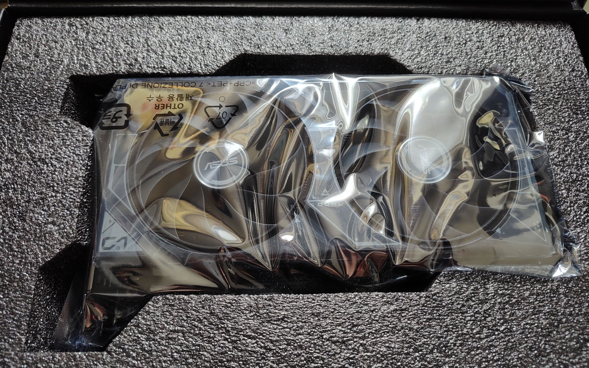
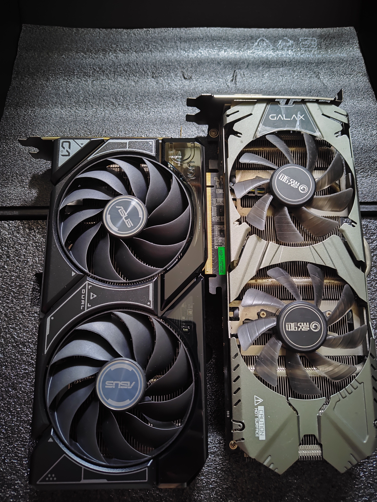
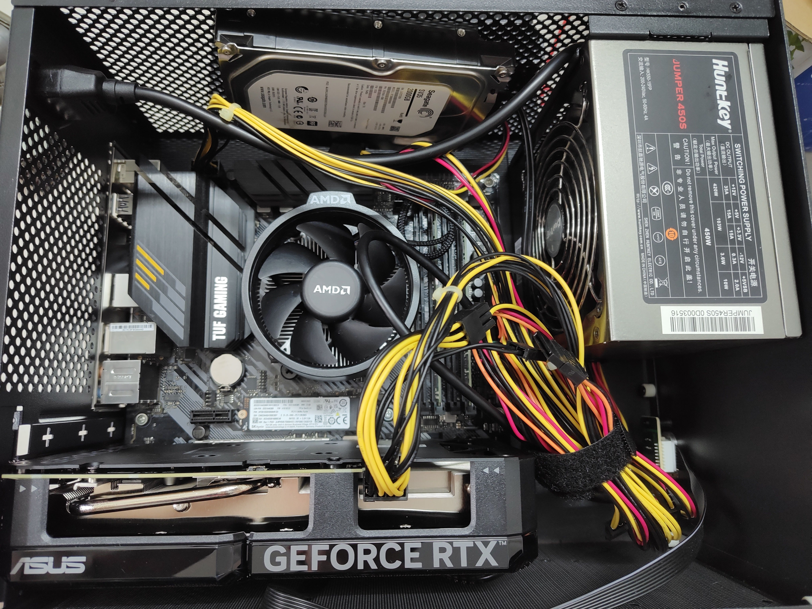
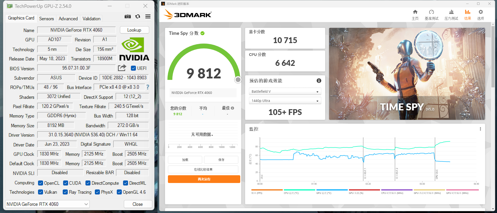
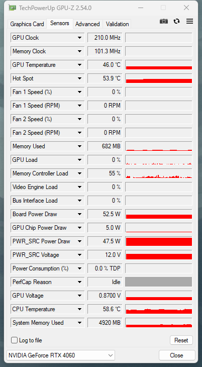

在上周，英伟达的 RTX4060 发售了，虽然这张卡被打上了“溢价”和“毫无诚意”的标签，但这抵挡不了我对它的向往，月末收到工资后便立即购入了，对我来说这是一份等了十年的礼物。

## 我的玩机历程

得益于老爸的言传身教，我在小学的时候就接触到了电脑，老人家是从 386 时代开始玩的，而我的第一台电脑则有着一颗奔腾 E + 2G RAM，跑着 WindowsXP。那时候还不算正式关注这些，对我来说打的了 CF 就可以，后面也有简单升级，加了一根内存条、换了 Windows 7，这系统在当时让我两眼一亮，怎么有这么好看的系统！等我上了初中后，接触到了当时正火的 Minecraft，贴吧里所热议的光影水反、模组和开服都驱动着我去关注电脑的硬件的和软件，在那时显卡吧里最经典的配置我想就是 i5-4590 + GTX960，四五千的价格让你可以玩转时下各类游戏，只可惜当时的我只是个没有经济收入的穷学生，也不可能去向家里人开口再配一台昂贵的电脑，于是乎便只能看并羡慕着。

到了高中，我才得到了一套 i5-4590 + 8G RAM 的配置，只可惜还是没有显卡，只好像图拉丁吧的吧友一样开始“捡垃圾”，捡到的第一张显卡就是家里尘封的 9600GT，这是一来自 2008 年的显卡，有着 512MB 的显存，但却还能点亮！实在是太酷了！（这卡怎么来的至今还是个迷）没过多久这卡寿终正寝，我又在附近的废品站捡了一张 HD 4830，无论我如何维护这卡一满载核心就会上 100 度。后面则在闲鱼收了一张 HD 7770，可以说我在 2016 ~ 2018 年的这段时间里用了 2008 ~ 2012 年发布三张显卡，见证了时代的变迁，而我的朋友却已用上 GTX1060，真是羡煞我也。

后面的事正如我在之前的文章中说的，在服役了 4 年后，这张 HD7770 也寿终正寝了，当时正经历着矿潮，虽说此时已有经济条件和理由买新显卡了，但奈何买不到，只好捡了二叔家闲置的 GTX970。当时拿到它我内心真的是五味杂陈，一是高兴：因为我又有显卡能用了；二是可惜：因为这是 8 年前的准旗舰卡也是我初中时期的“梦中情人”，当时的梦想永远都是当时的，曾经得不到的东西如今得到了却令人可惜；最后则是无奈，因为纵观我过去的一生居然连一次新显卡都没用过。正好 RTX4060 发售次日我便拿到了工资，趁着热情还未消退，这一次我不想等了。

## 开箱&装机

选择入手的是华硕的 RTX4060 DUAL OC，京东售价 2499 人民币，实际上是花了 2399（用了公司端午发的 100 元京东 E 卡）。

和 970 相比，这张 4060 要厚一点且短一点。

但这也为我之后的装机带来了不便，因为我的机械硬盘是固定在机箱底部的，换上新显卡会被顶到，于是只好把机械硬盘移到机箱顶部去了。

## 跑分&体验

我的配置如下：

|      | 型号                          |
| ---- | ----------------------------- |
| 主板 | 华硕 TUF GAMING B450M-PRO S   |
| CPU  | AMD R5 3600                   |
| 内存 | 金士顿 8Gx2 DDR4 2666Hz       |
| 显卡 | 华硕 RTX4060 DUAL OC          |
| 硬盘 | 海力士 512G m.2 + 希捷 2T HDD |
| 电源 | 航嘉 JUMPER450S 450W          |
| 屏幕 | 红米 1A 1080P 75Hz            |

简单跑了个 3DMark TimeSpy，由于主板只有 PCIe3.0，因此这张卡是在 PCIe3.0x8 下运行的。

实际体验可以用一句话总结：功耗更小了、温度更低了、游戏更绚丽流畅了。

## 一些小问题

在查看 GPU-Z 时，我发现闲置时全卡功耗竟然有 52.2W！

后面买了个米家智能插头来计算整机功耗，发现闲置时整机也不过 40W~60W 🤔，至此可以认为应该是软件的问题，等后续更新看看怎么样。

## 最后

正值我毕业和找到工作，就用这个作为给自己的礼物吧！希望能永远保持初心。
