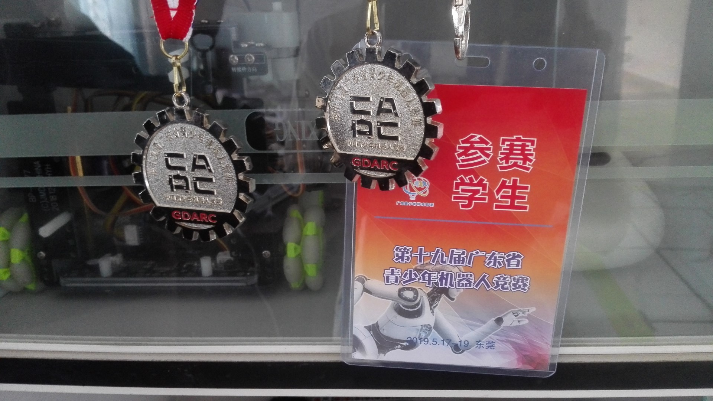
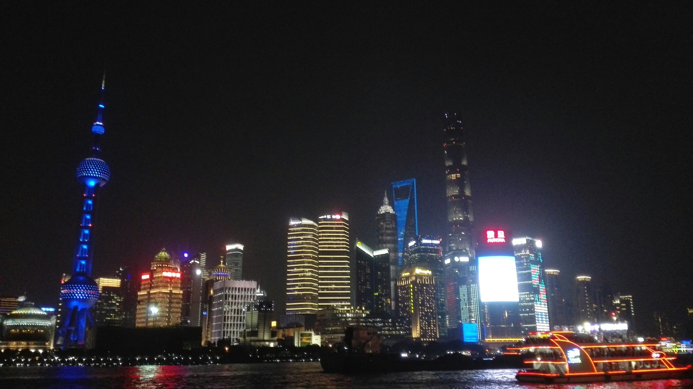
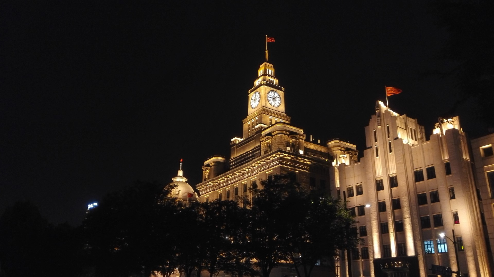
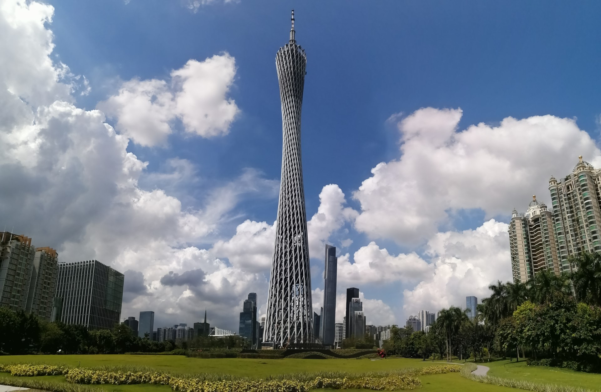
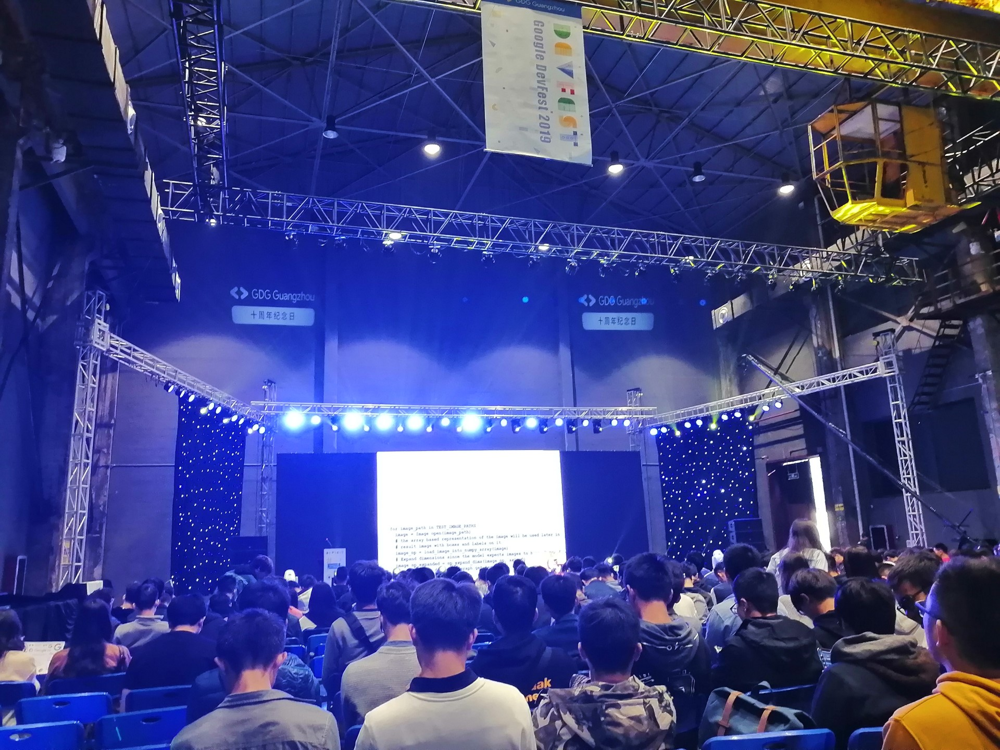
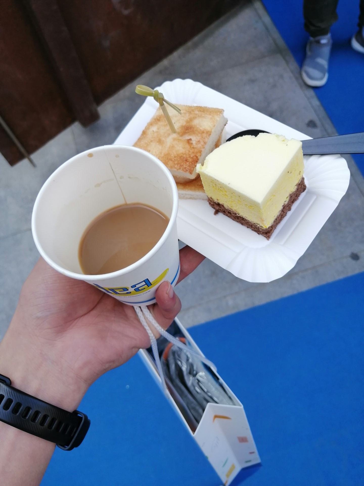

昨天是高考百日誓师呢，没想到一年一下就过了，在这里纪念下我过得最精彩的一年吧！

## 高中生活的最后一百天

19 年的四月份到来时，我参加了市里的机器人的比赛，也是为了弥补上一年的遗憾，没想到 19 年这么顺利，拿了一等奖，晋级了省赛，我和搭档又一次开心的把科技馆逛了一次。

现在想想，当时能和几个同学一起在本该上课的时候跑出来玩，吃着主办方的免费盒饭实在是爽爆了！

省赛被订在了五月中旬，也就是离高考只剩 20 多天的时候。斟酌了一会还是决定去了！

毕竟是和搭档努力换来的省赛！自然的，班主任找了我们俩，但最后也没多说些什么，只是让我们要抓紧学习。但依旧打电话给家长了，好在的是，我也有两位开明的家长！(=v=)b

## 高中生活的最后 20 天

省赛的前一天下午，在大家午睡的时候，有一群人提着大大小小的箱子从各个教学楼走出来，在无人的校道上朝着校门口走去，我和我的搭档就成了当中的两个，也是唯二的高三生。那天按计划是用来周测的，也就是说我们翘掉了一次考试，爽爆了！

我们坐着市教育局的大巴，和其他小学生、初中生、高中生一起去比赛，路上实在无聊又和搭档讨论起了当天的数学题。

酒店超级豪华！还带地毯的！不亏是市教育局！为了壮胆（雾），我还买了一瓶 RIO 鸡尾酒，这成了我第一次住酒店和第一次买酒喝。另外，主办方的学校也很豪华！

比赛分两个时段，上午一场、下午一场，上午场出了些状况，主要是因为两个参数调小了，出师不利！下午场完美通过并拿了全场最高分，可惜比赛是算总分而不是最高分的，我们只能拿了个二等奖

之前听大学舍友说他们在高中宿舍里烧烤喝啤酒时，就感觉自己是不是虚度了高中生活，现在想想，我的青春也不算虚度，我不是翘课出去喝酒了吗？

不知为何，若要我回忆我的高中生活，最多的回忆还是比赛的日子，为什么没有那一百天轰轰烈烈的复习和最后两天的高考呢？我想是相比之下过于压抑了。

总而言之，最后的高考我还是发挥正常的，没上 211 但已经满意了，能够去广州这个大城市同时还能享受到大学城的便利～

## 高中和大学间的暑假

暑假和高中同学组队报名了 19 年的上海的创客马拉松，可实际上我什么也不会，最多当个鼓励师。

那是我第一次坐飞机，到了上海我们三人挤在一个一天 300 ￥的小酒店里，主要还是因为这酒店离机场和外滩近，当晚我们就逛了外滩，看了东方明珠，遇到了好多黑哥哥（个个都两米高）。次日去了上海科技馆，跟我们市的比真的高级了很多。

果不其然，比赛期间我除了 PPT 全程都在摸鱼，比赛结果也是不怎么理想，但最后我们结识了一群大学生的队伍，同时开拓了视野，他们的思想一定程度上的也影响到了我，收获还是蛮多的 233。后来我们一起去逛了田子坊和外滩，次日就坐飞机回来啦～

## 大学初体验

终于来到了大学，能上自己喜欢的课程，享受一线城市的便利实在是幸福，军训结束后没多久就一个人跑出去逛广州城了，第一站就是广州塔～

初到广州也有些不适应，比如物价（幸好在上海有了心理准备），还有每天跟舍管阿姨打招呼，她说"早晨"（粤语），我老是会用客家话回她。还有装作师姐卖笔的骗子（在上海也被骗了）

十二月初的时候，和朋友一起去参加了广州 GDG 举办的 Google DevFest，吃到了好吃的点心，看了不明觉厉的演讲，最后的抽奖还拿了个三等奖，真的是人品爆棚啊 2333

## 最后

于是 2019 年便这么结束了，大学的第一学期也结束了，因为疫情现在还呆在家中，现在希望就是疫情快快过去，让我能早早返校。
