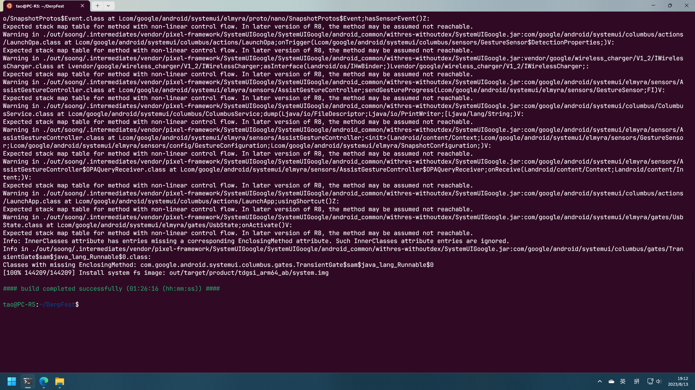
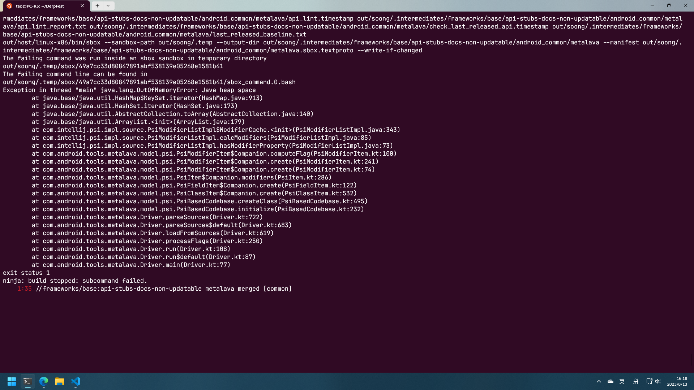

import LinkCard from '/src/components/LinkCard';

## 前言

最近入手了一个平板电脑：酷比魔方掌玩 mini，性价比和可玩性都十分不错，官方还提供 BL 解锁和原厂镜像，可以让我大胆刷机了。我上一次刷机时差不多是十年前了，十年后的现在玩法多了很多，就比如今天的主角——GSI。

### 什么是 GSI

Generic System Image(GSI) 通用系统镜像，是一种通用的 Android 系统镜像。只要你的设备符合以下三点要求，GSI 的大门就会向你打开。

- 已解锁 Bootloader
- 符合 Treble 架构要求
- 设备出厂版本为 Android 9（API 28）或以上

也就是说，现在如果想刷机是不用苦苦等待某个有着一样设备的大佬来作包了，这真是太棒了！

你可以在这里查看并下载到一些 GSI：

[$card](https://github.com/phhusson/treble_experimentations/wiki/Generic-System-Image-%28GSI%29-list)

### 为什么要自己编译 GSI

Github 上已有大量的官方/非官方 GSI，完全可以下载、解压、刷机、双清、开机一气呵成，为什么还要自己编译呢？

这是因为 GSI 仍然不是那么“通用”，我在平板上前前后后刷了 Pixel Experience Plus、EvoluationX、crDroid、Project Elixir 和 DrepFest。一些 Rom 会保留你的设备型号和制造商，一些则会修改为：Google Treble vanilla；一些能正常显示平板的 UI（如分栏的设置界面），一些则不行。

为了解决这些问题，就需要我们自己修改源码和编译了。

## 准备编译

### 理论基础

了解以下知识点：

- 基础的计算机知识
- Linux 操作
- Git 使用

### 硬件需求

- Linux
- 300 GB 以上的硬盘空间
- 10 GB 以上运行内存、swap（越多越好）
- 可以畅连 GitHub 和 Google 的网络环境

也可以使用 WSL2 进行，可在 `%UserProfile%` 下新建一个 .wslconfig 文件，并粘贴以下配置：

```text
[wsl2]
memory=10GB
swap=16GB
```

### 软件需求（以 Ubuntu 22.04.2 为例）

参考：

[$card](https://github.com/phhusson/treble_experimentations/wiki/How-to-build-a-GSI%3F)

#### 安装 Android SDK

下载 platform-tools：

<LinkCard
  title="dl.google.com"
  link="https://dl.google.com/android/repository/platform-tools-latest-linux.zip"
  description="Latest platform-tools for linux"
/>

解压：

```shell
unzip platform-tools-latest-linux.zip -d ~
```

编辑 `~/.profile`

```shell
# 将 Android SDK platform tools 添加到 PATH
if [ -d "$HOME/platform-tools" ] ; then
    PATH="$HOME/platform-tools:$PATH"
fi
```

#### 安装依赖

直接执行：

```shell
sudo apt update
sudo apt install bc bison ccache build-essential curl flex g++-multilib gcc-multilib git gnupg gperf libxml2 lib32z1-dev liblz4-tool libncurses5-dev libsdl1.2-dev libwxgtk3.0-gtk3-dev imagemagick git lunzip lzop schedtool squashfs-tools xsltproc zip zlib1g-dev openjdk-8-jdk python2 perl  xmlstarlet virtualenv xz-utils rr jq libncurses5 pngcrush lib32ncurses-dev git-lfs libxml2 openjdk-11-jdk-headless
```

#### 安装 repo

直接执行：

```shell
mkdir -p ~/bin
curl https://storage.googleapis.com/git-repo-downloads/repo > ~/bin/repo
chmod a+x ~/bin/repo
```

查看 `~/.profile` 是否包含 `~/bin` 目录，若没有，添加以下代码

```shell
# 将用户 bin 添加到 PATH
if [ -d "$HOME/bin" ] ; then
    PATH="$HOME/bin:$PATH"
fi
```

#### 别忘了 source 一下

```shell
source ~/.profile
```

#### 配置 Git

配置你的 Git 信息

```shell
git config --global user.name "your username"
git config --global user.email yourmail@example.com
```

#### 配置缓存

配置缓存，如果你只打一个包的话，25~50GB 就够了。

```shell
export USE_CCACHE=1
export CCACHE_COMPRESS=1
export CCACHE_MAXSIZE=50G # 50 GB
```

### 拉取代码

一些 GSI 提供了十分便捷的打包脚本，可以一键拉代码、打 patch、编译，但是这里还是一步步的介绍一下，参考：

[$card](https://github.com/ponces/treble_build_evo/blob/tiramisu/build.sh)

#### 初始化 repo 仓库

这里以 DerpFest 为例，首先需要新建一个目录用于放置我们的全部源码。

```shell
mkdir DerpFest
cd DerpFest
```

随后初始化 repo：

```shell
repo init -u https://github.com/DerpFest-AOSP/manifest.git -b 13
```

执行完后，目录下会生成一个 .repo 文件夹。如果你是第一次接触 repo 的话，它是用于管理多个 git 仓库的，manifest 相当于是 repo 的“配置仓库”，用于定义一个 repo 有哪些 git 仓库以及它们的远程地址和本地路径等。

#### 拉取 GSI 仓库

```shell
git clone https://github.com/KoysX/treble_DerpFest_GSI.git
```

由于 GSI 一般是第三方开发者维护的且为了避免影响正常的系统源码，因此 GSI 部分源码都是放置在独立的一个仓库，通过打 patch 的方式来进行合并。仓库内还有一个 manifest.xml 文件，需要拷贝至 `.repo/local_manifests` 来让 repo 拉取 treble 部分的代码。

```shell
mkdir -p .repo/local_manifests
cp treble_DerpFest_GSI/manifest.xml .repo/local_manifests/derp.xml
```

#### 同步仓库

拉取源码：

```shell
repo sync -c --force-sync --optimized-fetch --no-tags --no-clone-bundle --prune -j$(nproc --all)
```

这一步大概会下载 60GB 的文件并用掉 100GB 左右的硬盘空间，在你等待之余不妨起来活动一下。

## 源码和配置

仓库同步完后，赶紧来看一看这 100GB 的大宝贝！仓库下的结构应该和下面的类似：

```txt
DerpFest
├── .repo
│   ├── ...
│   ├── local_manifests
│   │    └── derp.xml    # 由下方的 manifest.xml 复制而来
│   └── manifest.xml
├── ...
├── device
│   ├── ...
│   └── phh
│       └── terble
│           ├── ...
│           ├── derp.mk    # 由下方的 derp.mk 复制而来
│           └── generate.sh
├── vendor
│   ├── ...
│   └── derp
│       └── config
│            └── *.mk
├── treble_app
└── treble_DerpFest_GSI
    ├── patches
    │    ├── misc
    │    ├── pre
    │    └── trebledroid
    ├── apply-patches.sh
    ├── manifest.xml
    └── derp.mk
```

一些我觉得比较有用的配置文件在上面标出来了，省略号部分以后再来探索吧，对于走完打包流程和修改设备信息，修改这些配置文件就足够了。

将 `treble_DerpFest_GSI/derp.mk` 复制到 `device/phh/treble`，并切换到该目录下：

```shell
cp treble_DerpFest_GSI/derp.mk device/phh/treble/derp.mk
cd device/phh/treble
```

### 适配设备尺寸

查看 derp.mk 文件：

```makefile
$(call inherit-product, vendor/derp/config/common_full_phone.mk)
$(call inherit-product, vendor/derp/config/common.mk)
$(call inherit-product, vendor/derp/config/BoardConfigDerpFest.mk)
$(call inherit-product, vendor/derp/config/BoardConfigSoong.mk)
$(call inherit-product, device/derp/sepolicy/common/sepolicy.mk)
-include vendor/derp/build/core/config.mk

TARGET_HAS_FUSEBLK_SEPOLICY_ON_VENDOR := true
TARGET_USES_PREBUILT_VENDOR_SEPOLICY := true
SELINUX_IGNORE_NEVERALLOWS := true
#BOARD_EXT4_SHARE_DUP_BLOCKS := true
BUILD_BROKEN_DUP_RULES := true

TARGET_NO_KERNEL_OVERRIDE := true
TARGET_NO_KERNEL_IMAGE := true

TARGET_FACE_UNLOCK_SUPPORTED := true
TARGET_BOOT_ANIMATION_RES := 1080
EXTRA_UDFPS_ANIMATIONS := true
USE_LEGACY_BOOTANIMATION := false

#PRODUCT_PACKAGES += \
#      OnePlusCameraHelper

PRODUCT_SYSTEM_DEFAULT_PROPERTIES += \
    ro.system.ota.json_url=https://raw.githubusercontent.com/KoysX/treble_DerpFest_GSI/13/ota.json
```

第一行导入了 `vendor/derp/config/` 中的 `common_full_phone.mk`，查看该目录下我们会发现大量的 makefile 文件，除了 `common_full_phone.mk` 还有 `common_full_tablet.mk` 和 `common_mini_tablet.mk` 等。可以根据需要将其替换成对应的 makefile，便可将设备的 UI 适配成合适的尺寸了。不过一些 GSI 可能会自动适应，并不需要这么做。

### 修改设备制造商和设备名

同一目录下还有一个叫 `generate.sh` 的文件，查看它，我们会发现在接近 90 行左右的地方有以下代码：

```makefile
PRODUCT_NAME := $target
PRODUCT_DEVICE := tdgsi_${arch}_$part
PRODUCT_BRAND := google
PRODUCT_SYSTEM_BRAND := google
PRODUCT_MODEL := TrebleDroid $apps_name
```

这里定义了设备名和设备生产商，我们可以在这里修改为自己设备的原信息，比如我要修改为：ALLDOCUBE zhangwanmini，那么可修改为：

```makefile
PRODUCT_NAME := $target
PRODUCT_DEVICE := tdgsi_${arch}_$part
PRODUCT_BRAND := ALLDOCUBE
PRODUCT_SYSTEM_BRAND := ALLDOCUBE
PRODUCT_MODEL := zhangwanmini
```

### 生成 makefile 文件

最后执行该脚本生成 makefile 文件：

```shell
bash generate.sh derp
```

### 打 Patch

切换回仓库根目录，执行 `treble_DerpFest_GSI/apply-patches.sh` 以打上对应的 patch：

```shell
cd ../../../
bash ./treble_DerpFest_GSI/apply-patches.sh ~/DerpFest/treble_DerpFest_GSI trebledroid
bash ./treble_DerpFest_GSI/apply-patches.sh ~/DerpFest/treble_DerpFest_GSI misc
bash ./treble_DerpFest_GSI/apply-patches.sh ~/DerpFest/treble_DerpFest_GSI pre
```

即可将 `treble_DerpFest_GSI/patches` 下对应的 patches 都合并到源码中。

## 开始打包

终于到了最后的打包步骤了，不过在每次打包前还要再配置下：

```shell
source build/envsetup.sh
export _JAVA_OPTIONS="-Xmx4g" # 可选，修改 JAVA 可用内存，防止爆堆
lunch treble_arm64_bvN-userdebug
```

打包：

```shell
make -j$(nproc --all) systemimage
```

如果你有一个 CPU，且 CPU 有 6 个核心，每个核心有 2 个线程，那么上方的命令将会允许 12 个任务同步进行，如果你的内存不是很大，那么你应该把 `-j` 的值调小些。

打包成功后，即可在提示的目录下找到系统镜像~



## 疑难杂症



编译时的 metalava 过程会吃掉大量内存，稍有不慎就会爆堆，且由于其一般都在 95% 左右时进行，经常打包打了一个小时后报错，让人血压拉满，可以尝试一下 XDA 论坛上的[这个办法](https://forum.xda-developers.com/t/guide-how-to-build-android-11-with-low-ram.4298483/#post-86771209)。
