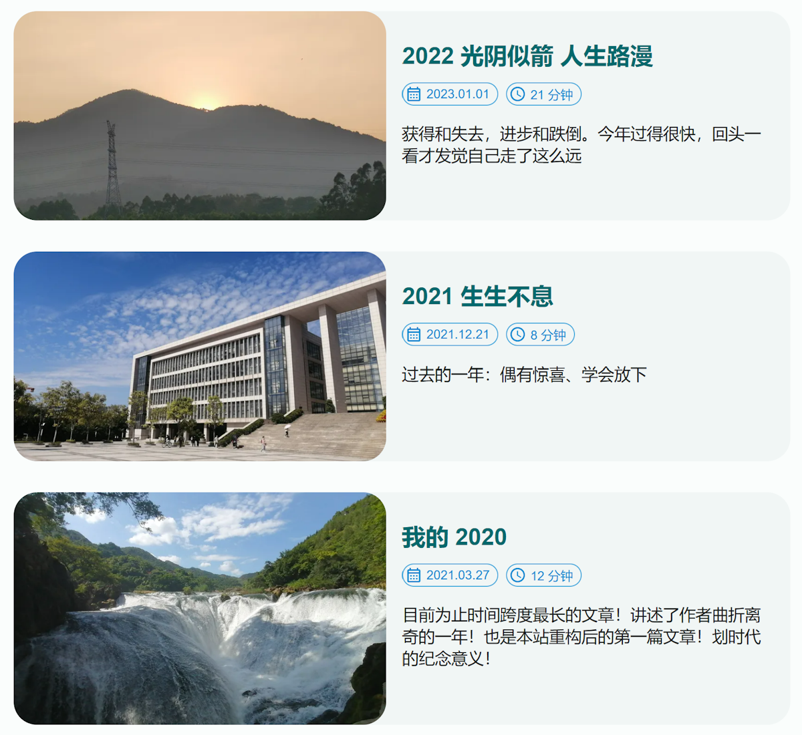

毕业出来已经工作几个月了，每次在工位上听到大学时常听的歌总会想起当时的事和当时的心境，越发觉得该找个时间记录下我四年的光景和心路历程。

## 大一

2019 年 8 月 25 日，我正式成为了一个大学生，压线录取进了广州大学的网络工程专业。在这之前我从未接触过代码编程，仅仅是因为对计算机感兴趣而选择了这个专业。而作为一个县城长大的“乡下人”，对大城市天然抱有着憧憬，当父亲的车开到琶洲大桥，我得以看到远处货真价实的广州塔时，内心很是激动：精彩又未知的大学生活就在眼前了。

我想每一个中国大学新生对大学的第一印象就是自由，你可以光明正大地把手机放在课桌上听课（也可以不听课），你可以在寝室里玩电脑玩得天昏地暗，也可以放学后到处撒野只要第二天能来上课就好（其实也可以不来上课）。当大一的我骑着单车赶去上早上第一节的高数课时，我的肺里满是自由的空气，眼里全是明亮的晨光，这就是我刚进入大学的感受。

我逐渐和舍友熟悉起来，找到了玩游戏和看动漫的同好，一起熬夜打游戏、一起看电影、一起逛了广州塔、沙面岛、上下九······还加入了学院的团委学生会和红十字会，期盼着社团活动能进一步丰富我的大学生活，并且也确实做了一些工作，为网页设计大赛而摆摊宣传、布置比赛会场，拜访了养老院、组织了一场志愿活动。

就这样子，我大学的第一个学期就这样结束了。当我享受着没有作业的寒假时，新冠肺炎来了！在那时看来，我绝对想象不到它会这样深刻而长久的影响着我的生活。

开学前学校便通知我们要居家上课了，我从未如此地渴望返校！但是延迟返校的通知一个接一个地到来，我也只好在家中“享受”我的大学生活了。为了填补我的空闲时间，我开始实现我的大学目标——拥有一个自己的网站！由于大一学的还都是理论课居多，和编程相关的也仅仅只有 C++ 而已，因此我只好自学 Web 开发，我从 IIS 的默认网页开始了解到了 HTML、CSS、JS，便边学边写搞出了一个就像是 Windows 画板画出来的网页。也是在那时我开始折腾校园网路由器，以此了解到了 Openwrt 和 Linux 相关的技术。我疯狂的学习这些知识，甚至把上课的时间也用来学习这些，毕竟网课挂在那里就好了，这也导致我那个学期的成绩巨差！（但还不到挂科的地步）

由于返校时间一拖再拖，直到最后考试复习了，我才决定把课本寄到家里来，每次看到这些几乎没被使用过的课本时我都觉得很对不起它们，但是没办法，毕竟我也是受害者的一员。

## 大二

大二开学时，我终于如愿返校了，在体验到编程的乐趣后，我迫不及待地的想要一展身手。由于大一下没有机会开展部门活动，我和另外两位同学成了少数组织过志愿活动的部委。当部长问我是否考虑留部时，我宛然拒绝了，毕竟那时我的心早已飞到代码和编程上了，现在想想若当时我同意了人脉可能会比现在拓宽很多，~~甚至有女朋友了也说不定~~。

但终究我还是一心投入到了编程上，我对技术的选择都是偏向最终能看得到摸得着的，因此前端和嵌入式是我当时最感兴趣的两个方向，暑假买的树莓派成了我在这段时间最称手的玩具。Web 开发、路由器 Openwrt、树莓派嵌入式，成了我当时投入时间最多的项目。接近学期末时，我还和舍友一起组队参加了网页设计大赛，这次比赛也使我意识到：我的技术水平可能已经领先身边的大多数人了。最终比赛获得了三等奖，奖品是一个得力的小台灯。

这之后我开始在学校寻找和我一样对技术抱有着热情的同好，我在学校的 GitLab 上发现了一个学生组建的技术社团组织，我通过学校的企业微信联系了其中的成员，可惜并未收到回复。之后通过舍长又了解到学校在组织学生为图书馆开发一个新的系统，便加入了进去，可惜最后项目也泡汤了。在这段时间我的感受就是孤独，又或是怀才不遇？因为没有可以沟通技术的伙伴，没有一展身手的舞台，便这样结束了大二的第一个学期。

但这些付出并非毫无作用，在大二的下学期，通过图书馆项目我还是认识到了一帮创业的师兄师姐，终于有机会可以和他们一起做项目、聊技术了。这段时间我的技术水平又得到了一个阶段的成长，也确定了前端为我的主要方向。且之前因为闲得慌，又加入了大物老师的一个课题项目、和选了一个公认极难的课程——嵌入式，加上当时紧张的课程安排，让我的这学期基本完全围绕着这三件事转，十分忙碌，以致最后只好放弃了课题项目。

## 大三

大三的上学期我基本就是在上课和做兼职项目中渡过的，空闲时间捣鼓捣鼓自己的博客，2021 年可以说是我最忙的一年，不是因为事情多，而是因为事情难而复杂，这一年的年度总结也成了我三年里最短的一篇。

随着 2021 年的结束，大三上学期也要结束了，这时发生了一件重要的事：可能是由于长期的操劳过渡，我被诊段出了房性早搏，差点就去动手术了。好在大三下学期，课程数量明显减少，我也就有机会好好休息，身体自然也恢复了不少。在有充足休息时间的前提下，其余时间我基本上就是在玩和找实习中渡过的，然而实习没找到，游戏和项目倒是玩了不少。

## 大四

到了大四上学期，我开始准备秋招了，有了一点面试经验的我，原以为能在这激烈的战场中杀出一条路出来，怎想我还是连一份 offer 都没收到······这对我的打击很大，让我不断放低着自身预期的同时也使我考虑着其他出路，比如考研。那时虽然没什么事做，但每天都过得很是焦虑，找不到方向不知道该往哪里出力，不知道明天是怎样，又觉得自己在虚度光阴。

元旦封控时在家写了 2022 年的总结，突然发觉过去一年还是有开心的时刻，终于决心放下求职的不快，先专注眼前的事——毕业设计。我对毕业设计有着很大的仪式感，什么样的作品才能作为自己大学四年的华丽答卷？这是我首要考虑的。为了实现我的想法，我选择了自主命题，并在寒假就开始写毕设项目了。

到了大学最后一个学期开学时，我的项目已经写好，毕业设计只剩论文了。剩下的大量时间，我用来春招求职和面试。但即便防控已经放开，即便我已不再害怕面试，春招的难度还是比之前来得更高，直到五月底我才收到了第一份 offer。寒冬已经过去，此刻正是春暖花开之时，但就像外出打拼的父亲意识不到孩子的长大一样，我也意识不到自己即将毕业了。当我重新将目光聚焦到自己身上时才发觉原来我已经不再是个学生了。

## 最后（写于 2024 年 6 月 12 日）

我的大学短暂而不完美，但我仍然过得十分快乐。上大学时经常会做关于高中的梦，无一例外都是有作业漏做之类的，压抑且窒息，毕业工作后这些梦才开始渐渐被大学的梦的所替代，而关于大学的梦却总是五光十色的：有趣的事和可爱的人。诚然我的高中也有快乐的回忆，但既然梦是人潜意识的体现的话，那我的内心深处看来还是很偏爱大学时光的。

这篇文章写好后我迟迟未放上博客，总想着还能再补充些什么，就一直拖到了现在，最后什么也没补充······

“子在川上曰：逝者如斯夫！不舍昼夜。”

时间确实就像川流一般。它冲洗着记忆的鹅卵石，只留下闪闪反光的回忆。
