去年约朋友一起去香港玩没去成（他到了深圳才发现没带通行证）。月初的时候另一位朋友也打算去香港玩，于是我们便一拍即合地出发了。

广东整个四月都是雷雨天，因此那天的香港也是阴沉沉的，不过好在没有一直下雨。我一天的行程大概是这样：深圳湾口岸 → 天水围 → 西九龙 → 尖沙咀 → 星光大道 → 中环 → 太平山 → 摩天轮 → 天星小轮 → 尖沙咀 → 西九龙 → 天水围 → 深圳湾口岸。

## 准备

最重要的港澳通行证不能少！港币最好也准备几百块，虽然很多地方已经支持扫码和刷卡，但一些关键的场所还是只支持现金和八达通（比如饭店）。此外由于内地电话漫游到香港也还是有墙的，因此最好也准备一张电话卡。

## 过关&会合

离我最近的关口是深圳湾口岸，因此选择从那过关，深圳很多公交线路都能到这里，未来还会有深铁 13 号线，还是蛮方便的。在口岸能看到很多香港人来深圳，双向奔赴了 😂。朋友坐高铁因此我们先去西九龙（柯士甸）站会合。

过了关周围的环境就感觉不同了。是繁体字！

下个目的地是天水围站，根据指引去到 B2P 的站牌，大巴支持刷支付宝和微信。

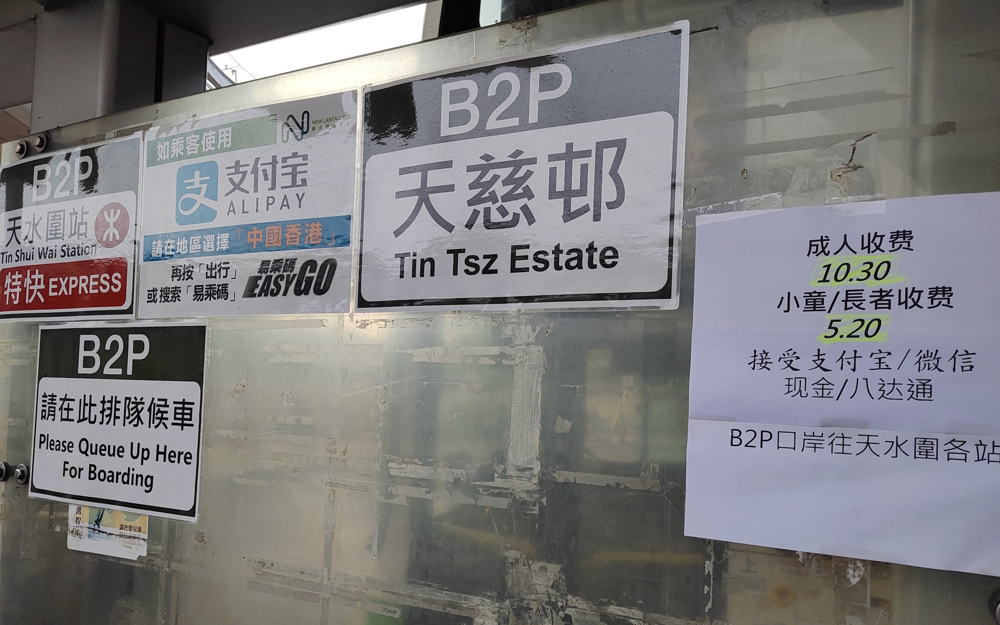

过了深圳湾大桥就是香港了。

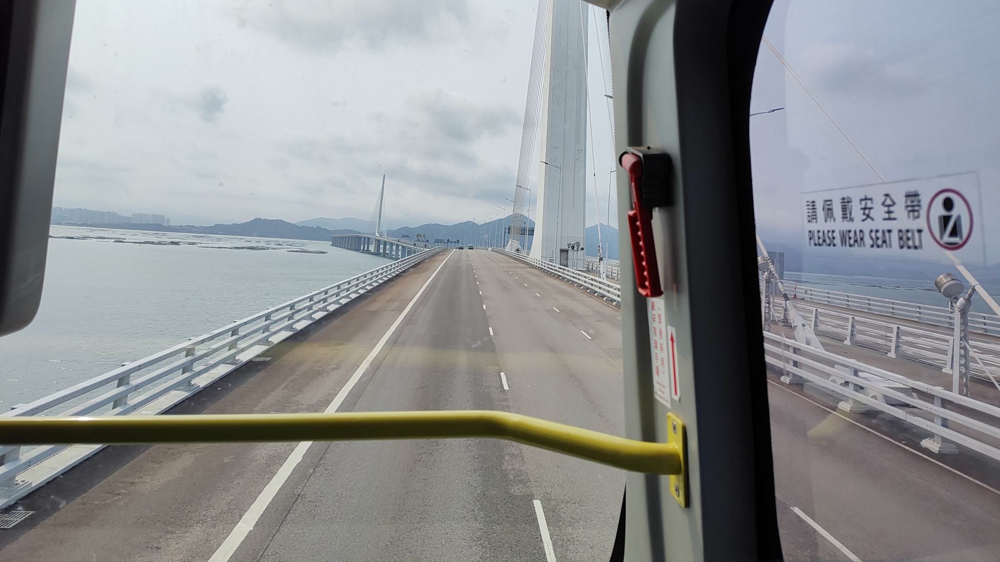

到了天水围，先去客服中心给八达通充了 200 块，客服中心只收现金。过闸机的时候总感觉少了些啥，原来是少了安检！半小时就坐到柯士甸站和友人会合了。

## 开始走爆

第一次“出门”，身边是平时不常见的建筑风格和语言文字，还是有些小激动的。虽然在广州读了四年书，但我还是一口塑料粤语不敢说出口，因此全程都在讲普通话，其实也是 OK 的。

### 买药

和友人会合后先去万宁扫货！我买了一些常用药，像是黄道益、虎标这些，听说要买头疼的药油，店员还推荐了我这个薄荷<ruby>薑<rp>(</rp><rt>jiāng</rt><rp>)</rp></ruby>油。

[$card](https://www.mannings.com.hk/gandd-mint-and-ginger-herbal-oil-10ml/p/791384?lang=zh_TW)

作为一个经常头疼的人，风油精真的是常备品，这个不但设计方便还挺好闻的，很是实用（不是在打广告 😇）。

### 星光大道

买完药吃完饭我们就去逛星光大道了，这里算是必经之地了！对面望过去便是港岛了。

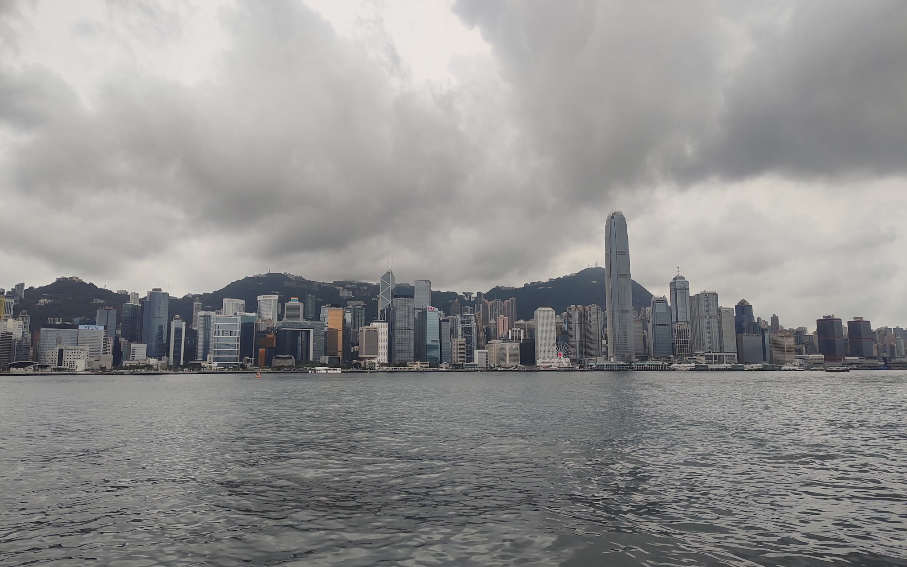

### 中环

来到对岸的香港岛，中环是最繁华的地方之一，刚好去的那天是周日，有很多菲律宾人在街头摆摊、跳舞和聊天，很有氛围。

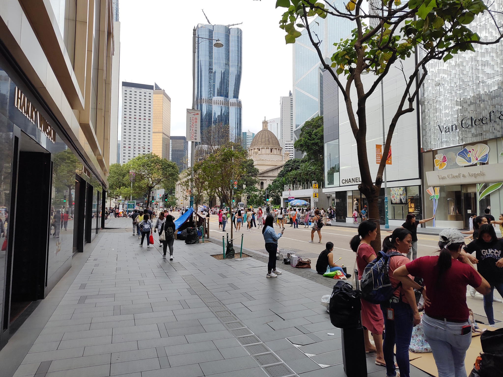

叮叮车，可惜没能坐成。

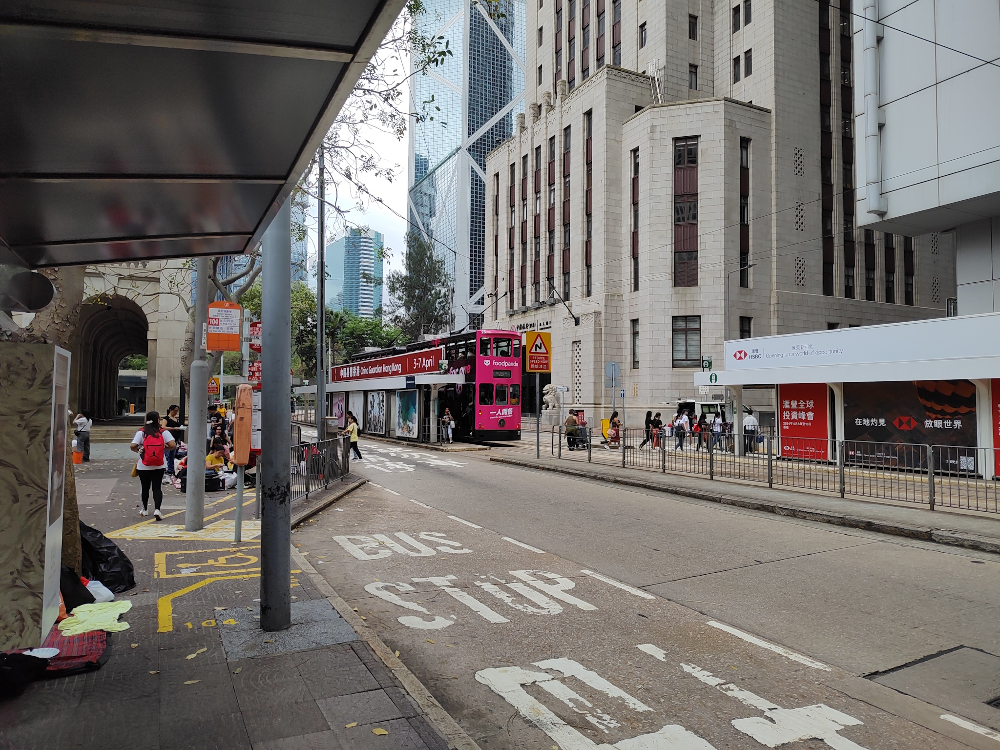

中银大厦。

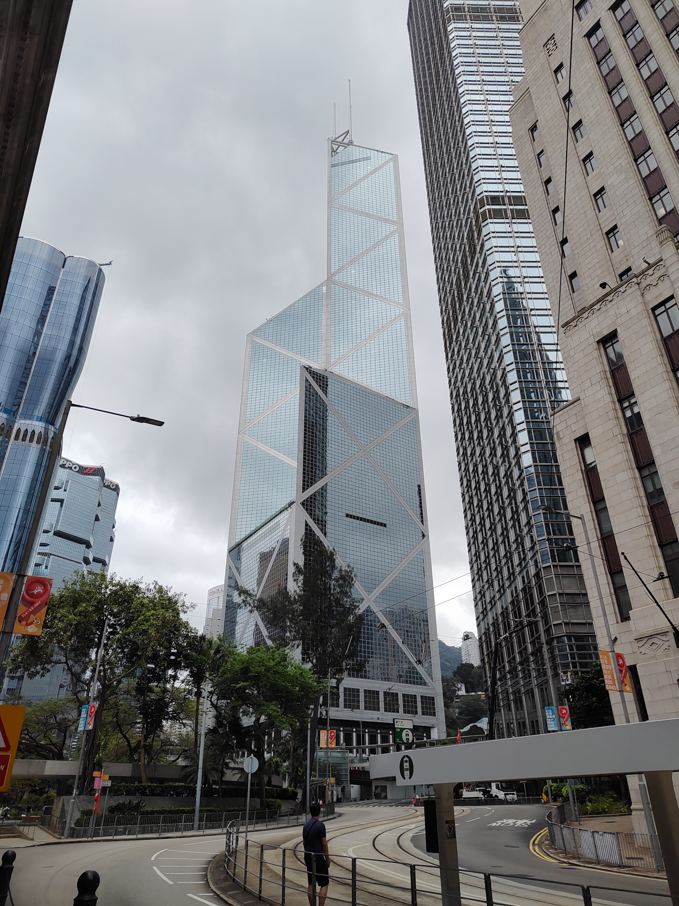

### 太平山

我们就这样一路走到了太平山下坐缆车。缆车上山要 $76，下山只要 $32，腿脚利索的可以爬上去在坐缆车下来，我们就不了，还要节省时间和精力逛别的地方！

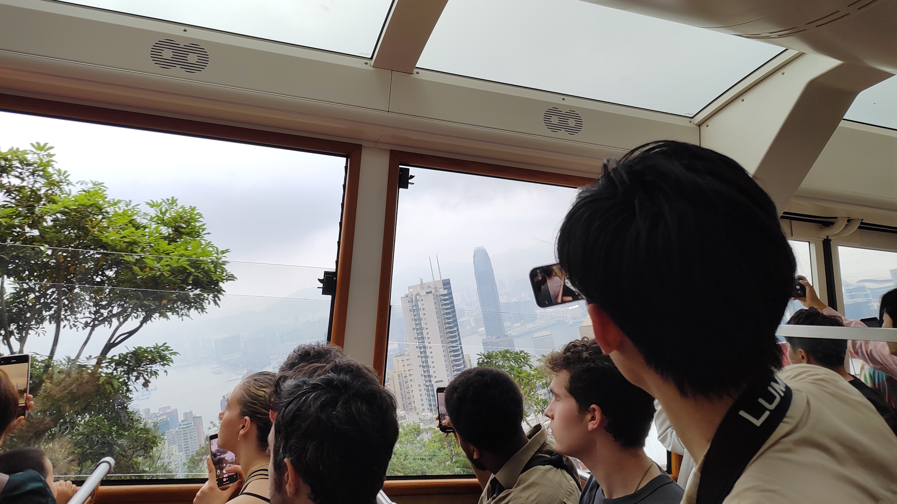

到了山顶已经开始下了些小雨，还在打雷🥲

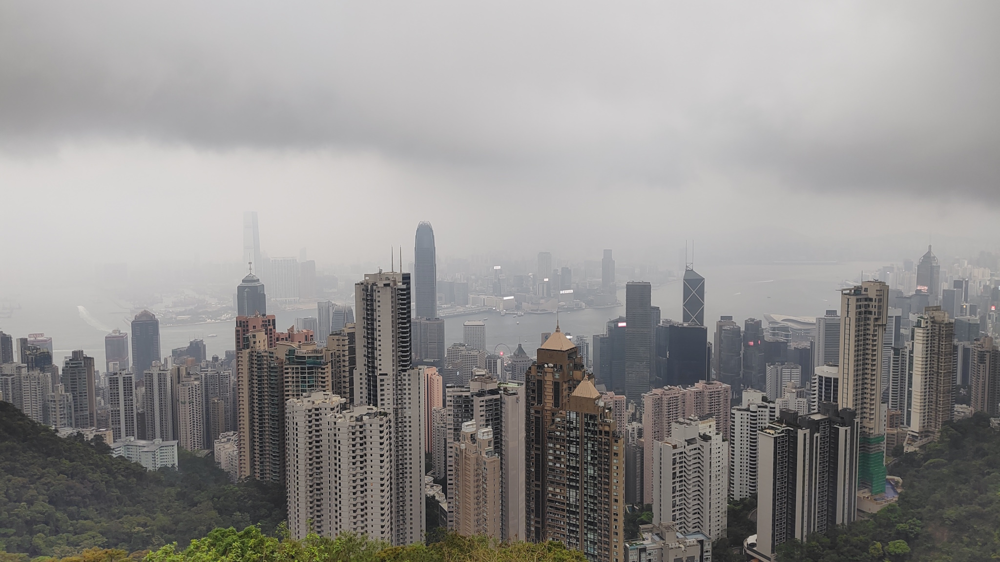

### 摩天轮

下山后就直奔摩天轮！

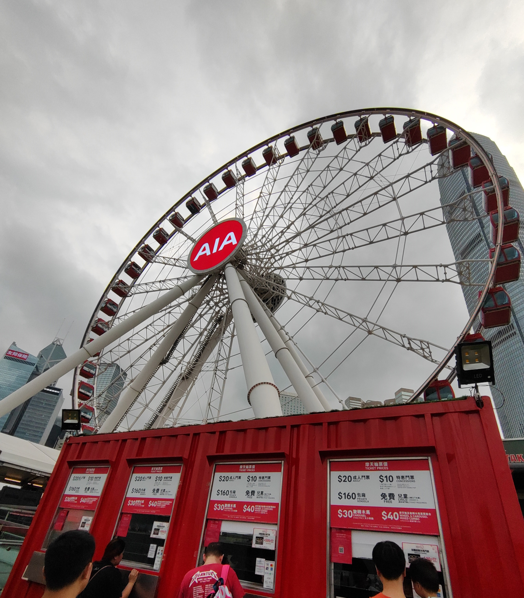

票价很实惠，因此排队的人也超多！我们排了差不多 20 分钟才坐上。

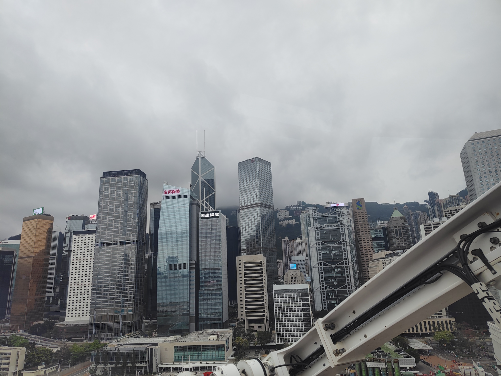

香港的高楼真的很是密集！

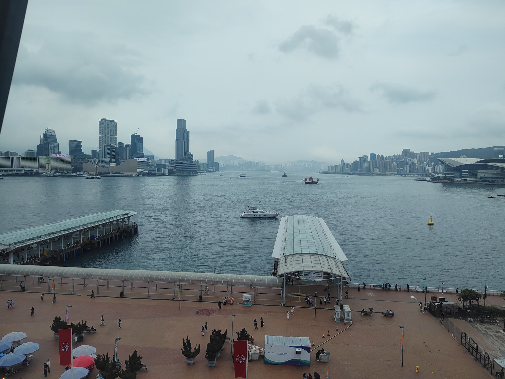

最后我们坐天星小轮回到尖沙咀（渡轮比港铁便宜好多！），又步行回到柯士甸，一天就这样走了两万多步。

## 回到深圳&回顾

回到深圳已是九点多了，一天的旅行就这样结束了！😌

在香港的这一天时间里，似乎一切东西都缩小了：建筑物的距离、人与人的距离（物理），仿佛光靠走就能去到很多地方！深圳经常见到的八车道，在香港基本不可能见到，但香港就是在这样有限的地方创造出了大量的财富。

总体而言这次的旅程还是很开心的，旅行的意义或许就在于将自己从熟悉且枯燥的环境中剥离出来，去重新感受时间和空间的尺度吧。未来还有很多地方想去，希望世界和平！🙏🕊️
