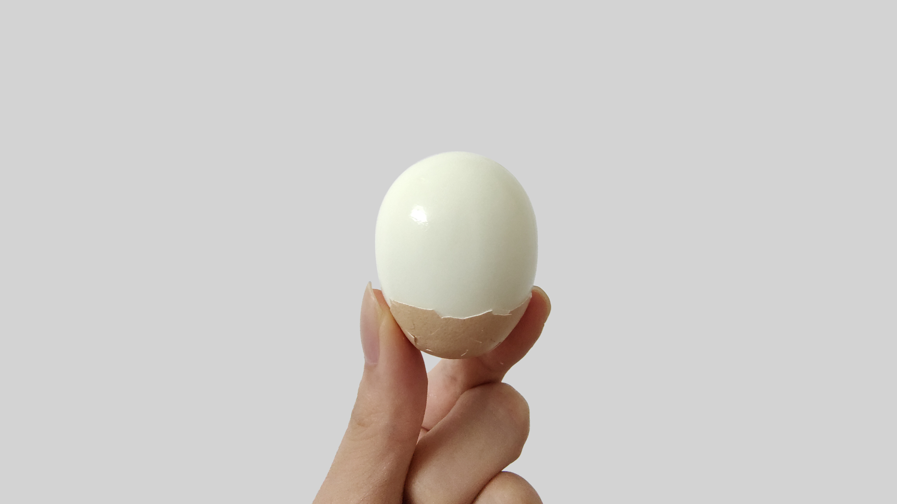

## 写在前面

最近买了个小冰箱，便从家里带了一排鸡蛋回来，平时煮两颗，当早餐和宵夜吃。但是每次剥壳都很难剥——蛋白会和壳膜黏在一起，剥完之后整个蛋都坑坑洼洼的，浪费了不少。根据网上的说法尝试了几次后学会了如何煮出一颗完美的水煮蛋！于是记录一下。

## 煮前的准备

把鸡蛋从冰箱拿出来后用清水洗干净，放置一段时间，让鸡蛋的温度变得和室温一样，防止下锅时因为温差太大导致蛋壳破裂，网上也有说法是常温下可以让鸡蛋排出水分。

我一般会在前一天晚上放出来，第二天早上再煮。

## 正式开煮

我是用电热水壶煮的，方便控温。

1. 装一些足够淹没鸡蛋的水，把水烧开后，关掉电源。（不能一直让水沸腾，否则鸡蛋上下跳动很容易裂开！）

2. 把鸡蛋用勺子缓慢放入水中。（切勿直接投入，不然鸡蛋很可能会裂开！）

3. 把水温定在 85℃ 。看个人喜好，更低的温度能煮出溏心蛋。

4. 等十分钟，鸡蛋就煮好了，准备一碗凉水，把鸡蛋捞出后放进去。

## 剥壳的方式

将鸡蛋较大的那头敲碎，然后用手把蛋壳的剩余地方都搓碎，一样从较大的那头开始剥开就好，不出意外的话，蛋壳应该会连着薄膜一起剥落，就能得到一个完美的水煮蛋了。

