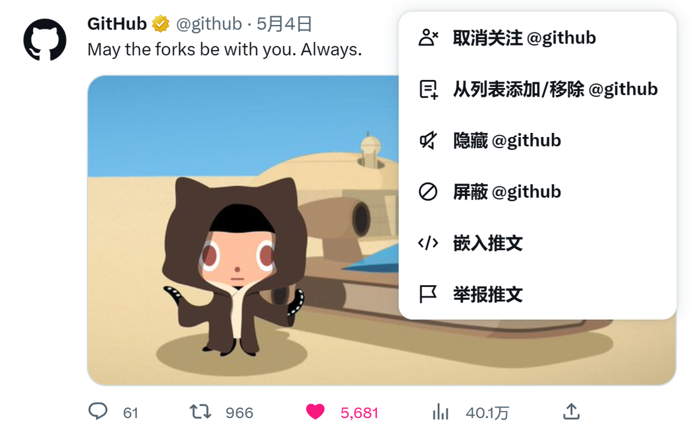

import Tweet from '/src/components/Tweet';

最近发现了一个开源库：react-tweet，由 Vercel Labs 开发。可部署为 Serveless 函数、为网页嵌入推特推文卡片、支持夜间模式、还使用了 SWR 和 React Server Components 在内的新技术，这实在是太酷啦！我整整把玩了一天！

[$card](https://github.com/vercel-labs/react-tweet/)

Vercel 使用 Next.js 搭建的 Demo，很好的展示了其所有特性，可以去体验下：

[$card](https://static-tweet.vercel.app/)

## 传统方法与其弊端

将推特推文嵌入网页不是什么新鲜事，如下图，只要点一下“嵌入推文”就能拿到一串“神秘代码”，把代码粘贴在想要的地方就可以了。



这种方式自然有其弊端：

首先，代码是需要从 platform.twitter.com 加载 JS 脚本的，虽然在海外访问推特的服务器非常迅速，但在内地因为众所周知的原因这段脚本是加载不出来的，因此嵌入的推文会一直是默认 blockquote 的样子。

其次，嵌入的卡片样式一直是默认的白色背景，这在网页切换为夜间模式时十分不协调。

最后，每嵌入一个推文都要粘贴不少的代码在文章或程序中，不够简洁。

## 如何使用 react-tweet

### 前端

在 react-tweet 的仓库中已经放了 Next.js、Vite 和 Create React App 的使用方法，可以去看看。

基本用法：

```jsx
import { Tweet } from 'react-tweet'

export const IndexPage = () => <Tweet id="1628832338187636740" />
```

只需要传递一个推文 ID 即可。

在 SSR 框架下可能会遇到 React 的水合报错，可以自行封装一个组件做类似处理：

```jsx
import React from 'react';
import {Tweet as ReactTweet, TweetSkeleton} from 'react-tweet';

export default function Tweet({id = ''}) {
  const [mounted, setMounted] = React.useState(false);

  React.useEffect(()=>{
    setMounted(true);
  }, []);

  return mounted ? (
    <ReactTweet id={id} />
  ) : (
    <TweetSkeleton />
  );
}
```

### 在 Gatsby 下使用的方法

我在 Gatsby 中使用时出了问题，控制台输出了一堆 CSS 样式导入的问题，幸好在这篇 issue 中开发者已经给出了解决办法。

[$card](https://github.com/vercel-labs/react-tweet/issues/45)

需要在 gatsby-node.js 下修改 Webpack 配置：

```js
export const onCreateWebpackConfig = ({
  actions,
  getConfig,
}) => {
  const config = getConfig();

  config.module.rules.forEach((rule) => {
    rule.oneOf?.forEach((rule) => {
      rule.use?.forEach((plugin) => {
        // 我将原代码中的"/"删掉了，因为 Windows 的路径使用的是"\"，会无法匹配
        if (
          plugin.loader.includes('css-loader') ||
          plugin.loader.includes('mini-css-extract-plugin')
        ) {
          if (plugin.options.modules?.namedExport) {
            plugin.options.modules.namedExport = false;
          }
        }
      });
    });
  });
  actions.replaceWebpackConfig(config);
};
```

以及还需要在 gatsby-browser.js 中手动导入 theme.css:

```js
import 'react-tweet/theme.css';
```

做完这些工作，react-tweet 才算能在 Gatsby 中使用，但仅限 SWR 下。根据该 issue 所说，在开启了 PARTIAL_HYDRATION 后 Gatsby 报错了（Gatsby 开启该选项后会使用 React Server Components），由于我并不使用该特性就不继续处理这个问题了（毕竟开发者都没有找到解决办法，最后甚至将整个 Gatsby 示例给删掉了😕）

### Serverless 函数

根据文档所说：

> 若 Tweet 组件的使用环境不支持 React Server Components，它将使用 SWR 作为代替，且推文数据会向跨域友好的 `https://react-tweet.vercel.app/api/tweet/:id` 获取。

同样因为众所周知的原因 Vercel 在内地也是无法访问的，为此可以选择自行部署一个 Vercel Function 并使用自己的域名进行访问，开发者也给出了示例代码，你可以在 [apps/vite-app/api/tweet/](https://github.com/vercel-labs/react-tweet/blob/main/apps/vite-app/api/tweet/%5Btweet%5D.ts) 找到。

我的博客是部署在 Netlify 上的，因此实现一个 Netlify Function 会是更好的选择，我的实现如下：

```ts
import {
  Handler,
  HandlerEvent,
  HandlerContext,
  HandlerResponse,
} from "@netlify/functions";
import { getTweet } from "react-tweet/api";

// 配置跨域，方便本地开发
const headers: HandlerResponse["headers"] = {
  "Access-Control-Allow-Origin": "http://localhost:8000",
};

export const handler: Handler = async (
  event: HandlerEvent,
  _context: HandlerContext
) => {
  const tweetId = event.path.split("/").pop();

  console.log({ tweetId });

  if (event.httpMethod !== "GET" || typeof tweetId !== "string") {
    return {
      headers,
      statusCode: 400,
      body: JSON.stringify({ error: "Bad Request." }),
    };
  }

  try {
    const tweet = await getTweet(tweetId);

    return {
      headers,
      statusCode: tweet ? 200 : 404,
      body: JSON.stringify({ data: tweet ?? null }),
    };
  } catch (error) {
    console.error(error);
    return {
      headers,
      statusCode: 400,
      body: JSON.stringify({ error: error.message ?? "Bad request." }),
    };
  }
};
```

我在 yarn berry 的 pnp 模式下使用 Netlify Cli 有点问题，因此单独建了一个仓库用于放置 Function 的代码以便单独打包后再部署。

[$card](https://github.com/Talaxy009/react-tweet-netlify)

此外，因为 react-tweet 用到了 Fetch API 因此需要使用 Node.js 18 才能运行，所以在部署前还要将 Netlify 的环境变量 `AWS_LAMBDA_JS_RUNTIME` 设为 `nodejs18.x`。

如果想让访问的 URL 更简洁，还可添加一条配置到 _redirects 中，这样一来直接请求 `/api/tweet/:id` 就可以了。

```txt
/api/*  /.netlify/functions/:splat  200
```

最后修改一下之前包装的组件，`siteUrl` 是站点的首页地址，为了方便本地调试因此没有使用绝对路径。

```diff
- <ReactTweet id={id} />
+ <ReactTweet apiUrl={`${siteUrl}/api/tweet/${id}`} />
```

大功告成！🎉

## 后记

关于 React Server Components 部分的特性没能体验到，比较可惜，但这也是我第一次体验 Serverless Functions 也是蛮有趣的。

最后嵌入一条可爱的二次元纸片人推文：

<Tweet id="1653937781549461504" />
