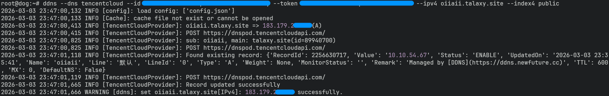
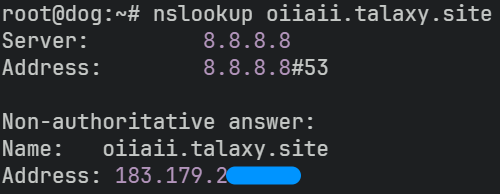

## 写在前面

DDNS 不等于内网穿透。

DNS（Domain Name System，域名系统）是互联网的基础设施之一，用于将方便好记的域名解析为机器可识别的 IP 地址。比如将 apple.com 解析到 17.253.144.10。

DDNS（Dynamic DNS，动态域名解析），也就是动态的 DNS，是为了在 IP 发生变化时更新解析记录，将域名及时解析到当前 IP。实现方式也很简单粗暴，那就是定时检测→发现变更→更新 DNS 记录。

市面上存在一些免费的 DDNS 服务，适合在你没有域名时临时使用，比如 [Duck DNS](https://www.duckdns.org/)，其官网上付有教程，可移步查看。而花生壳 DDNS 这类服务本质上更属于内网穿透而非 DDNS，如果需要内网穿透可移步至 [frp](https://gofrp.org/zh-cn/)，我在六年前也写过相关的文章（天啊居然过了那么久！）。

如果你有一个域名，本质上除了域名的注册费，是不需要再额外掏钱给 DDNS 的，所以市面上的“免费 DDNS”的“免费”一般是指他们会提供一个域名给你不需要你去注册。

## 使用 DDNS

这里正式介绍下 DDNS 的使用步骤，为了方便我拉来了一台位于香港的 NAT 主机，其有一个共享的动态 ipv4，现在我要把 oiiaii.talaxy.site 解析到它的地址上，这正是 DDNS 的使用环境。接下来我会在 debian 13 环境下使用 NewFuture 开源的 DDNS：

[$card](https://ddns.newfuture.cc/)

### 获取 Api key

首先需要从你的域名注册商获取 Api key，比如我的域名注册在腾讯云：

1. 访问腾讯云的 [API密钥管理](https://console.cloud.tencent.com/cam/capi)
2. 点击“新建密钥”按钮
3. 复制生成的 SecretId 和 SecretKey 并妥善保存

### 安装 DDNS

先安装必要工具，在服务器终端执行：

```shell
apt install curl dnsutils
```

最后安装 ddns

```shell
curl -fsSL https://ddns.newfuture.cc/install.sh | sh
```

即可。

### 执行命令更新解析记录

在控制台执行：

```shell
ddns --dns tencentcloud --id SecretId --token SecretKey --ipv4 域名 --index4 public
```

将 SecretId 和 SecretKey 替换为上面新建的两个密钥，如果你的域名注册商不是腾讯云也需要将 `tencentcloud` 替换成对应的值，具体可见文档：

[$card](https://ddns.newfuture.cc/providers/)

默认情况下指令会从网卡获取 IP，在 NAT 网络下此时获取到的是内网 IP。因此这里使用 `--index4 public` 以通过第三方服务获取公网 IP。如果你不在 NAT 环境则可以直接去掉该参数。



执行完后使用 `nslookup oiiaii.talaxy.site` 指令查看结果：



可以看到已经成功指向公网 IP 了。

### 定时执行

接下来把这段命令放在 crontab 中定时执行即可，在控制台执行：

```shell
crontab -e
```

最后一行处粘贴：

```txt
*/10 * * * * 命令
```

便会每十分钟执行一次 ddns 指令了。

虽然 ddns 也有自带的定时任务功能，但我更喜欢在 crontab 中维护，需要的可以自己去文档中查看。

## 最后

水完一篇文章了！最近看 Google Search Console 的统计，网站的点击数在过去一年是在逐步下降的。包括我现在也更倾向于使用 AI 而非搜索引擎了，估计博客类网站在未来可能会变为一种纯粹的兴趣爱好吧。
