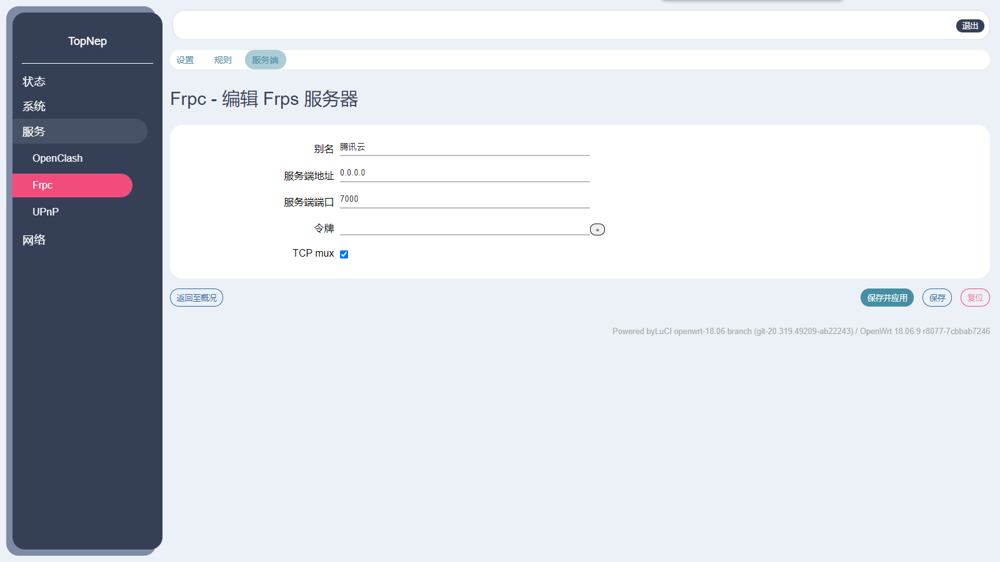
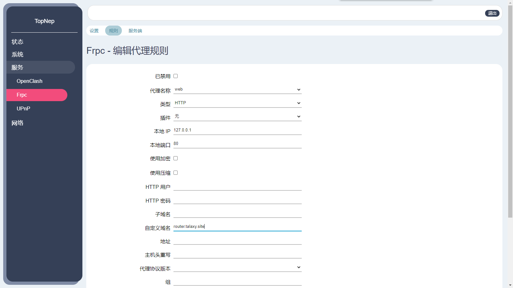
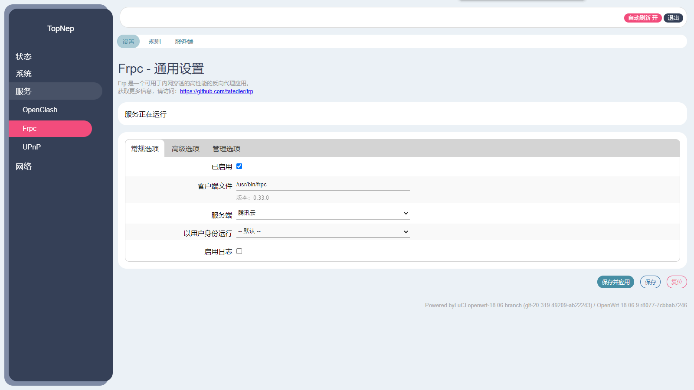

## 写在前面

最近从 PandoraBox 转到 OpenWrt 阵营，无奈原本的 phddns 无法使用了，今天摸索了下 frp，发现出乎意料的简单！frp 与普通内网穿透最大的不同是它需要一个有固定公网 IP 的主机或是云服务器（VPS），如果你恰好有那么一个正在挂着博客网站的云服务器，那么它就能派上用场！下面以 Windows Server 2016 来作服务端，以 OpenWrt 18.06.8 来作客户端进行演示。

## 准备步骤

- 下载 [frp](https://github.com/fatedier/frp/releases) 作为服务端
比如我的 VPS 的系统是 Windows、CPU 是 E5，那么我就要下载 windows_amd64。

- 解压
解压后会发现里面主要分为 frps 和 frpc 两种，前者是给服务端后者是给客户端用的，由于我们只需要服务端所以把 frps 相关的发送给你的 VPS 就好，客户端我们使用下面的 openwrt-frp。

- 下载 [openwrt-frp](https://github.com/kuoruan/openwrt-frp/releases) 作为客户端
下载客户端端所需的程序，比如我的路由器的系统是 OpenWrt、CPU 是 MT7621，那么我就要下载 mipsel_24kc。

- 下载 [luci-app-frpc](https://github.com/kuoruan/luci-app-frpc) 让我们可以在路由器管理页面操作 frpc

## 把路由器的 Web 管理页放到公网去

### 服务端配置

- 修改服务端的 frps.ini 文件，设置 http 访问端口为 8000：

```ini
# frps.ini
[common]
bind_port = 7000
vhost_http_port = 8000
```

然后在防火墙 里开放 7000 和 8000 端口，另外安全起见建议你在调试结束后修改默认的 7000 端口或添加客户端身份验证。

- 启动 frps：

```shell
./frps -c ./frps.ini
```

出现 `start frps success` 即说明启动成功。

### 客户端配置

#### 修改服务端配置

- `服务端地址` → VPS 的 ip
- `服务端端口` → 对应服务端配置中的 `bind_port`
- `令牌` → 对应服务端配置中的 `token`



#### 添加/修改规则

- 修改 `类型` 为 `HTTP`
- 修改 `自定义域名` 为你想在浏览器访问的地址，我这里设为 `router.talaxy.site`



#### 启动 openwrt-frpc



### 成果

当出现服务端出现 `http proxy listen for host [router.talaxy.site]` 时，说明服务端与客户端已成功建立连接，这之后就能通过访问 [http://router.talaxy.site:8000](http://router.talaxy.site:8000) 访问到内网中路由器的 Web 管理页了。


## 让 frp 在后台运行

### 服务端

Windows: 只要不关掉控制台即可。

Linux: frp 解压后有一份 service 文件，可以添加至系统服务中。

### 客户端

完全不用其它操作，openwrt-frp 会做好他的工作。

## 最后

frp 能做的事有很多，你可以查看 [这里](https://gofrp.org/docs/examples/) 学习更多操作，比如把内网的 ssh 放到公网上，或是用来给游戏服务器做内网穿透。
