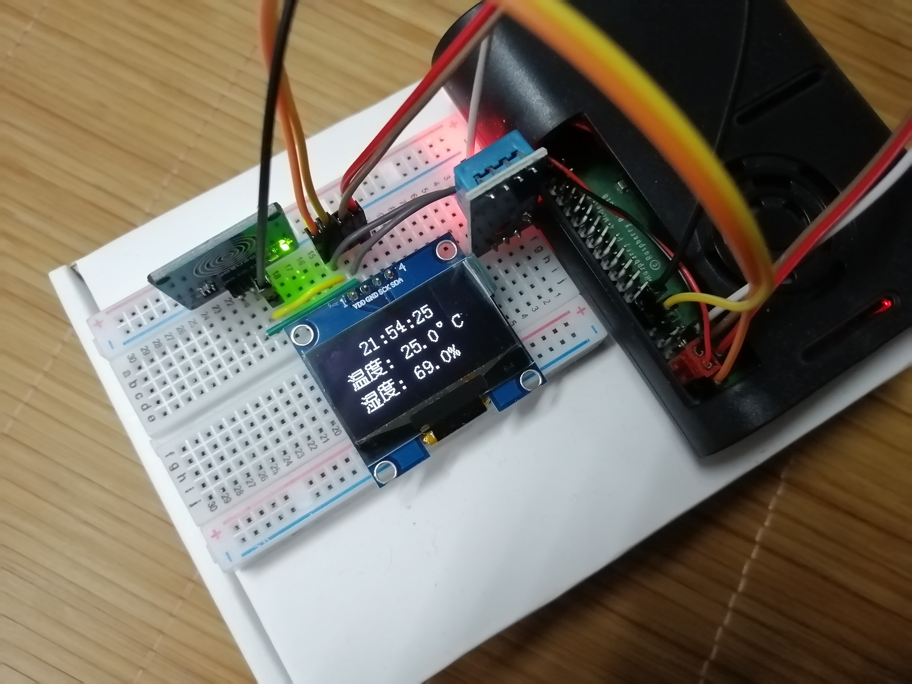
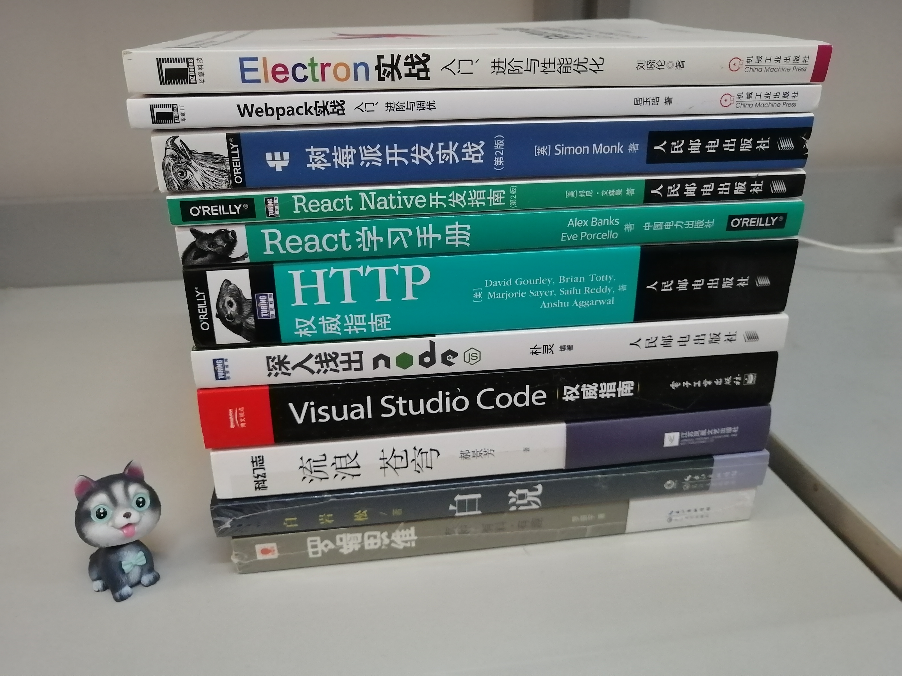

好久没有写博客了，最近也想着把博客框架换一下，虽然 Gatsby 很好用，无论是图像的 lazy-load 还是 SEO  都很方便，但感觉依赖太多了，有点臃肿，另外就是想逐渐试试看动态博客。解决方法可能是自己用 React 写一个，但是 Markdown 转 Html 可能有点复杂。本想把这件事搞定后再写 2020 的总结的，但担心会把我这一年干的事都忘了，所以还是现在写吧。

## 新冠前后

> 下面这些原本是我在六月份时写的随笔，改了改就放上来了，里面提到的一些事现在可能不是那么重要了，如果有什么地方看上去怪怪的就自动忽略掉吧。另外在改的时候我发现我当时把 React 打成 Rust 了，笑死🤣

1月份时在手机上刷到 “武汉市爆发不明肺炎” 的新闻，当时并没有多在意，以为这会像 19 年的几次禽流感那样，还没大范围传播就消失得无影无踪了。但，事实并非如此。

春节后就收到了学校延期开学的通知，一个月后又收到了上网课的通知，本想着 4 月或者 5 月就能返校的来着，可到了 6 月我还待在家里上着网课。上网课有好的一面也有坏的一面：好的的方面，防止了疫情发展这点就不说了，我可以睡到八点半起床，边吃早餐边上网课，还可以站着上课、躺着上课、趴着上课，就是躺着上课上着上着就睡过去了，这也不用担心，因为有回放，这也算是好处之一了；而坏的方面，首当其冲的就是物理实验课了，本该实操的课变成了对屏幕点鼠标，老师的面也没见过几次，与其说是听老师讲课倒不如说是在听电脑讲课，碰巧的是这电脑有老师的声音和知识。值得一提的是就是在这次超长寒假期间，我因为过于无聊而自己去自学了一些 HTML、CSS、JavaScript、React 的知识，搭建好了这个博客网站，提前完成了自己之前大学生生涯规划里写的：在大一有个自己网站！这也算是我在长期宅家期间的意外收获了。而长期宅家坏的方面也是有的，社交断绝的孤独感，而这点已经可以被现代社会发达的网络大幅缓解了，宅家期间每晚都会在电脑前和好朋友一起玩游戏，实在是不亦乐乎～大家长期宅家的好处也有，那段时间世界各地的空气污染程度都降低了，油价也更低了，之前听过一个理论说：人类成本最高的就是运输，若是能解决运输问题，很多东西的价钱都会降低，比如商品的价格，若是能从工厂直接瞬移到客户家中，价钱能低很多，又比如旅游预算的机票前就占很大一部分。

然后是 “后新冠时代” 的一些国际情形，美国退出了一大堆国际组织，中国也为防止外来病例而关停了国际航班，全球仿佛都在开倒车般的逆全球化中，“新冠” 过后世界会不会更坏呢？现在大家都变得神经兮兮地了，之前广州的 “黑人事件” 和最近美国的 “双城游行” 把种族歧视又一次地搬上了论坛，无论过去多久，种族歧视的 “种子” 还是会在一些人的心中生根发芽，“人生而平等” 看来会是人类长久的目标之一了。科技方面，Space X 的新型载人飞船成功发射了！而中国发射了火星探测器，月壤样本也顺利带回地球了～看来即便是在这种事态下，科学依然是我们不懈的追求。

大灾大难会将一些问题暴露出来，而 “禁闭” 又会促使人思考，这两者加起来我们就能反思了。

## 返校返校返校

说返校前还是说说返校前的暑假吧，还好我对那段时间干的事还有些记忆，这部分就现在写了～

### 暑假

暑假那段时间去深圳打暑假工了，干了六天赚了 1300￥，嘿嘿嘿。去华强北逛了几次，发现好多地方现在都是在卖手机和手机周边配件了，一些卖电视音响那些，倒是老华强那边还有在卖 IC 那些。好多地方还没逛完，因为我都只逛一个下午，有一次还被晒伤了，手臂脱了几层皮的那种。

那些钱我用来买了

- 荣耀 Flypod3（第一用主动降噪耳机，好棒啊）
- 电动牙刷（用了半年了，好像牙也变白了，不知是不是心理作用）
- 买了个驱动板把旧笔记本的屏幕做成显示器了（这是最亏的，因为我发现那个屏幕效果太差了，现在放着吃灰）
- 船模（计划中，不知是买 Des Moines 还是 Bismarck）

原本还要把 树莓派 4B 也加进去的，但是我爸听说我要买单片机就欣然表示他来出钱了（当时不知该怎么解释，就说是单片机了）

打暑假工真的是锻炼人，“软硬件” 上的那种。因为是在奶茶店打工，免不了要跟客户打交道，有一天我一个人点了 130 单，感觉我的与人交流能力直接 level up！另外还遇到了一个眼睛很漂亮的同事，可惜人家只干了一天就走了，没能增进感情······诶，命里有时终须有，命里无时莫强求。

### 返校

- 返校后买了一些电子元器件来玩树莓派的 GPIO，尝试着搞出了一个 [简单的温湿度计](https://github.com/Talaxy009/rpi-thermometer) ，为此接触了一点 Python 的皮毛，有一说一我真不喜欢用缩进来区分作用域😖

- 跟舍友组队参加了学校的网页设计大赛，拿了三等奖🎉🎉🎉 增强了一些 React 的相关知识
- 用 Electron + React 做了一个选课系统，完成了数据库的大实验，极大的增加了我对 React Hooks 的认识

以上总结下来就是，学到了很多😁

然后还和一位 [推友](https://twitter.com/Gah0_tweet) 借着 Google DevFest 2020 的机会面基了，交流了一些思想，可惜的是没能留下照片纪念，希望还有下次机会😔。啊，想起来我当时还说过：“无论什么博客框架都是基于 React 的！”😅当时还是 too young ，知识面都不够充分。

寒假前参加了学院的一个项目——给学校图书馆做一个微信小程序，学院想法很好：找几个学生过来，让一个师兄师姐的创业团队来给我们做指导，既可以培养学生能力，又可以校企合作。我也很顺利的通过了 gatsby 测试，本以为可以了解到一些项目开发流程、学习到小程序开发的知识的，可惜项目泡汤了，因为图书馆已经把这个项目外包出去了，哦豁😫

## 最后

最后放一张放寒假前拍的照片，是我一年买的书，有些没看完，有些甚至还没拆封，希望今年能把剩下的书看完吧😅

最后的最后，说一下最近的情况吧。这段时间跟大学物理老师一起打算搞个项目，他想用机器学习来复现一篇论文，所以在学习 tensorflow.js 。另外又和之前的师兄联系上了，打算跟他们做一个项目锻炼锻炼，最近应该会蛮忙的吧，嗯，加油吧！

## 真的是最后了（写于 10 月 13 日）

上面说到的一些事的后续，比如我打算换博客框架这事：最近把博客重构了一遍（还是用了 Gatsby🤣），用了一些我这段时间接触到的技术，比如  [styled-components](https://styled-components.com/) 和 [GraphQL](https://graphql.org/)，虽然之前的也用到了 GraphQL 不过这次是自己写的了，还是蛮享受的，所以并没有换框架；以及[上一段](##最后)说到的和教授一起的项目也泡汤了，原因应该会在今年的总结里提到，还有很多想写的，留给下个总结吧，总之我有史以来时间跨度最长的文章就到此结束了。
