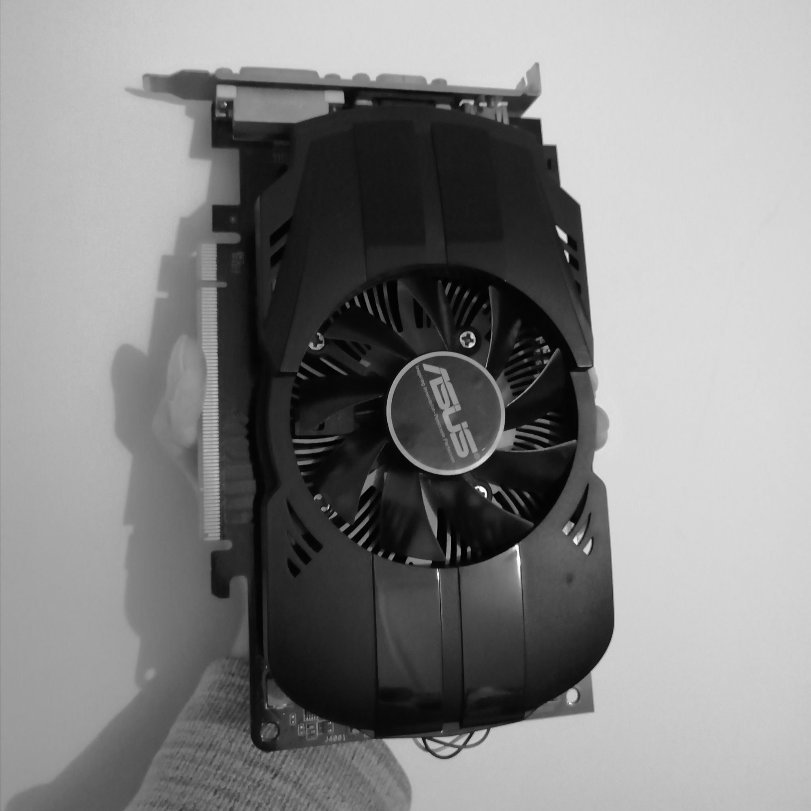

今天是冬至，吃午饭时送了碗汤圆，是花生 🥜 馅的，甜的恰到好处。

去年的回顾是今年三月份写的，结果因为各种原因拖到了十月份才贴出来，所以这次我要赶在年底把回顾写出来。今年我感觉过得不如去年精彩，可能是没有了初来大城市的新鲜感，也可能是因为疫情的原因没啥地方能给我跑，今年的大部分时间我都用到了学习上，我就不按照时间线来记录了，而且也没啥图片😔所以这次总结看起来应该会十分之枯燥。

## 兼职

寒假泡汤的图书馆小程序项目（具体可看[去年回顾](../my-2020)），因为师兄看到了当时我交上去的 “简历”，今年三月份找到了我一起写项目，感觉是很难得的机会所以我当时就同意了。师兄们是 15 届的，这样算来应该是在我刚入学那年他们就毕业了，创业的过程想必是没那么容易的。公司就在信息枢纽，偶尔有事需要过去时也十分方便，公交或者自行车最多 20 分钟就到了。师兄们偶尔也会带我去吃吃饭，交流之中可以学到蛮多东西的 😋 而且能蹭饭吃。

### 做了什么项目

第一个项目是个基于 react native 的 APP，第一次接触，感觉能用前端语言写出一个 APP 蛮奇妙的。能接触到核心的开发流程，有时候也要自己学习和摸索。几个月下来，接口联调、第三方登录、消息推送，都深度体验了一波，获得了大大大量的经验！也接触到了一点 iOS 和 Android 开发的皮毛，收获颇丰。

还有一些 Web 前端的项目，有涉及到诸如 NFT、合约、Web3.js 的部分，不过我接触不多，只是尝试调过一次合约而已，很多时候我都是只负责界面部分，以后有时间一定要了解一下区块链相关的东西。

## Skyrmion

年初时打算和物理老师一起做课题研究的，他的想法是将机器学习应用到一些物理数据的处理上去，寒假的时候我在他的指导下写了一个简单的 2D Ising 模型的蒙特卡罗法模拟程序，当时感觉还是蛮新鲜的。但到了开学的时候，繁重的课程量和师兄那边的兼职机会，导致我无法同时兼顾三个事情，有那么一段时间我都无法好好休息。另外一点则是在和老师的深入沟通之后我发现：我们之间的沟通有时候不是很让人舒服。有时候讨论一个问题，在老师那边他只需要理解思路即可，而我这边则是想着要用什么实现、怎么实现。在这种情况下，经常会出现类似这样的对话：`我觉得实现起来不是很容易，可能需要些时间。`，`怎么会呢？这只是一个······的问题。`老师会认为我没有理解他的模型，而我则认为他少看了我的工作量。种种情况之下我最后还是退出了老师的课题组，但在这期间我也了解到了一些人工智能的知识。

然而对我来说我在这段时间里学到最重要的还是学会了放下，我加入课题组的主要原因还是因为感兴趣，当我发现我的时间已经不够我发展兴趣时，我就应当果断放弃的，但是我并没有。我就在那样紧张的情况下勉强维持了两个月，因为我担心我会辜负他人的期待，我担心一件事会因为我而失败······也许是责任感在作祟，因为不能半途而废或是说到就要做到之类的原因。但最后我还是想通了：果断的退出也是一种负责，总会有人顶替我的。当我真正退出课题组后，我感觉如释重负，走在路上也身轻如燕，我终于可以专心负责另外的两件事了。

## 新博客

 🎉

之前一直想抛弃 Gatsby 的原因是：

- 我刚接触 Gatsby 和前端而导致遇到问题要找好久原因
- 我那时候写代码多是网上借鉴（copy），整个项目的代码风格乱七八糟的
- 年轻气盛，想着自己造的轮子不一定比别人的差

总结就是：`too young, too simple!`

在接触了这么多项目之后，我的知识水平得到了提高，终于在十月份时！我决定！再用回 Gatsby 来重写一遍自己的博客！

>尘埃落定后，一个崭新的博客出现我的眼前，她从上到下、从左到右、里里外外我无不参与、无不知晓，我知道她闹脾气的原因，也知道如何安抚她，我知道她需要什么、不需要什么，此时此刻我才真正的拥有了这个博客，我的精神得到了飞升！我满足了！

## 年末的不幸

### 噗通噗通

前段时间呢，学校体检，检查出我存在 `心律不齐、频发早搏` 的情况，我蛮害怕的，我感觉我这段时间胸闷气短的原因就是出自于此，我去医院做了个动态心电图，这 24 小时下来我就有 12000 多个房性早搏，医生建议我做射频消融术，和爸妈商量后还是选择了不动手术的治疗方案：

- 中药调理
- 多吃橘子
- 一天晒一小时太阳
- 每天 23 点前睡觉

到现在已经过去三周了，我觉得我的症状有所改善，希望继续下去可以根治😊

### 显卡哭哭

与我一同驰骋沙场的战友、挚友——HD7770，于 2021 年 12 月 5 日 20 时 16 分在 WOWS 的菲律宾港口中不幸殉职······

她已经陪了我 3 年了，现在矿潮依旧，好卡难求，我现在只能希望明年年初的时候 RTX3050 和 RX6500 能真正以入门级显卡的姿态呈现，如果不能······我也没有什么办法，还是得乖乖拿出我的钱钱，正好兼职之后我也有点儿收入，希望能度过一个快乐的寒假吧
