import Tweet from '/src/components/Tweet';

一直提醒着自己差不多该写年终总结，结果还是拖到了现在。对我来说 2022 说不上是难过但也说不上是快乐，它就像是把白砂糖和中药加到一起一样，然后让你喝完后评价一下味道如何，嗯······我大概会说：还好吧。

## 不错的开始

### 元旦の漫展

2022 年的第一天，我和三个朋友一起去逛了元旦的漫展（2023 的第一天我却窝在家里写去年总结）。

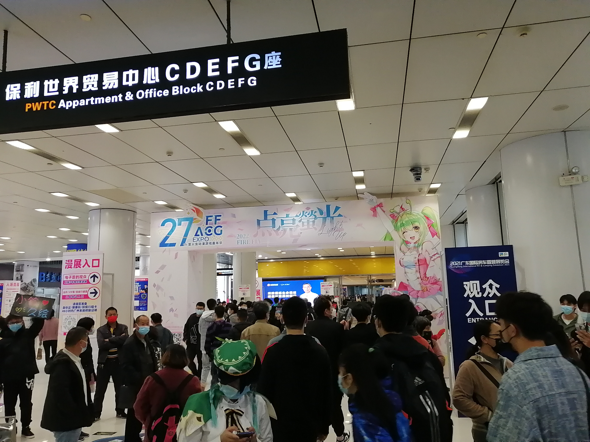

上一次去逛萤火虫还是 2017 年的时候和同学一起去的，上一次去实乃囊中羞涩，就买了一个小电视抱枕（36 ￥，还是盗版），这次去的时候也不知道打算买什么的，但决定了不要空手而归，最后在逛书摊的时候买了全套 EVA 漫画和一本小豆泥，大概花了 200 ￥ 多；小抽个奖、小集个徽章，搞了包辣条和威化饼，展里卖吃的一堆人还贵，出去再进来又得重新买票，全靠这两包东西救我狗命；去扭蛋机扭了一个绫波丽的钥匙扣。其实我也是刚补 EVA，从新剧场版入坑的，没有在这里认到老婆，主要还是因为作品本身对生命和宗教的探讨以及情节才入坑的。

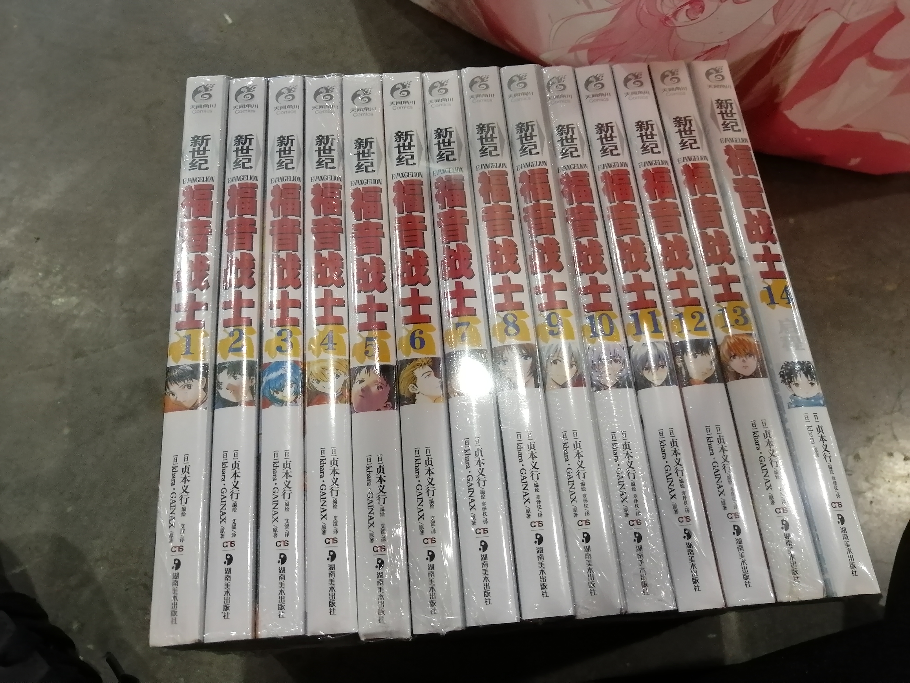

整场漫展下来感觉商业气氛浓厚，很多展子都是二次元游戏宣发（死宅的钱真好赚），但是也有很多优秀的 coser，蛮多原神相关的（有一个一米八的 ♂ 甘雨），逛了几个小时后提着又粉又重的帆布袋回学校了，时隔 5 年了再次去到故地，见到一些景象真的会很眼熟 😭 时间过得好快，我现在都快大学毕业了。

### 公司的年会

之前在师兄那干活顺理成章的混到了一个年会座位蹭吃蹭喝，去到了四海一家，好高档的一家自助餐厅，餐点涵盖了世界各地的东西，味道也不错！另外还有想吃多少吃多少的哈根达斯，听说他家的朗姆酒葡萄干冰淇淋是《摇曳百合》里一个角色最喜欢的口味。

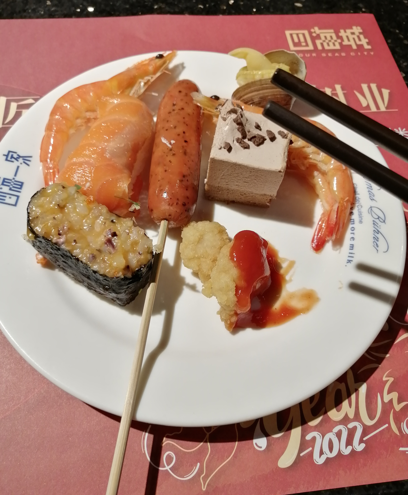

## 新东西

2022 年收获了很多，以下是一些新的物件或是体验。

### 有显卡啦

一月听说我爸从二叔家里的一台闲置电脑上薅了个 i7 4790 下来，正好我缺显卡用（详见去年的总结末尾），就向二叔打听，成功把显卡也薅过来了 🎉。谢谢二叔！电脑在当时花了好几千块钱配的，我计算了一下如果是 N 卡那在当时应该是张 GTX960/GTX970，具体得看奸商良心程度了，到手后果然是一张影驰 GTX970 黑将 👍，后续拖到放假回家才把显卡装上电脑，发现是坏的 😭，维修师傅说供电芯片烧了，最后花了 220 ￥ 修好了。

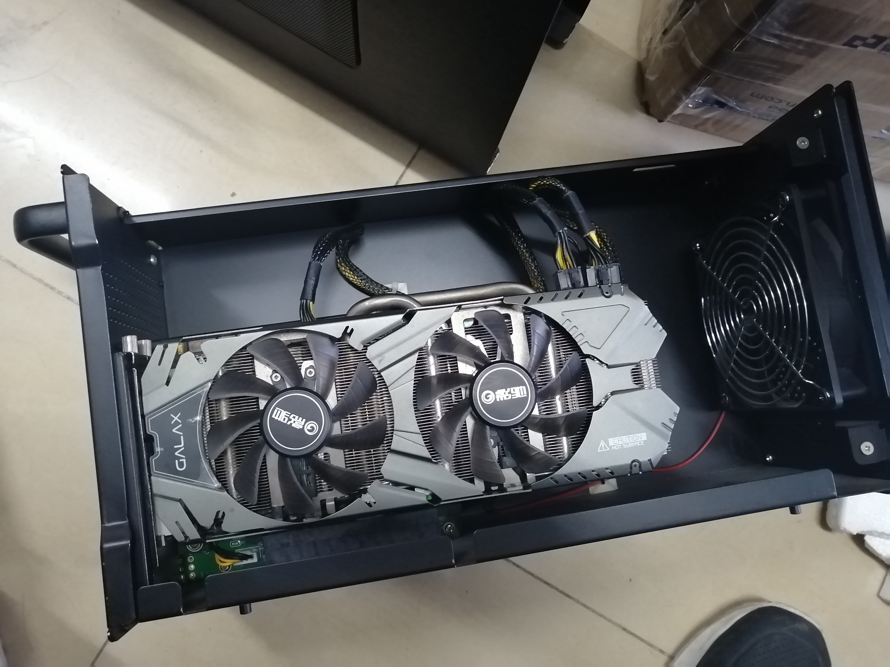

14 年的次旗舰显卡放在 22 年还是能用的，性能和 GTX1060 差不多。开学后花了 800 ￥ 买了一个二手的 AKiTiO Node 雷电三拓展坞，终于在学校也能玩 3A 大作了 😭 不枉我当初把预算花在了雷电三上。体验推文：

<Tweet id="1497456977340866560" />

### 新笔电

暑假时老爸要去上海出差，没有笔电用就把我的旧笔电拿走了，刚好可以换一个新笔电。由于我对二合一也不那么执着了，恰巧京东那时候也在搞秒杀，所以选择了不能反转的 YOGA 14s。下面是一张简单的对照表，新电脑可以说是大大提高了我~~打游戏~~的生产力。

|        | 新电脑                    | 旧电脑            |
| ------ | ------------------------- | ----------------- |
| 型号   | YOGA 14s (2021)           | YOGA 730 (2018)   |
| CPU    | i5 11300H                 | i5 8265U          |
| 内存   | 16G DDR4                  | 8G DDR4           |
| 显卡   | Intel iris + NVIDIA MX450 | Intel HD620       |
| 硬盘   | m.2 512G                  | m.2 512G          |
| 屏幕   | 16:10 2.8k                | 16:9 1080p 可触屏 |
| 雷电   | 雷电 4                    | 雷电 3            |
| 二合一 | ×                         | √                 |
| 售价   | 4999 ￥                   | 6999 ￥           |

### 新手机

双十一期间入了刚发布三个月的**摩托罗拉 S30 Pro**。

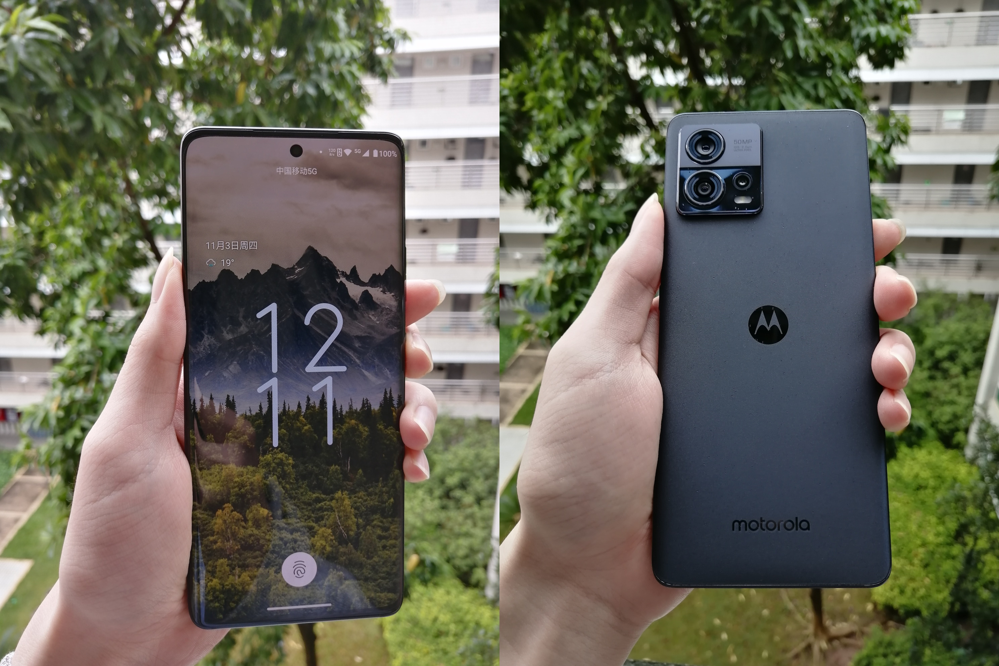

主要是奔着他家的类原生系统去的，实际体验下来很舒服，谷歌服务点一下就能用，“毛胚房”的风格也很清爽，可惜并不像华为、小米那样有大量应用适配推送通道。买前就听闻这机的**骁龙 888 Plus**调教很出色，实际体验下来确实如此，温度控制很好，没有火龙的感觉 😌。相机如何呢？我感觉不孬，自己也不是专业摄影的，交由大众评议了。

### 新的大门？

一天晚上看到宿舍群里有同学在卖剪线键盘，百十块钱就能买到一把机械键盘，正好家里的旧键盘“坏了”我就心动了。

<Tweet id="1562676955874357249" />

目标是 100 ￥ 左右收一把 87 配列的段落轴键盘。宿舍里用的是 RK61，个人也比较偏好青轴。

先试了一把雷蛇的绿轴，RGB 背光 √，音量调节 √，成色也还行，但实际上手后发现轴体成色太惨了。磨损原因？手感十分不统一：有的键位很清脆，有的棉棉的，后续发现 D 键位偶发粘滞（回弹卡住）毅然决然换一把。

在这位同学宿舍里看见了很多“玩具”：键盘、高达等。现场也试了几把键盘，也向他传达了我就是奔着段落轴过来的，线性轴感觉就是在按弹簧！没有内蕴！然后他便给了我几把润过轴的线性轴键盘试试，顿时觉得丝滑无比，如同牛奶入喉一般~~我悟了大师~~！最后还是选了一把 box 白轴的键盘回去体验，如同按圆珠笔一样很清脆。然后打了一小时的代码，sorry 这实在是太硬了 😭 手指酸了，于是等到次日又去拜访了同学。

有了上次丝滑的线性轴体验，我把目标转移到了线性轴上，同学那里的 87 配列段落轴我几乎都摸过了且没有相中的。最后选择了一把**海盗船 K63**，手感顺滑且统一，一眼就相中了，同学手润的红轴、单色背光，正面成色不错、背面比较惨脚撑也没了，大键调教过加了消音棉，顺带接口也给魔改成了 Type-C（好评）。同学开价 180 ￥，虽超出了我预算，但考虑到同学在这上面的时间成本，且我也顺带摸了很多键盘，还是成交了 👌。回去后又在拼多多买了套新键帽换了上去，正面观感已十分不错，可以说是比较满意的了，这篇文章就是用这把键盘打出来的。

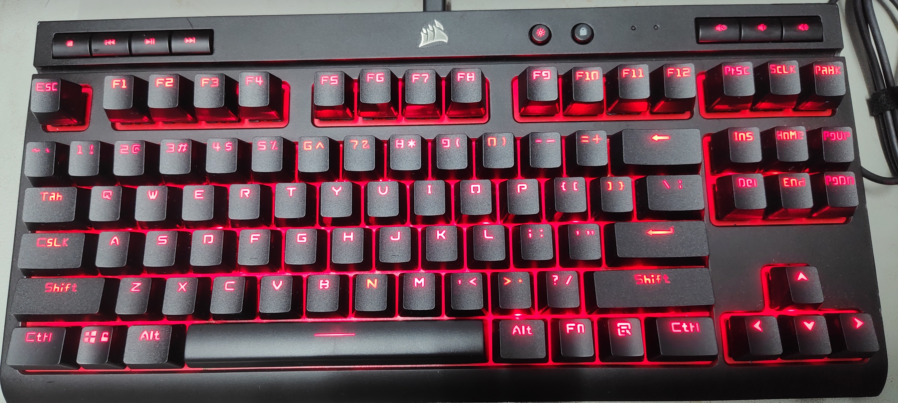

### 新的项目

- 为了实现之前的一个想法，写了 gatsby-remark-link-beautify，并以此发布了我的第一个 npm 包。详细可以看这篇文章：
  [$card](https://www.talaxy.site/gatsby-plugin-dev/)

- 跟同学组队参加了计算机设计大赛，可惜止步于校赛三等奖了，我觉得项目的创意和完成度是有竞争力的，或许是名称不如他人高大上的原因。

- 又一个为 Gatsby 站点嵌入 Valine 评论系统的插件：gatsby-plugin-valine-comment。
  [$card](https://github.com/Talaxy009/gatsby-plugin-valine-comment)

- 开始写毕设项目了，是自主命题，因为想把前端和 Web3 结合起来写个项目，所以打算做一个基于以太块链的社交网站。目前差不多写好合约部分了，前端部分在构建，对于一些大的文件可能还要再写个后端服务？或者是用 IPFS？这块还没想好。

## 凄凉的求职（0 offer）

终于还是到这部分了，本人是 2023 届应届生，2022 年的 23 届秋招是我的主战场，不过在这之前还是说一下 22 届春招。

### 22 届春招（实习）

开学后听说 22 届春招已经开始，对于 23 届来说这是个找实习的好机会，日常实习和暑期实习都可以找，于是便不知好歹地投了三家，由于是第一次面试加之准备不够充分算是陪跑了。

- A 厂，朋友亲戚内推，一小时电话面试。比较紧张，有几次听错了问题，面试完毕后直接收到感谢信。
- B 厂，网申，半小时视频面试。问得很深，已经问到 TCP 快重传了，准备不足，一周后收到感谢信，面试官在结束时还给了我一些建议。
- N 厂，校园大使内推，简历挂。

大概是这样，春招实习对我来说算是一场预演吧，在当时投递就拿到面试资格的概率还算比较大，这给我了一种秋招我一定行的错觉。

### 23 届秋招（正式）

也就在 22 年夏天传出了各厂裁员、毁约、缩招的小道消息，还有华为的“将寒气传递到每一个人”🥶。随后秋招也开始不对劲了，投递了有 34 家，最后收到笔试通知的有 9 家，有面试的只有 3 家，到终面的只有 1 家，这过程说实话很难受，测评一堆，没消息的一堆，你不知道哪家公司会要你，你只能抓住每一个你能抓住的机会，然后等通知，很多公司并不会发感谢信，等你去网上查流程时才发现流程已结束，而收到一个笔试、面试通知就像中奖一样高兴······

- 4 厂，校招内推，一面技术、二面 HR（挂）。技术面只用了 15 分钟，全程感觉如同聊天一样，HR 面自觉没有什么原因，或许有更合适的人选了。
- D 厂，牛客内推，一面 HR（挂）。几乎都是在问人生观价值观的问题，不再过多评价。
- O 厂，牛客内推，一二面技术，三面 HR。流程很快，四天面完三场，唯一到终面的一家。一面技术气氛浓厚；二面比较轻松，感觉面试官还有让应聘者推动面试进展的感觉；三面没有特殊印象；自觉二面没有发挥好，和面试官聊了太多自己不熟悉或是没亮点的地方。

其他公司不再赘述了，不过我还是想提一下 N 厂，这家的校园大使一直都有在我们学校宣传，但是我三次投递简历都直接挂了，自觉我在学校里也不是下水道的存在，为什么会连个笔试机会都没有 🤔。

## 精神食粮

也就是：玩了什么游戏？看了什么番？无剧透，可安心阅读。

### 游戏

有了新显卡和拓展坞，今年得以玩了不少新游戏。

#### 地铁系列

之前玩到最后的曙光就没玩了，今年接着进度把“离去”也打完了，玩完整个系列有一种成就感。“离去”的画质好了不少但是玩到后期越玩越卡，原本高画质能 60 帧的，到了沙漠图必须得中画质了，网上的说法是草丛阴影导致的，也有说是 DX12/DX11 的原因。

#### PREY

朋友推荐的游戏，题材很符合我的口味，都已经加入 steam 愿望单了，结果 Epic 就送了 👍。剧情不错，带有些恐怖元素，节奏、难度都把控的很好。

#### 绯红结系

又是朋友推荐的游戏，JRPG 类。题材符合我的口味，剧情节奏稍微有点混乱，中期有种超展开后突然给你按住的感觉，后期明显有通过增大难度/刷怪来强行拉时长的意图，刷着都快不记得剧情了，不过结局还算 OK，挖的坑都有填上。
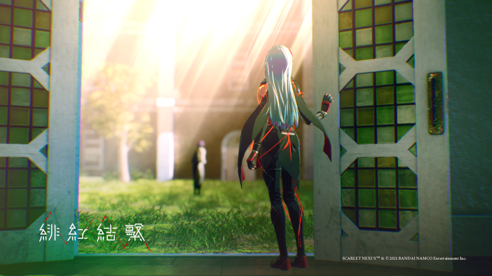

#### 死亡搁浅

还是朋友推荐的游戏，小岛秀夫的作品不必多说。
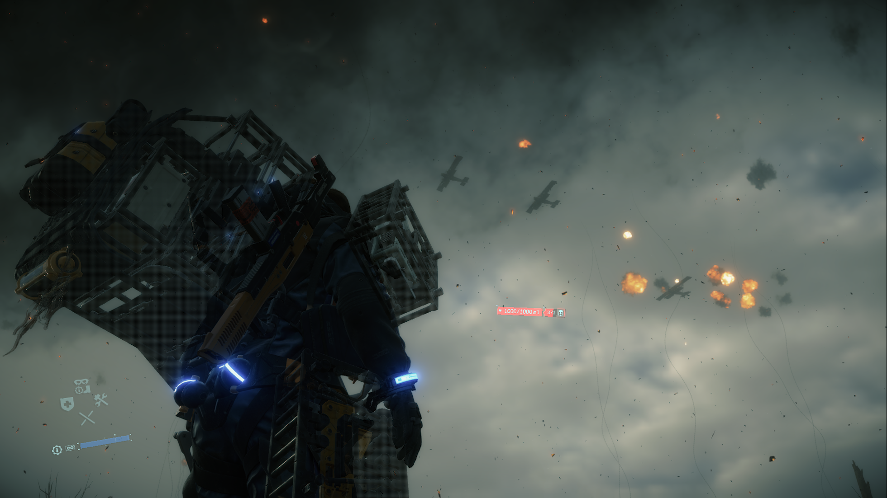

#### 原神

弃坑有一段时间了，须弥更新之后又下了回来。打完了更新的主线，七圣召唤也很好玩，但玩完这些之后，它又变成了抽卡游戏，由于抽不到珐露珊，加之我也不知道玩什么了，就······等待下次有缘之时再见吧。
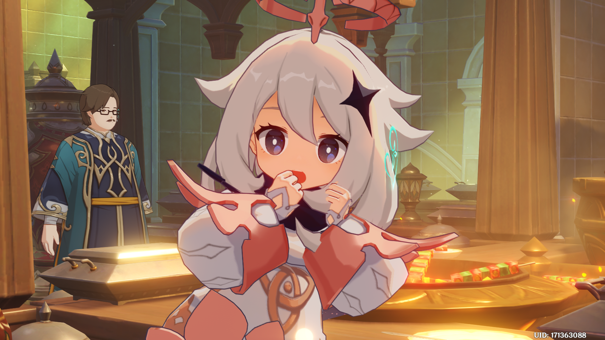

#### 量子破碎

目前只玩了一章，第一次接触这类互动式电影，比较新颖。

#### 极限竞速：地平线

飙车，男孩子就是喜欢机甲和车车，二次元顺便搞搞痛车。
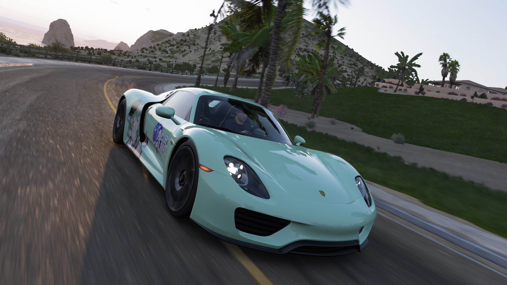

#### 战舰世界

玩了七年的游戏了，不必多说，今年在推特上找到了小伙伴一起玩。
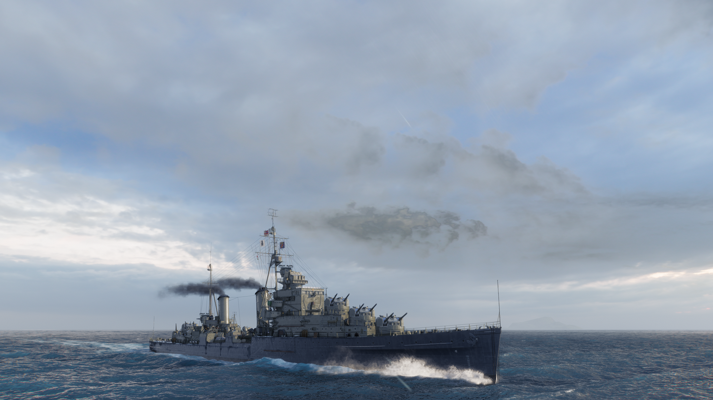

### 动漫

| 名称             | 评价                                                                                                         |
| --------------- | ------------------------------------------------------------------------------------------------------------ |
| CLANNAD         | 经典。                                                                                                        |
| 龙与虎           | 经典。                                                                                                        |
| 夏洛特           | 音乐好听，后期有点超展开。                                                                                        |
| 天使的心跳        | 经典，才发现我原来在初中就听过《theme of SSS》了。                                                                  |
| 86-不存在的战区   | 这是我看过最满意的动漫了！配置拉满，看完后有种寒窗十年考上北大的快感（虽然并未实际考上过），泪腺崩坏，大脑空空。           |
| 夏日重现         | 没看过原著，不过动漫本身有点高开低走？                                                                               |
| 万神殿           | 美漫，设定新颖，节奏和剧情都不错。                                                                                  |
| 赛博朋克：边缘行者 | “妈妈，看啊，我现在就站在荒坂塔的顶端”😭 是救活了游戏本体的好作品，对世界观的展现很不错，血腥暴力原因不建议 18 岁以下观看。      |
| 银河英雄传说      | 因为和 WOWS 联动才知道这个的，看的是新的重置版，第三季的 OP 和 ED 太美了！老杨经常能说出深邃的话语。                         |
| 间谍过家家        | 后期逐渐找到属于自己节奏的优质作品，在搞笑之余给大众转递了和平可贵的精神食粮，老少皆宜。                                     |
| 来自深渊          | 感觉是一部重在讨论人性和精神的“旅行番”，音乐好听！有种独特的风格。~~我也想吸娜娜奇！~~                                     |
| 在盛夏等待        | 奔着田村大魔王看的，前期日常，后期剧情有点牵强。                                                                      |
| 游戏三人娘        | 非常搞笑！~~我也想看青空的裙底~~                                                                                   |
| 电锯人           | 写实风格我感觉还蛮不错的，剧情上也不错，打戏时好时坏，文戏发挥稳定。                                                      |
| 孤独摇滚         | 黑马！音乐好听，表现手法鬼斧神工。                                                                                   |
| EVA（TV 版）     | 看完了漫画就去看 TV 版了，新剧场版入的坑，刚开始有点不明觉厉的感觉，其实 TV 版有很多剧情设定。感觉是一部探讨生命和宗教哲学的作品。 |

### 电影

#### 西线无战事

小说改编的电影，我没看过原著，电影感觉蛮不错的，如果你喜欢《1917》这类的，那你大概率也会喜欢这个。

#### 光年正传

迪士尼的动画电影，讲了巴斯光年的故事，还蛮有意思的。

#### 哥斯拉

重温了第一部，第一部把人类的渺小和对未知的恐惧展现的淋漓尽致。然后去看了第二部，就很平庸了，如果你只是看怪兽打架那没问题，因为它全在演怪兽打架，这里出场的人物也全是在为怪兽打架创造机会的存在而已。

#### 星球大战

经典。

## 最后

在写这篇文章时我的情绪由于求职失利算是比较低落的，但是在我翻相册时往往会想起很多开心的事，这时便想：“哇！原来我今年做了这么多事！”抛开求职失利不谈今年过得还是很开心的，毕竟生活是生活，工作是工作，如果工作不是人存在的意义，那找工作的结果也不该是衡量我今年的指标。但还是希望 23 年的春招求职能顺利，如果不顺利的话我毕业就要失业了 😂。之后怎么办？或许我会去准备考研？以后再说吧。
