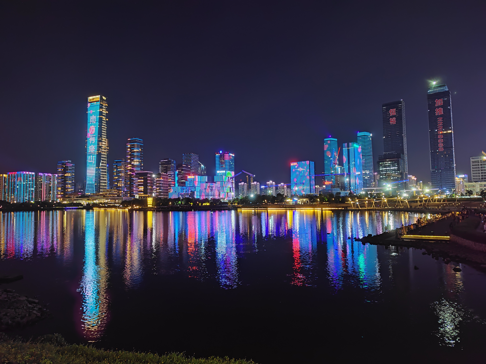
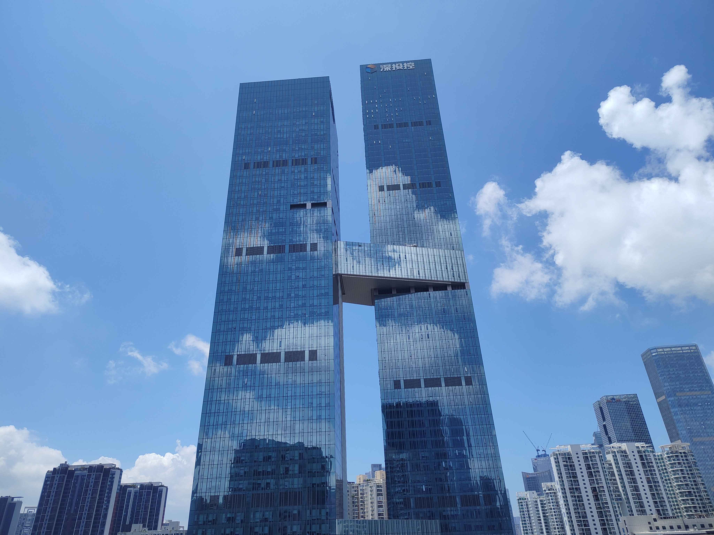
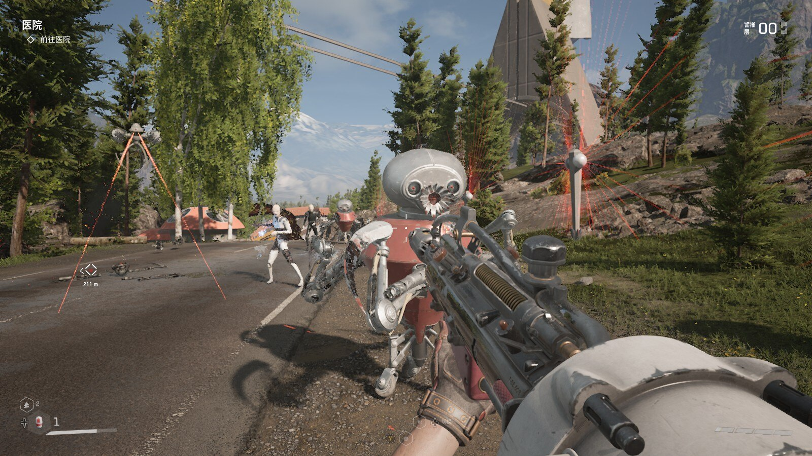
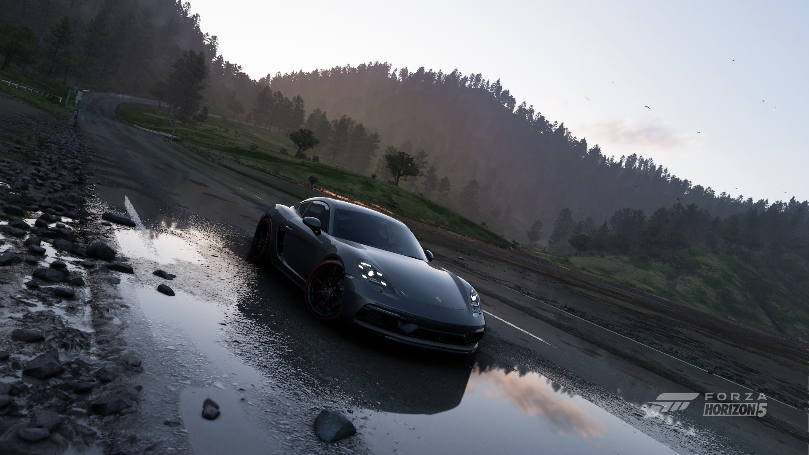
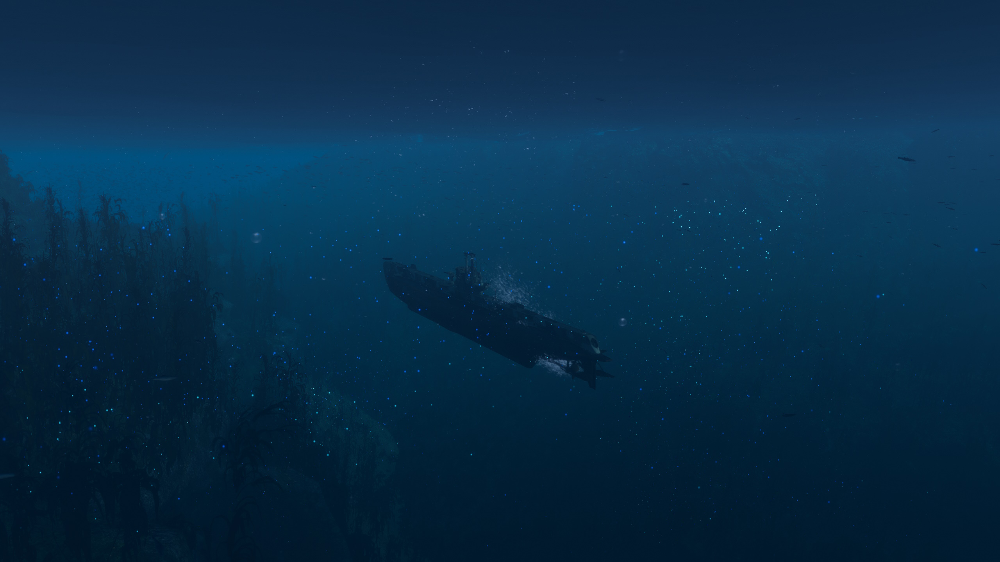
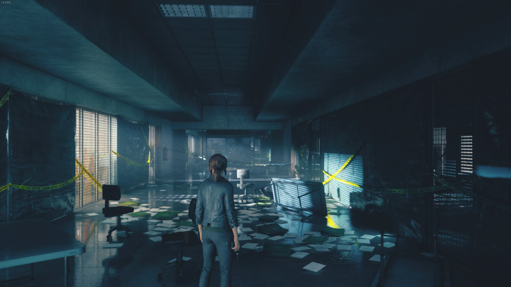
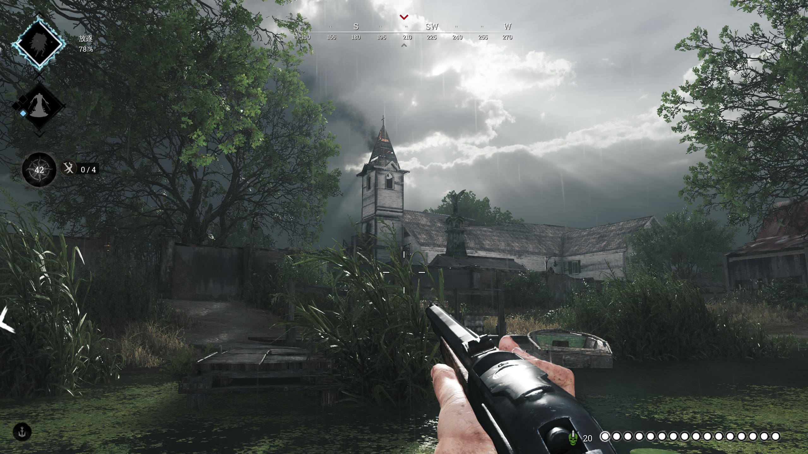
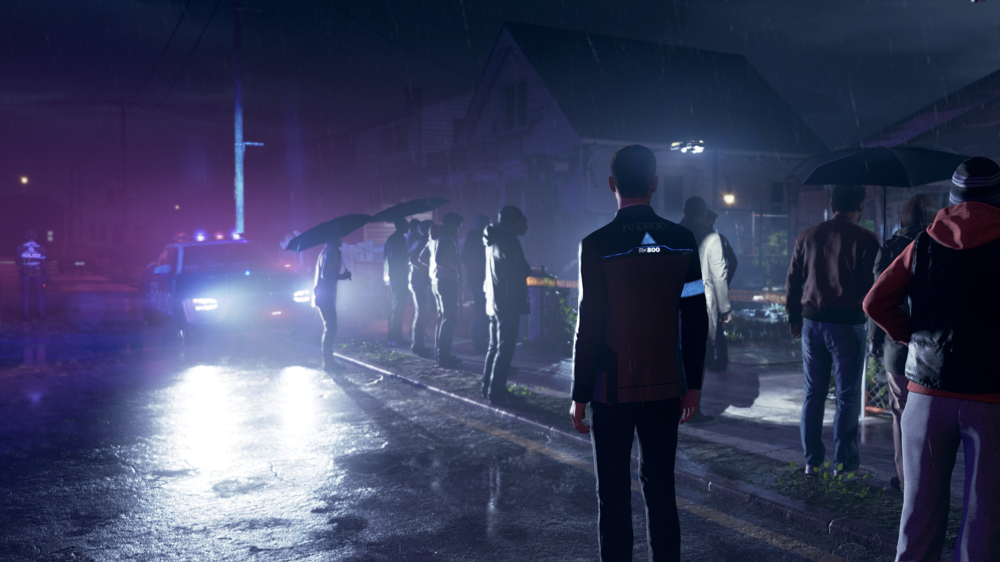

import Tweet from '/src/components/Tweet';

2023 年终于要结束了，这是我作为学生的最后一年，也是我作为打工人的第一年。回顾今年时不得不感慨，人总是失去了才会珍惜。读大学时我想尽办法实习、求职，工作后又开始怀念大学的生活。

而无论我着急或不着急，希望或不希望，我终会迎来新的一天、毕业的一天、成长的一天。所以我选择了“静待花开”来作为今年的标题，也为提醒自己：不要害怕未来、专注当下，命运自有安排。

## 大学最后的寒假

正如我在上一年总结写得那样，我的春招和秋招都一塌糊涂。而今年的春招前还有一段时间——寒假。这段时期为了摆脱焦虑我一直在写项目（只要没时间胡思乱想，就会不会产生焦虑！）。寒假的这段时间就像我大一停课在家自学前端那样，除了吃饭睡觉就是专研项目，不用考虑其他的事，单纯的享受技术带来的乐趣和动手实现想法的满足感。

### 毕业设计

毕业设计是迟早要做的，因此我从去年 12 月就开始着手这块了。为了给我的大学末尾画一个有点挑战性的“句号”，我自主命题了一个侧重前端和区块链的课题来作为我的毕业设计。区块链也是我感兴趣的方向之一，而在自学 Solidity 时，ChatGPT 帮了很大的忙，仿佛它的面世就是为了帮助我们 23 年的毕业生写毕设和论文一样 😂。最终我在寒假结束前就完成了项目开发，剩下的就是写论文了。

### 每日一萌

一次失眠夜让我产生了写一个 APP 的想法。

我使用 WOWSINFO 这个 APP 已经有段时间了，觉得通过调用已有 API 来实现一个应用程序是个不错的路子。于是我便看向了 [lolicon-api](https://api.lolicon.app/#/)，想法是通过调用这个 API 来实现一个根据用户偏好来显示 P 站作品的 APP。这个项目我也做得很开心：自己写代码、设计图标、制作横幅，累了就打打游戏一天天就这样过去了。我还花了 25 美元去注册 Google Play 的开发者账号，可惜的是最后没能上架，或许我的下一个 APP 能如愿上架吧。

[$card](https://github.com/Talaxy009/Moedaily)

## 大学最后一学期

返校后春招便开始了，我又开始了投简历、刷题和面试，与上一年不同，我开始投递一些北京、上海、杭州、武汉等地区的岗位了，只要给我个班上就好 😭。最后杭州一家公司在三月底走完了面试流程，但一直泡在池子里······于是便加了一个池子群交流，看里面时而有人开奖、时而有人抱怨，这段过程真的煎熬！等了一个月后已是四月底，后面投的简历就像进了无底洞般没有一点声响，真的心灰意冷。

用一句话总结我当时的心境就是：世界这么大却没有我的容身之处，大学毕业后我只能滚回老家，实在是无颜面对父母。

后面经师兄鼓励，我又继续去 Boss 直聘海投，最终五月底时收到了深圳一家公司拿到了 offer。这期间还发生了间有意思的事，我写在这篇文章里了：

[$card](https://www.talaxy.site/wonderful-night-wonderful-life/)

次日正好是毕业答辩，那天上午我收到了 OC，中午饭后打印完论文，回来拿电脑时发现舍友把门给锁了！只好立马找舍管阿姨开门，随后我便背着包跑向教学楼。那时候的我终于把心中的石头放下，未来已有方向，可能是世上最开心的人了。

六月二十号我请假回学校开毕业典礼。大学生活就这样结束了多少让我有些惋惜，还有想做的事没有做，还有想去的地方没有去。之前总觉得以后还有时间，突然发现已经没有以后了。好在那天晚上，舍友提议去唱 K（唱 K 是我们一直嘴嗨到最后都没去干的事之一），才终于去唱了一次。唱到凌晨两点我们一个个嗓子都哑了才回去，因为不想过门禁，我们去了传说中可以钻进去的一处围栏，最后只有一半的人能转进来🤣。没想到大学的最后一晚能这样结束！

## 深圳的生活开始了

毕业后的第一份工作在深圳，让我对深圳这个城市又增添了一些情感。爸妈也曾在深圳务工，随后相识相爱才有了我，听说小时候我也在深圳生活过一段时间，但我已没印象了，只能看一看当时的照片确定确有此事😌。

### 高消费

来到深圳的第一件事就是找房，一如网上看的那样：深圳的房租的是真的贵！最后在离公司三个地铁站的地方找了个单间，一个月就要两千一百多，虽然远的地方也有性价比高一些的房子，但考虑到舅舅也住在这附近，周末还能过去 ~~蹭饭~~ 玩就决定要了这间。

而吃饭，基本上一餐就得二十块钱起步，价格是学校里的两倍，一天下来，50块钱就没了！高中的时候 50 块钱能吃个三四天呢，大学的 50 块钱也能吃两天，打工人真的是不容易。

### 风景线

公司和住的地方都在南山，刚来的时候真的震撼，到处都是高楼大厦还有认得出的公司名在上面。当时“打卡”国际大厂的推文：

<Tweet id="1705547245893136423" />

人才公园离我住的地方很近，因此偶尔会去走走，白天门口的风景：

晚上的夜景：

还有公司附近的风景：

这两栋楼一栋挂着【字节跳动】、另一栋挂着【深投控】的牌子：

基本上出门走在路上一定会看见：蓝天、白云、绿树和反光写字楼的排列组合。对于刚刚经历过物联网寒冬的我来说，身边的这些经济奇迹却给我了一种“不真实”的感觉：仿佛经济从未止步于此，各行各业都在蓬勃发展。

而南山很多地方都是填海填出来的，也就是说脚下的土地和身边的大楼可能还没有我大！在这一点，深圳相比广州给我的感觉很不一样：深圳是个十分年轻的城市！

[$card](https://zhuanlan.zhihu.com/p/29038412)

### 工作内容

与大多数软件公司不同，我入职的公司是做工业领域，比如仓储管理和生产管理的软件。在这个行业，前端的页面内容都很质朴：除了表格和表单就是弹窗 + 表格和表单😉。前端可能更多的是专注在操作的流程是否严丝合缝、软件能否正常运行在各种设备上。

此外，公司实行的是 965 的工作制（2 小时午休），偶尔会加班，加班则能提供对应时长的调休，在我看来很不错👍。

## 新玩具

有了收入来源，自然是要满足自己一些追求。

### 新电脑？（忒修斯之船）

今年买了许多电子产品，包括一些电脑配件给我爱机升了升级。

[$card](https://www.talaxy.site/a-gift-to-myself/)

目前我的配置是（标价的是今年买的）：

| 项目  | 型号                            |
| ---- | ------------------------------- |
| 主板 | 华硕 TUF GAMING B450M-PRO S      |
| CPU  | AMD R5 5600 (¥754)              |
| 内存 | 金士顿 8Gx2 DDR4 2666Hz          |
| 显卡 | 华硕 RTX4060 DUAL OC (¥2499)     |
| 硬盘 | 致态 TiPlus5000 1T + 希捷 2T HDD |
| 电源 | 航嘉 JUMPER450S 450W             |
| 屏幕 | SANC G5C2 1440P 165Hz (¥949)     |

### 平板

首发入了一个酷比魔方的 掌玩 mini（¥799） 娱乐用。官方开放了 BL 锁，因此刷机玩十分合适！8 英寸的屏幕用来看漫画也很合适。

## 精神食粮

电影 & 番剧 & 游戏

### 电影

今年看了不少电影！

| 名称             | 评价                                                                 |
| --------------- | -------------------------------------------------------------------- |
| 满江红           | 剧情不错！一波三折，不断的反转，听说原本是打算拍一镜到底的，没拍成挺可惜的。     |
| 流浪地球 2       | 我觉得这个叫流浪地球 0 可能更合适，特效不错！                               |
| 头文字D          | 再快的 86 也追不上坐奔驰的夏树😭。                                       |
| 酷爱电影的庞波小姐 | 画面很绚丽，从内到外都践行着 90 分钟定则，是个愿意看多几次的好作品。            |
| 铃芽之旅         | 大学看的最后一部电影。画面稳定发挥，但是男女主感情线感觉有点仓促，不知原著如何。   |
| 青春变形记        | 剧情很有意思，主线是华裔家庭和青春期的冲突，时而会有共鸣。                     |
| 月球奇幻旅        | 感觉主旨是想表达儿童的无拘无束和纯真友谊，但是剧情编排太乱了，发展有点莫名其妙。   |
| 阿凡达：水之道    | 主线就是：家庭！家庭！守护家庭！嗯，没了。                                   |
| 奥本海默         | 需要了解些历史才能看得比较清楚，表现手法很独特，切实传递了人物被时代裹挟的无力感。  |
| 悲惨世界         | 第一次看音乐剧，冉·阿让和沙威击剑的那段很不错！                               |
| 普罗米亚         | 很燃的表现手法，由此开始关注扳机社了，反派 cv 是堺雅人，真的好怕他突然喊土下座🤣。 |
| 回到未来         | 严谨的因果关系和牢不可破的逻辑推理，穿越剧的鼻祖。                             |
| 拿破仑           | 有点辱法的传记电影，感情线占大头，改编得过头了。                              |

### 动漫

| 名称                   | 评价                                                                |
| --------------------- | ------------------------------------------------------------------- |
| 别当欧尼酱了            | 第一次！追的漫画动画化了！动漫的画风比原作“软萌”些，有趣的性转题材作品。        |
| 三体                  | 无论是剧情还是人物塑造都偏离原著太多，建议当平行世界看或者不看。               |
| 辛普森一家             | 看了一两季，下饭很棒。                                                  |
| 秋叶原冥途战争          | 一本正经的演绎，无厘头的搞笑剧情，放飞自我的原创番，挺有意思的。               |
| 石纪元3                | 节奏稳定的重铸人类文明之光中。                                           |
| 天国大魔境              | 伏笔埋埋埋，快出下一季啊！                                              |
| Daring in the Frankxx | 前期实力超群，看了还想看，后期超展开！不知看的是啥了。                       |
| A.I.C.O.              | 剧情有点老套，但是女主可爱😋                                            |
| 僵尸100                | 第一集很抓眼，后面发挥稳定。第九集后突然憋住了，最近才放出后三集，还没看完。    |
| 满怀美梦的少年是现实主义者 | 剧情好赶，人设很可爱，但明显经费不足的感觉。原作传达的那种细腻的情感全没了。    |
| 斩服少女                | 正好是十年前的番了。奔着扳机社看的，风格独特，剧情紧凑，极其上瘾。             |
| 药物少女的呢喃           | 好看！猫猫可爱！与其说是宫斗，我觉得更像是以后宫为背景的爱情和悬疑题材作品。     |
| 16bit 的感动           | 剧情有点放飞自我了，压根猜不到怎么发展，还是挺有意思的，另外女主声音太像派蒙了🤣。|
| 葬送的芙莉莲            | 上头！好看！要感动有感动，要搞笑有搞笑！                                   |

### 游戏

今年也是狠狠的玩了！还玩了一些光追游戏~

#### 原子之心

架空历史是我非常喜欢的一类题材，因此当时发布便入手了。输送管道和球烛真的一次次让我回忆起玩传送门的日子。如果不去摸研究场的话主线有点短，双结局其中一个收尾过于仓促。音乐好听，苏联美术设计真的很独特。

#### 深海迷航：零度之下

不知是不是一代太完美了，这一代的剧情引导和地图深度都不如一代。没能玩下去。

#### 极限竞速：地平线 5

今年可以开光追啦，爱车终于会反光了。今年一直在开 A 级车跑公开赛，很解压。

#### 战舰世界

玩了八年的“破游戏”，今年经历了分家，希望毛子别作死把游戏搞死了。今年玩了下水下小人（潜艇），蛮有意思的，海底很好看！

#### 控制

当年首批支持光追的游戏之一，画面没得说！主线剧情有点短了，加上两个 DLC 才勉强 40 小时，期间很多时间都是在打怪。哈曼是真的难打！

#### 猎杀对决

今年又和朋友捡起来玩了，游戏模式还是很有意思的，就是服务器还需优化。

#### 底特律：成为人类

一个真正的“你的选择会决定剧情发展”的游戏，几乎每个决定都事关重大，让人不得不纠结。一周目后，三个主角都活下来我已心满意足。是一个深度和精细度都堪称上层的游戏。

## 最后

本来计划今年平安夜去香港的，结果泡汤了，希望新的一年能多出去走走看看吧！
