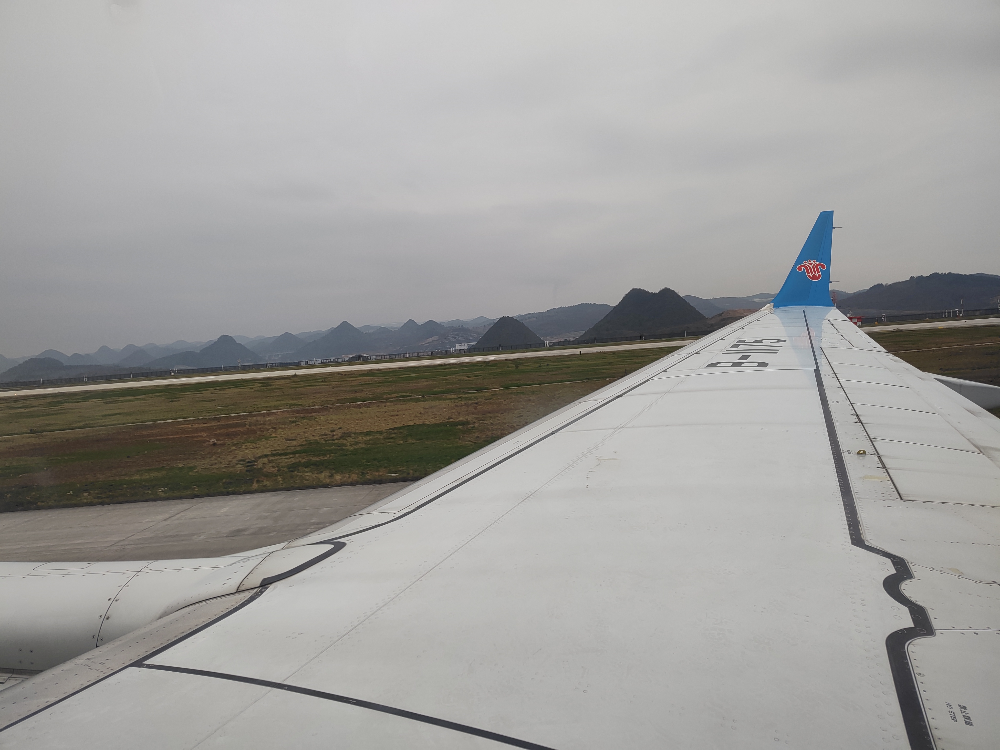
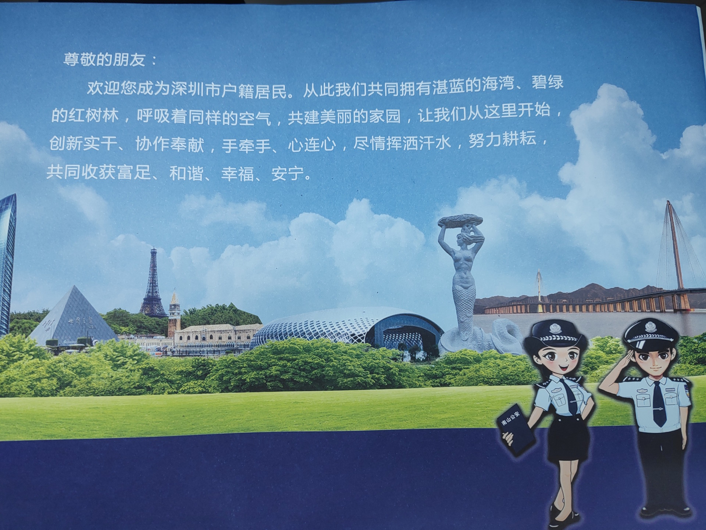
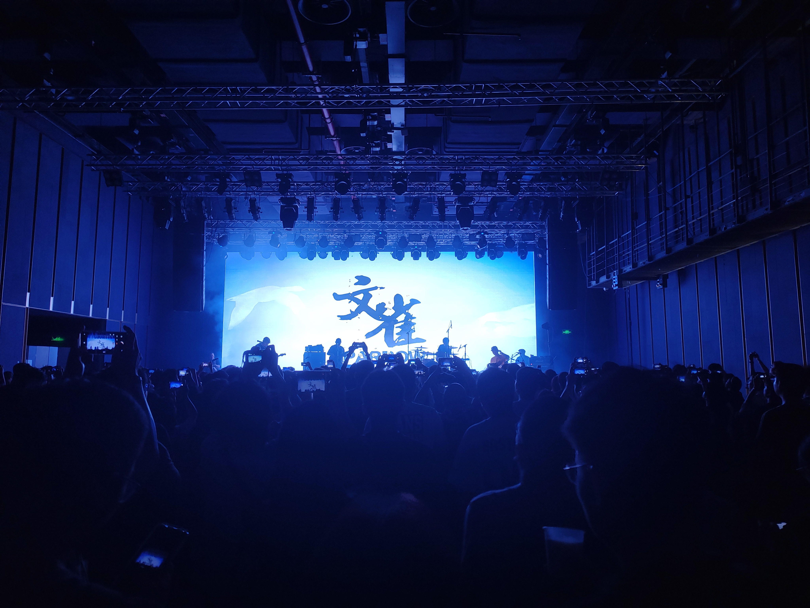
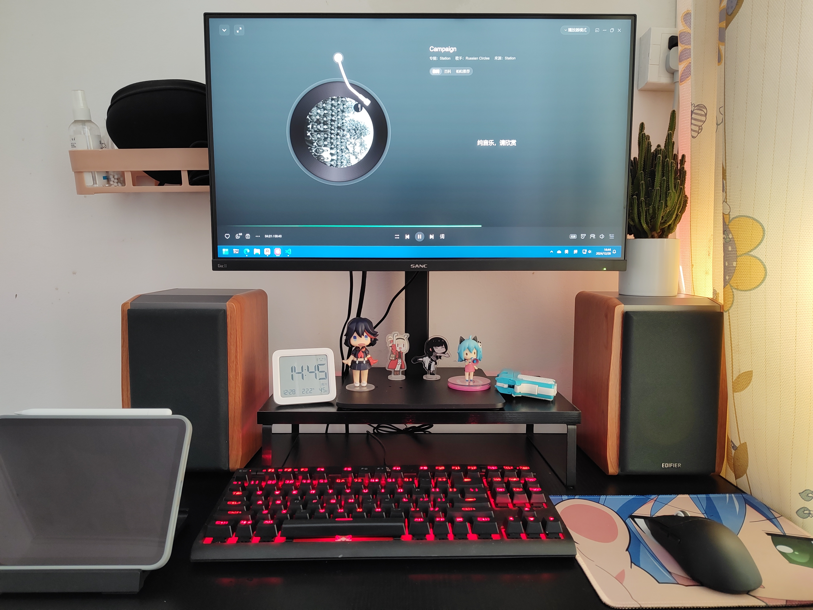
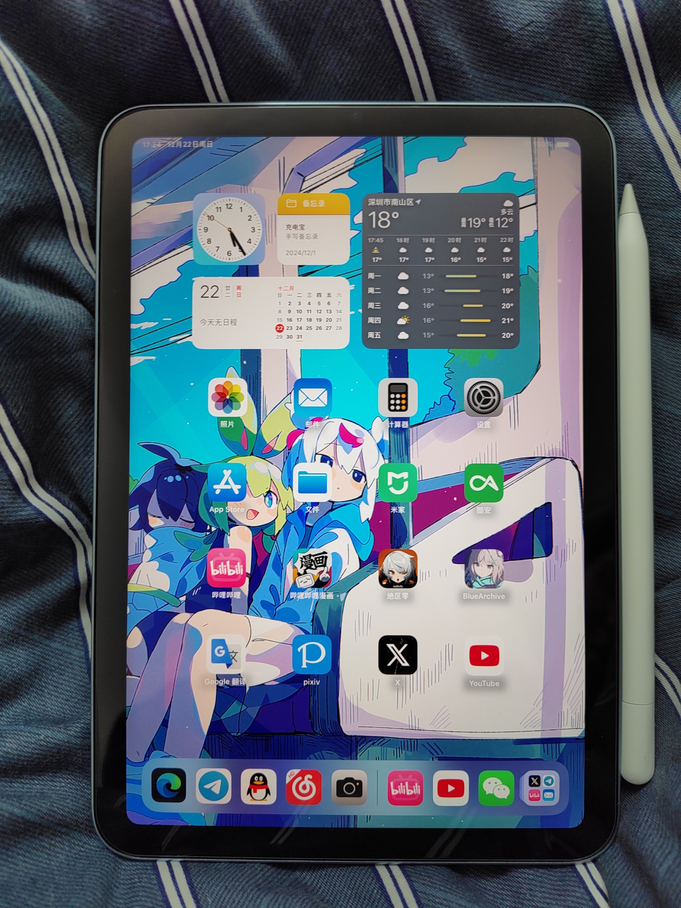
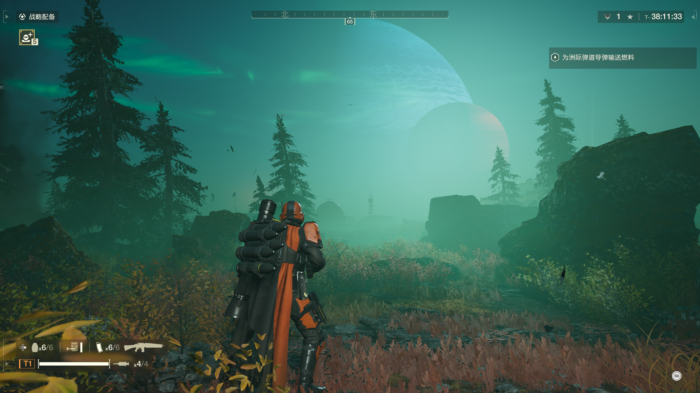
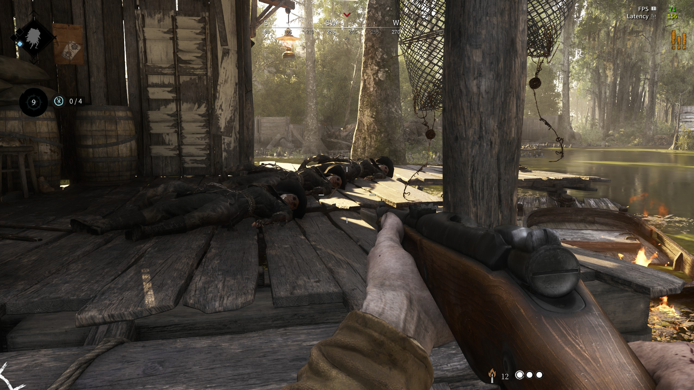

又过了一年，不像去年那般充满挑战；今年可以说是过得十分安逸，规律的上班且规律的娱乐，偶尔穿插些任务，就像是休闲游戏一样。

## “春天的故事”

### 年前有喜事

24 年的第一个月正好赶上老哥的婚礼；婚礼在贵阳举行，因此我请了几天假和爸妈一起飞到贵阳。家里基本没有一起出去旅行过，而老妈也是第一次坐飞机，所以一路上都有种新鲜且愉悦的氛围。



上次来贵阳找老哥玩已经是四年前的事了；那时贵阳还只有一条地铁线路，我也还在读大学，一眨眼就过去了。

婚礼很顺利，也很累人；跟着一起逛了贵州的一些地方。上次来还没有察觉，这次来发现贵阳有种重庆的感觉：你以为现在是 1 楼，其实是 18 楼。看看地图，噢！原来重庆就在隔壁 😂！那就不奇怪了。最后一天正好是晴天，录了这段视频，希望可以传递到一些意思。

[$card](https://youtube.com/shorts/_ouVHzpZdaI)

### 来了深圳就是深圳人

经过深思熟虑，年后回来把户口迁到深圳了，虽然公司给非深户也缴纳一档社保，但想到以后可能还会有的廉租房和车，还是把户口给迁了。

深圳入户很容易，主要是学历要求，本科只需要在深圳缴纳半年社保就能入户；且一申请就能拿到指标，两周就能跑完整个流程！唯一美中不足的是：新身份证的照片没有上一张好看 🥲。



## 出门走走

### 香港

四月份和朋友去香港玩了一天；第一次“出门”，记录了一下：

[$card](https://www.talaxy.site/hk-day-trip/)

加起来今年一共去了三次；有自己去的，也有和朋友去的，留下了一些回忆。


### 第一次听 live

今年去听了文雀乐队在深圳的现场；这个乐队的作品从高中就开始听了，很喜欢！现场的效果和氛围都拉满了，很满足！



演奏最后一首时，吉他手弹一会甩甩手，弹一会甩甩手；大伙好像都没 Get 到他的意思，我也是快结束才发现他是想让我们跟着一起哼 😂。可惜台下最后还是安静地收场了。

### 新窝

六月份合同到期就顺便换了间房；新房间就在隔壁几栋，因此搬家不会太费事。看中这间也是因为它的装修要好一些，且在四楼阳光更充足，代价是房租贵了点。缺点也是有的，最大的缺点就是网络太差了！房东让十几户租客公用一个百兆路由器！而且还是长城宽带！因此我网上冲浪的体验大打折扣！上一个房东虽然也是几个租客公用一个百兆路由器，但光猫就在旁边，因此我拉根网线就能拥有六百兆的带宽了（而且还是联通宽带）！希望百兆路由器快点从市场上消失！

另一个不爽的点是：当初谈价，我出价 2100，房东出价 2200，最后各退一步：2100 + 50 物业费；到了后面签合同时房东在租金一栏写着：贰仟壹佰伍拾，又在下面的物业费写了 50。当时谈话大致如下：

```txt
> 这 2150 包括下面的 50 吗？
> 嗯，是的。
> 也就是我到时就交 2150，不用交下面的 50？
> 诶，对。
```

后面我交了几个月房租才发现每个月是按 2200 收的！与其对峙无果，只得到了：“按合同来，我们当时说好的，不会骗你的。”的答复······现在只好每个月多交 50，作为给社会的学费 😩。虽然新窝很舒服，但就是心里膈应。

### 继续探索深圳

晴天的深圳很漂亮，九月去前海逛了逛，拍了点照片：


前海石公园：


此外还爬了左炮台和大南山，没留下好看的照片就不放了 😇。

## 新玩具

### 音响和内存条

因为编译安卓镜像时老是爆内存，所以年初换了两根 16G 的内存；后面又因为何同学的视频种草了音响，便买了对木音响。

目前我的配置是（标价的是今年买的）：

| 项目 | 型号                              |
| ---- | --------------------------------- |
| 主板 | 华硕 TUF GAMING B450M-PRO S       |
| CPU  | AMD R5 5600                       |
| 内存 | 阿斯加特 16Gx2 DDR4 3600Hz (¥459) |
| 显卡 | 华硕 RTX4060 DUAL OC              |
| 硬盘 | 致态 TiPlus5000 1T + 希捷 2T HDD  |
| 电源 | 航嘉 JUMPER450S 450W              |
| 屏幕 | SANC G5C2 1440P 165Hz             |
| 音响 | 漫步者 R1000TC 北美版 (¥268)      |

音响应该是今年买的最值的物件了，从五瓦的多媒体音响换过来的那一刻才发现：这首歌的低音居然是这样的！至于内存条嘛······后面基本不跑编译了，所以大多时候都用不到 16G，不过我相信这 3600Hz 一定是没有浪费的，尽管带来的性能提升可能没有那么明显。

今天刚好整理了桌面，放张照片 😋：



### 新平板

赶上国补 + 京东 plus 入手了 256G WiFi 版的新 iPad mini，花了 (4799-240)\*0.85 = 3875.15 元，优惠力度很大！

相比上一代就只是做了简单的配置升级，外观啥的都没变，还把二代笔的支持给砍了······但奈何小尺寸平板这条赛道的参赛者就是这么少，因此放眼四周还是选择了它。



## 精神食粮

电影&番剧&漫画&游戏。

### 电影/剧

今年订阅了 Netflix，所以看了不少电影和剧！

| 名称         | 评价                                                                                                        |
| ------------ | ----------------------------------------------------------------------------------------------------------- |
| 铁雨         | 来自韩国的架空世界系（现在是幻想时间.jpg），背景大胆且有意思。                                              |
| 蝙蝠侠三部曲 | 过年在家没事重温了诺兰拍的蝙蝠侠，特效和剧情都很好，展现了正义面对邪恶为所欲为时的无力，及善良的可贵。      |
| 周处除三害   | 今年的亮点之一！有点疯有点爱。                                                                              |
| 盗火线       | 有点古早的枪战片，片尾的镜头语言很有味道。                                                                  |
| 三体（网飞） | 三体世界又添一成员！原著成了看题写作的“题”，改得很“全球化”。                                                |
| 生活大爆炸   | 轻松愉悦的作品！时不时调侃下国家、名族、社会现象，很有意思！下饭一级棒！可惜马上要下架了，我还没看完啊 😭！ |
| 重案组       | 龙叔经典之一。                                                                                              |
| 国产 007     | 星爷经典之一。                                                                                              |
| 哥斯拉-0.1   | 本来是奔着哥斯拉看的，结果居然有高雄号大战哥斯拉！太酷啦！                                                  |
| 子弹列车     | 画面很炫，演出很有趣，剧情层层深入，总体而言挺不错的。                                                      |
| 新闻编辑室   | 剧情演出毫不拖泥带水，理想地展现了新闻工作者的道德操守。“这是个人，医生才能宣布她的死亡，新闻不能”          |
| 后天         | 重温了灾难片的经典之一，曾让年少的我从此爱上温暖的被窝。                                                    |
| 蒙上你的眼   | 有意思的世界观，不太喜欢里面的女主谈论是非对错就搬出自己付出了多少多少之类的。                              |
| 慕然回首     | 来自藤本树的温柔！（打出来感觉好怪 🤣）篇幅很短，结尾有十几分钟都是采访，但整体没毛病。                     |
| 厨子戏子痞子 | 曾经听说但没看过的电影，今年看了下，评价是——“抗日奇侠大电影”，现在就是后悔！相当后悔！                      |
| 战时丘吉尔   | 英雄人物的纪录片，补充补充历史知识~                                                                         |

### 动漫/漫画

今年看得不多······新番没啥感兴趣的，旧番也没啥想补的。

| 名称               | 评价                                                                                                                       |
| ------------------ | -------------------------------------------------------------------------------------------------------------------------- |
| 憧憬成为魔法少女   | 小孩子不要看！                                                                                                             |
| 夜晚水母不会游泳   | 前面观感还行，如果做成半年番应该不错的，后面节奏一赶起来就乱了。心疼黄毛，为了大团圆结局付出太多了。                       |
| 路人女主的养成方式 | 经典。“摄影师大吃饱系列”。                                                                                                 |
| 擅长逃跑的殿下     | 和可爱的角色一起学历史。                                                                                                   |
| 败犬女主太多了     | 今年的亮点！好的作品遇到了好的制作组。八奈见的小表情很有意思！文笔、镜头语言和绘画都令人赏心悦目！已经定了原作小说等补款！ |
| 乱马 1/2           | 重制的史前性转题材作品，角色可爱，但感觉打戏怪怪的。                                                                       |
| 电锯人漫画         | 看了才明白什么叫“只有坏女人和死女人”，令人又爱又恨的藤本树，不知下周又会犯什么病呢。                                       |

### 游戏

#### 超阀域空间

相见恨晚！十分精妙的解密游戏，毫无缺点的关卡设计；难度适中，富有挑战的同时又不用被逼着去找攻略。那是一个阳光明媚的下午，我本想玩一会就睡觉了，结果一坐就是几小时直接打通关了。

#### 绝区零

老米最新力作，格斗节奏很畅快！对话的处理不错——简单的对话就站桩，复杂些就用动态漫处理。和每个版本的更新内容都巨多（虽然没时间参与每个活动）；剧情水平感觉有起伏，1.4 和 1.2 的剧情都不错。走格子我觉得算是一个特色，但走得太多也确实犯困（比如那个邦布黄金城）。

#### 绝地潜兵 2

今年亮点之一！很好的游戏，又会整活又好玩！只可惜被神经运营搞了一手······咳咳咳~没想到吧！俺就是年度最佳运营！（反串）



#### 猎杀对决 1896

今年进行了大更新，因此又回来玩了，换了新引擎画面也更好了（对配置要求也更高了）。今年基本都在玩欧服，跟亚服比起来少了很多拉扯戏。下图不是 bug，是我们打死的一个三人队 😂。



#### 战舰世界

还在玩还在玩 😋。今年把殉爆给移除了，加上之前移除友伤可以看出毛子也想让这个游戏更娱乐性一些；感觉目前娱乐性已经足够了，希望不会一条路走到底。


## 最后

到此结束了~今年缺少了“新项目”的部分，原因是确实没开新项目，技术相关的今年也就摸索了下安卓 root 和自建代理，其余就没了，还是有点怠惰了······此外现在又继续写日记了，用来练字和自言自语。上一年希望新的一年能多出去走走，今年实现了！希望继续保持。前段时间也申请了廉租房，就在公司附近，希望能抽到吧 😌。最后希望新的一年能“更上一层楼”。
