最近在把博客迁移到 Astro 上去，想迁移好后再写总结的，发现还不是件容易的事。还是先把总结写了，毕竟拖了两个月了。

2025 年比 2024 年更有趣一些。发生了不少事，有的甚至时间跨度不短，所以今年也不按时间线写了。

## 不断升级的网络

### 宽带

年初的时候买了期待已久的新游戏——《夺宝奇兵：古老之圈》，现在的 3A 游戏动不动都是上百 G 的了，用房东的网下了半天才下下来，加之之前申请的廉租房没有抽到，未来大概率是会在这里常住了，于是直接拉了一条移动的宽带。好巧不巧赶上师傅追指标，一年的千兆宽带只需要 400 元，而且免安装费，立刻签了。网上冲浪舒服多了，也不用看邻居脸色，不禁反思自己之前过的是什么苦日子😭。

### 代理

之前买的代理服务遇到了重大的人事变动，甚至有过一段时间的“无人驾驶”，质量波动大，加之套餐用量实在不够现在的我使用。于是便开始自建服务，之前也有过小打小闹，但都是作备用，主用需要考虑的就很多了······深入了解后发现也不是件容易事。

最开始是买了一台 500M 共享带宽的香港 VPS，移动走 Lumen 线路很是快乐，而公司用的电信网，套个 IEPL 也能愉快使用。好景不常，七月开始管局开始大规模封禁专线入口，加之香港地区的 VPS 商家们开始相互 DDOS 大战，导致无论是 Lumen 还是 IEPL 的体验都急剧下降。随后开始加钱上三网优化，但移动一到晚高峰就开始限速了，CMI 来了都没用，加钱上 CMIN2？太贵了，还不如直接换宽带，就在我左右为难之时，前海 IX 来了！它有专线的体验，加之入口是自己的，所以不会受其它因素影响，应该是目前亚太方向的最优解了。激情下单！目前我主用的就是三台小鸡了，一台做入口，一台香港一台日本分别做落地，单线程测速能够跑满入口的 200M。

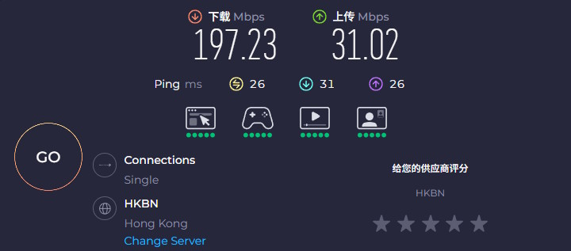

过去一年折腾这些搞得不亦乐乎，我觉得能水不少技术文出来放博客里，后面找时间写一下😉。也理解了为什么香港代理成本要比美国的高，为什么都说国际网上冲浪选联通了。现在 NodeSeek 论坛已经是我最常访问的网站之一了，也算是成为了一名 MJJ。

## 第一次出差

4 月底，我开始了生平第一次出差，目的地是海南三亚。一般来说前端几乎所有工作都能在公司完成，并不需要亲自到现场，但这次情况特殊：项目要验收了，实施组抽不出人手而后端的同事又赶上结婚，这才轮到我过去。三亚是个好地方，也未曾去过，这次算是公费旅行了。

4 月底的海南已经很热了，但可能是因为还不到五一黄金周，所以游客并不多，机票也便宜。

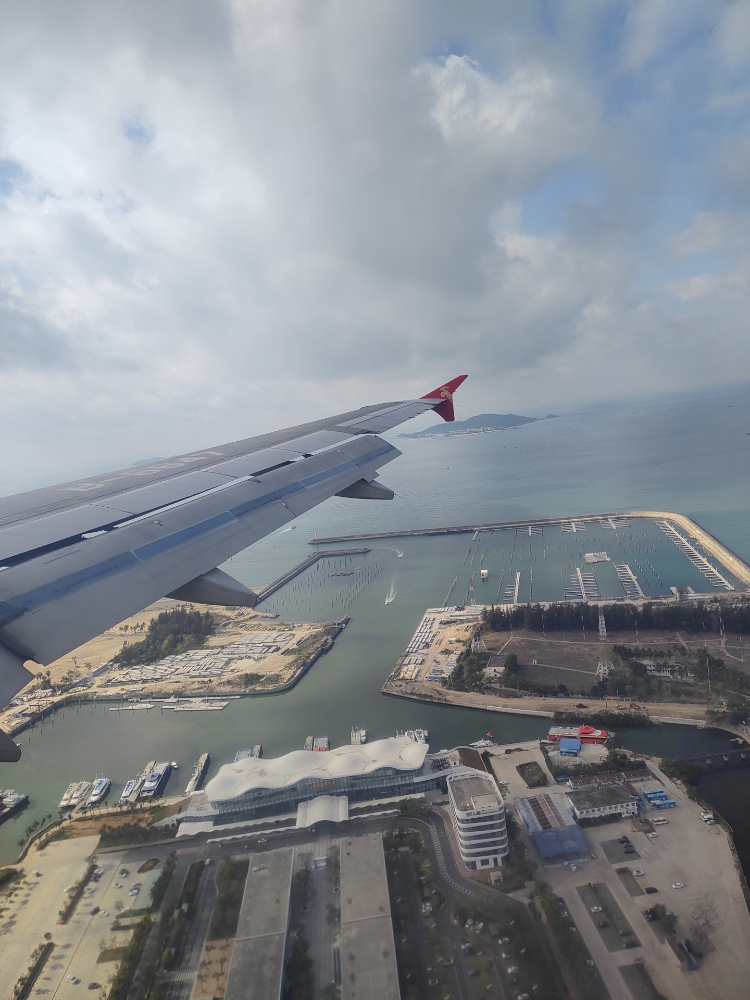

在项目现场待了差不多一周，挺累人的——需要一边处理客户，一边处理代码，环境和效率都不如在公司办公，幸运的是集成商和客户都是很好的人，项目的验收也算是比较顺利。

三亚给我最大的印象是这里的椰子树和外国人是真的多，特别是俄罗斯人很多，很多广告都会写上英语和俄语，而沙滩也是一眼望不到头！最后那天正好是周末，天气也不晒，我便下海游了半个小时。很久没游了，到是还记得怎么泳，只是没一会就累了。

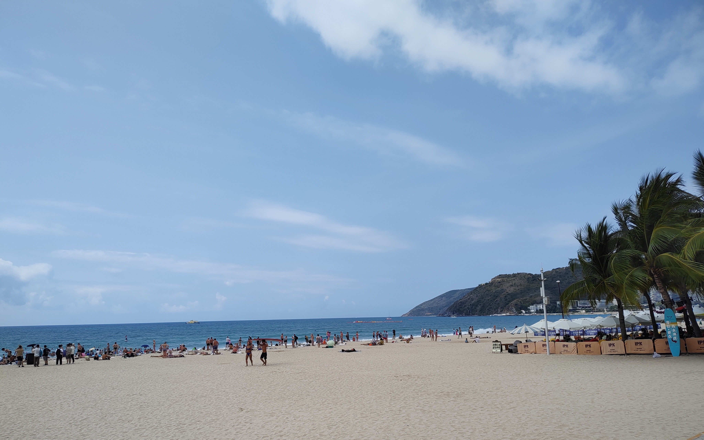

这次出差体验还不错，以后有机会了还想再来一次，当然不是出差的那种。回去后正好赶上 One on one，顺利的加薪了😋，希望来年能再接再厉。

## 一点投资

今年开始玩一些资本游戏了，年底带了一万块去香港，打了两只新股，收益都很理想。

| 名称     | 代号  | 成本价   | 股数 | 沽出价   |
| -------- | ----- | -------- | ---- | -------- |
| MINIMAX  | 00100 | 165.0HKD | 20   | 275.0HKD |
| 大族数控 | 03200 | 95.8HKD  | 100  | 117.9HKD |

MINIMAX 真是一支牛股，截至 2026 年 2 月 19 日已经 800 多块了，很可惜没有多打几手或是继续持有。但有收益就是胜利！现在账户里已经变成一万四了，接下来一年应该还会继续操作。

另外还配置了一些黄金，但是仓位比较高，在 1178 元/克上，希望后续能够回本吧。

## 新玩具

过去一年年买了不少东西，都带来了生活质量的提升。

### 打机装备

机械硬盘放游戏太慢了！于是年初的时候想上第二条 SSD，但是旧主板的第二条 M.2 是 PIE2.0 的，所以就连主板一起换了，新主板自带蓝牙，也是方便了很多。旧的则放闲鱼挂了 350，一下就被拍走了。

然后玩夺宝奇兵时老是爆显存，正好 5060TI 发布没多久，也把 4060 换掉出了 1850。

新显卡功耗上来了，我的旧电源又更吵了，于是从朋友那 50 元收了个闲置的海韵 G12，结果居然是坏的，好在还能申请保修，厂家直接寄了个新的回来！这波被我省到了😋。

然后又发现旧机箱设计太不合理了，热风是直接向上吹的，夏天玩热死了！正好 Chiphell 在办机王争霸赛，看到了乔斯伯 Z20 这款机箱感觉很不错！便激情下单了，夏天玩再也不热人了！

真是“牵一发而动全身”，目前我的配置如下，老样子，标价的是新买的。

| 项目   | 型号                               | 价格 |
| ------ | ---------------------------------- | ---- |
| 主板   | 华硕 TUF GAMING B550M-PLUS WIFI II | 587  |
| CPU    | AMD R5 5600                        |      |
| 内存   | 阿斯加特 16Gx2 DDR4 3600Hz         |      |
| 显卡   | 华硕 DUAL-RTX5060TI-O16G           | 3800 |
| 硬盘 1 | 致态 TiPlus7100 1T                 | 488  |
| 硬盘 2 | 致态 TiPlus5000 1T                 |      |
| 电源   | 海韵 G12 GM-850                    | 50   |
| 机箱   | 乔斯伯 Z20                         | 385  |
| 屏幕   | SANC G5C2 1440P 165Hz              |      |
| 音响   | 漫步者 R1000TC 北美版              |      |
| 椅子   | 西昊 Doro C100                     | 1175 |

最后放两张“全家福”。

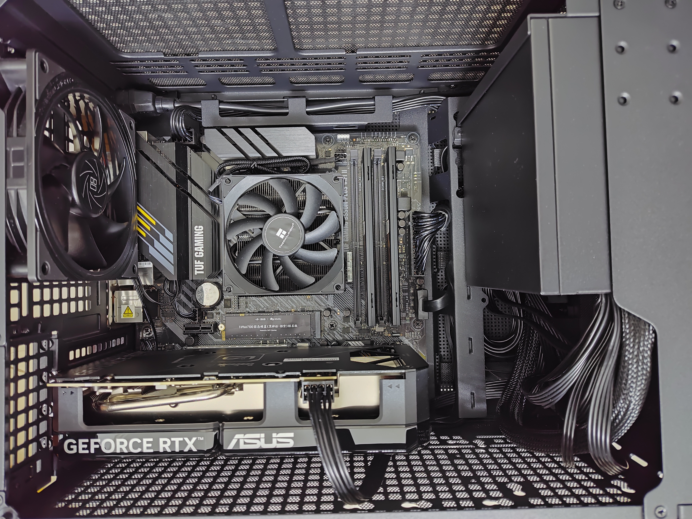

很喜欢这种纯黑的配色，再来一点 RGB~

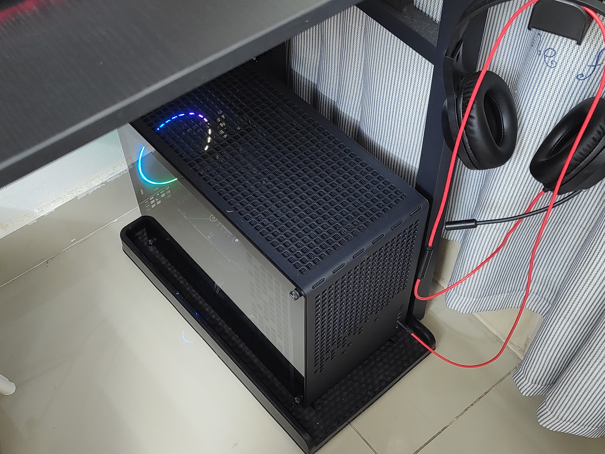

现在开机除了自检的滴滴声就没有其它声音了，我还挺怀念机械硬盘启动的声音的。

### EDC

过去一年 iPad mini 给我的体验还不错，正好 iPhone 17 标准版这次提升很大，高刷和快充都有了，也是激情下单！还赶上了政府补贴的末班车，后面又买了 AirPods 和 Apple Watch 也是小小出血了。

| 型号                          | 价格 |
| ----------------------------- | ---- |
| iPhone 17 标准版 256GB        | 5579 |
| AirPods 4 ANC                 | 949  |
| Apple Watch S10 42 毫米钛金属 | 2492 |

苹果全家桶配齐后生态是真的舒服，就是价格是真的贵，新系统的液态玻璃我个人挺喜欢的，很清爽通透的感觉。

## 精神食粮

### 动漫

今年看了三部少女乐队番！

| 名称                       | 评价                                                                                |
| -------------------------- | ----------------------------------------------------------------------------------- |
| 胆大党                     | 剧情很有意思！节奏、配乐都不错，很多脑洞令人捧腹大笑！                              |
| 无职转生                   | 当年被推上风口浪尖的作品。世界观完善，有软色情也有真感情！                          |
| 药屋少女的呢喃             | 终于完结了，看到最后才知道之前全是伏笔，不错！                                      |
| MYGO                       | 很不错的番，角色刻画到位，没有多余的笔墨，演出和剧情都不错！                        |
| Ave Mujica                 | 心里期望是第二个 MYGO，结果这演得是啥？看不懂的角色动机和剧情展开，虽然歌真的好听！ |
| 少女乐队的呐喊             | 前面的剧情和演出都不错，后面两集感觉很赶，圆得有点怪······                          |
| 莉可莉丝：友谊是时间的窃贼 | 很愉快的小短剧，把我带回了蒜必秒吻的那个夏天！                                      |
| 时光流逝但饭菜依旧美味     | 角色可爱，大学生吃喝玩乐的日常，看完让我后悔大学没和舍友多出去玩玩。                |
| 爱意随意链接               | 还挺有意思的一部老番。                                                              |
| 小城日常                   | 回来了！京阿尼回来了！喜欢看日常的绝对不能错过！                                    |
| 拔作岛                     | 小朋友不要看！没玩过原作，感觉剧情发展很怪······                                    |

### 电影/剧

| 名称          | 评价                                                                                           |
| ------------- | ---------------------------------------------------------------------------------------------- |
| 红辣椒        | 一场迷幻的冒险故事，配乐也有总奇妙的感觉，很独特的作品！                                       |
| 夺宝奇兵 1、3 | 经典作品！演出和剧情都很完美！                                                                 |
| 电幻国度      | 原作插画充满了蓝调和巨物的氛围，电影改编得······很符合大众口味的那种好莱坞的感觉，只能这么说。 |
| 谍中谍        | 经典，特工 + 高科技，当时的高科技现在看来别有一番风味~                                         |
| 米奇 17       | 关于复制体的有趣故事，带有一些疯狂的元素在里面，大老板让我想起了《千万别抬头》                 |
| 一战再战      | 不错的作品但意外的冷门，IGN 给了十分，我觉得确实有这实力！                                     |
| 凶降喜讯      | 根据真实事件~~开脑洞~~改编的作品，演出很有意思，刻画出了小人物的无耐。                         |
| 巨洪          | 奔着设定看的，后半段的展开有点牵强，很难代入，但这个场景也确实演不出啥了。                     |

### 游戏

今年回顾了一些老游戏。

#### 文明六

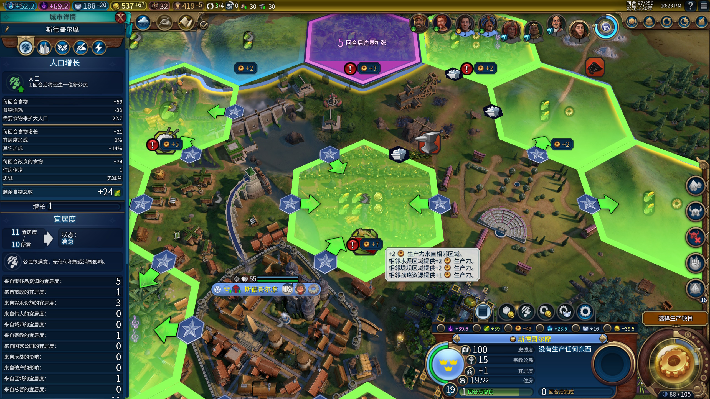

电子毒品了属于是，四个人天天打到一两点才睡觉，太上头了！后面缓了好久才恢复过来。那种和朋友不断探索世界和 AI 抢点的抢奇观的喜悦，这个游戏是独一份了。等后面文明七完善了我们应该还会再一起熬夜玩。

#### 红警三

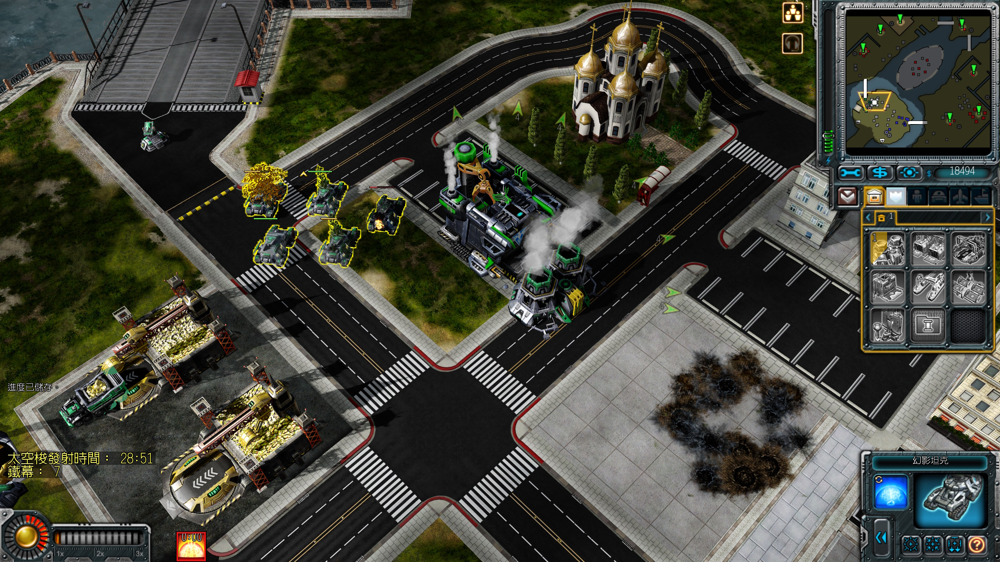

和老朋友一起重温了这部经典，把三个阵营的剧情都过完了，很怀念！可惜多线程操作能力不如以往了，很难一边搞战斗一边搞生产。盟军最后一关太难了，最后还是靠朋友从右边猛推，我从左边用超时空传送偷点才打下来的。

#### 战地四

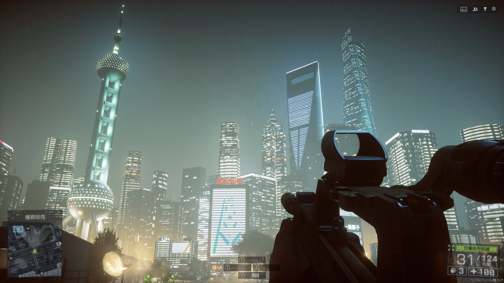

上次玩还在用 HD7770 呢，这次一口气把单人剧情打通了。十多年前的游戏了，画质放到今天还是不错的，剧情还行，中文部分的演出真的很搞笑，难怪衍生了那么多梗。

#### 夺宝奇兵·古老之圈

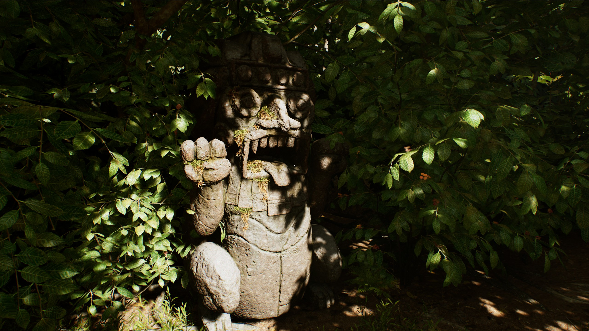

画面细节堪称爆炸！剧情引人入胜的同时也富含电影原作的幽默趣味，满分作品！可惜是在 24 年底发布的，如果早一点或者晚一点发布应该能拿更多奖项。为了舒服玩这游戏可投入了不少资金升级设备！

#### 绝区零

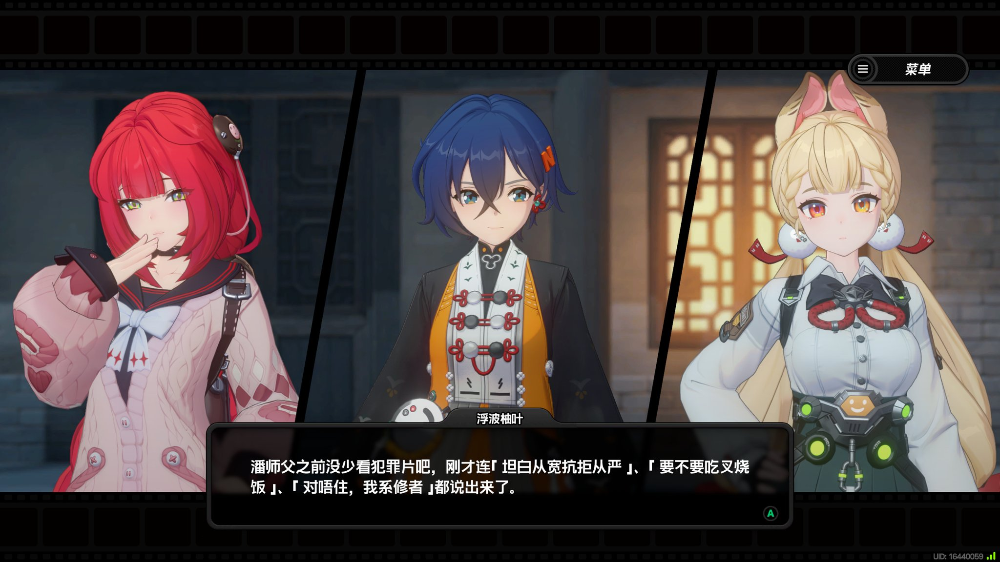

卫非地地图确实不错，很有老广味，剧情水平时好时坏。个人感觉 2.1、2.2 和 2.6 版本都是比较出彩的。

## 最后

过去一年有了钱消费观念也产生了一些改变：从上大学那会的能省则省，变成了“如果能用半小时的工资剩下一小时的时间，那就是赚的！”。简而言之是从更看重钱变为了更看重时间，我想原因多半是大学生没钱有时间，而打工人有钱没时间吧😂。最后放一张封面的原图——清明节拍的雨后象头山，希望新的一年能有更多的投资回报吧！

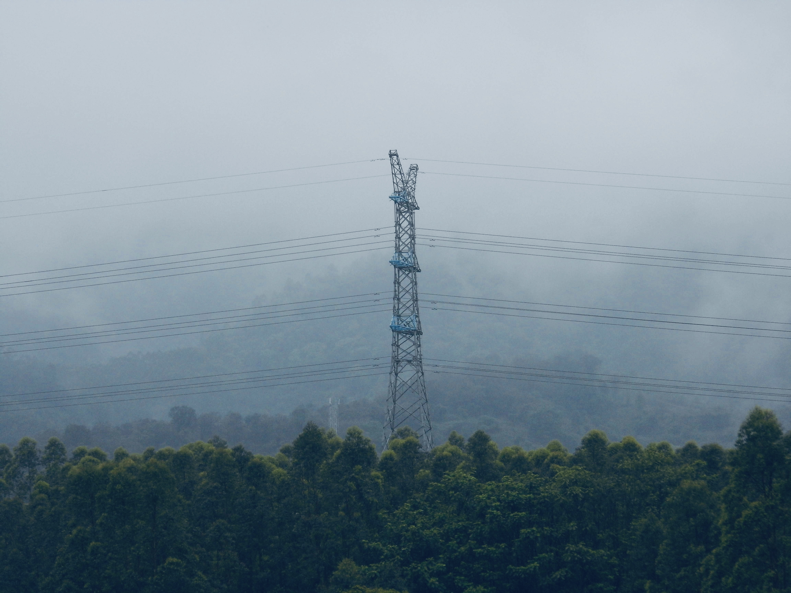
