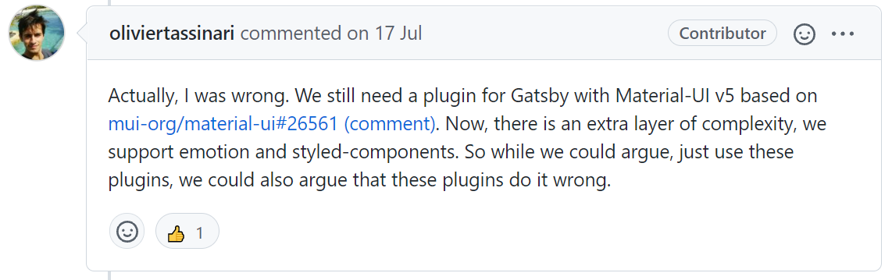
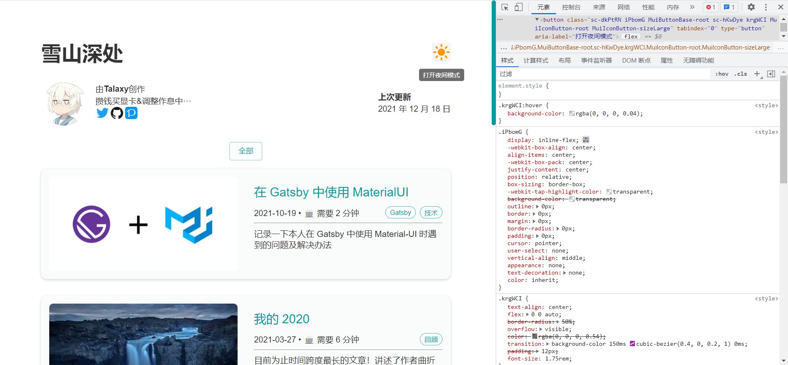

## 前言

[Material-UI](https://mui.com/zh/)（后面简称 MUI）是一个很棒的 UI 库，我经常在我的一些项目里用到这个库，但在 Gatsby 中，使用 MUI 还需要一些额外的依赖和操作。以本人的使用经验来看，若不执行这些操作，会导致页面中的 MUI 组件样式加载有“延迟”，比如在我使用 Button 组件时，刚进入页面时展示的是默认样式的 Button（方正、白色、有边框），过肉眼可观的一段时间后才会变成 MUI 的样式，还有 SVG 图标也是一样，会在一瞬间从大（大概有 96px 那样？）变到你指定的大小，还有种种就不在这里说了。解决方式也很简单，这也是本文下面要说的。

## 使用依赖

### MUI v4

在 MUI v4 中，需要使用 [gatsby-plugin-material-ui](https://www.gatsbyjs.com/plugins/gatsby-plugin-material-ui/)，依照文档安装并启用即可解决上述问题。

### MUI v5

到了 MUI v5，从官方的[安装文档](https://mui.com/zh/getting-started/installation/)可以看到，这个版本开始 MUI 需要额外的样式依赖，你可以选择文档中提到的 `@emotion/styled` 或者 `styled-components`，在 gatsby-plugin-material-ui 的这个 [issue](https://github.com/hupe1980/gatsby-plugin-material-ui/issues/70) 里，开发者有提到 MUI v5 不需要再使用这个插件了：


但后面又改口了 ↓



所以现在 gatsby-plugin-material-ui 的开发者们已经开始为 MUI v5 做适配了，不过截至我写这篇文章，这个组件还只支持 `@emotion/styled`，下面我分别分享一下在 Gatsby 中要如何使用依赖 emotion 和 styled-components 的 MUI v5。

#### 使用 emotion 解决方案

1. 安装依赖

   ```shell
   npm install gatsby-plugin-material-ui @mui/styled-engine @emotion/react @emotion/styled
   # 或
   yarn add gatsby-plugin-material-ui @mui/styled-engine @emotion/react @emotion/styled
   ```

2. 修改 `gatsby-config.js`

   ```js
   module.exports = {
     ...
     plugins: [
       ...
       'gatsby-plugin-material-ui',
     ],
   };
   ```

即可！

#### 使用 styled-components 解决方案

根据 MUI 官方的 [styled-components 切换指南](https://mui.com/zh/guides/styled-engine/)，需要修改 Webpack 的配置文件，否则会出现找不到 @emotion 组件的相关错误，但到了 Gatsby 这里，需要在 `gatsby-node.js` 修改 ↓

```js
exports.onCreateWebpackConfig = ({actions}) => {
  actions.setWebpackConfig({
    resolve: {
      alias: {
        // next 通道安装的应使用此配置
        '@material-ui/styled-engine': '@material-ui/styled-engine-sc',
        // latest 通道安装的应使用此配置
        '@mui/styled-engine': '@mui/styled-engine-sc',
      },
    },
  });
};
```

由于 MUI v5 的 bata 版本（@material-ui/core@next）和 stable 版本（@mui/material）的包名不同，所以需要根据实际情况（你安装的版本）选择上述两种配置中的一种（两种都选也可以），此外，如果你没有安装这些依赖的话（应该不可能），你还需要安装 `gatsby-plugin-styled-components` 和 `babel-plugin-styled-components`

~~执行完以上步骤后，应该就能舒适地在 Gatsby 中使用依赖 styled-components 的 MUI v5 了，目前为止只执行这些步骤已经能让我的网址正常使用 MUI 组件了。~~

## styled-components 背刺 (更新于 2021/12/19)

这两天我一直在处理一件事，就是我的一个 MUI 组件样式有些许问题，如下图所示，打包之后，我的夜间模式按钮出了问题（调试环境下正常）：



右下角显示的两个样式，正常来说后面那个 (.krgWCI) 应该具有更高的优先级，因为这是 MUI 组件的样式，而非前面那个 (.iPbomG) 默认的按钮样式，默认的样式将 MUI 组件的样式覆盖了，这导致夜间模式按钮在 hover 后背景变成了方形······

我尝试更换了相关组件的版本，但是无济于事，今天我发现官方的切换文档在 16 天前[更新](https://github.com/mui-org/material-ui/pull/30026)了，也就是上面放出的这个 [styled-components 切换指南](https://mui.com/zh/guides/styled-engine/)，文档中提到

> Using styled-components as an engine at this moment is not working when used in a SSR projects. The reason is that the babel-plugin-styled-components is not picking up correctly the usages of the styled() utility inside the @mui packages. For more details, take a look at this [issue](https://github.com/mui-org/material-ui/issues/29742). We strongly recommend using emotion for SSR projects.

我的翻译：

> 目前使用 styled-components 作为服务端渲染 (SSR) 项目的样式引擎时无法工作。原因是 babel-plugin-styled-components 没有正确获取 @mui 软件包中的 styled() 方法。欲了解更多详情，请查看这个 [issue](https://github.com/mui-org/material-ui/issues/29742)。我们强烈建议在服务端渲染 (SSR) 项目中使用 emotion。

所以在问题修复之前，我还是老实的使用 emotion 方案吧😭

### 后续 (更新于 2021/12/20)

今天把我的样式库替换为 emotion 了（我不能忍受我的项目里同时存在两个功能相同的依赖），可以说是无痛切换，甚至我 vscode 的  style-components 的插件还能正常使用，毕竟这两个样式库的 styled api 太相似了
