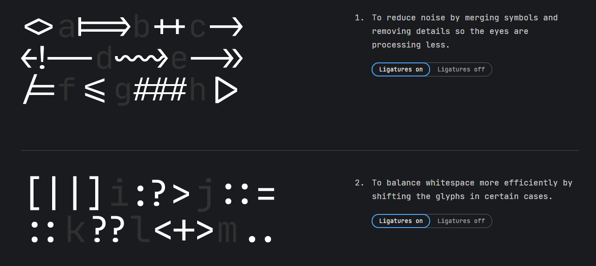
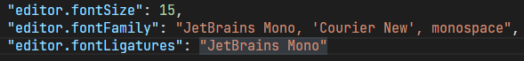
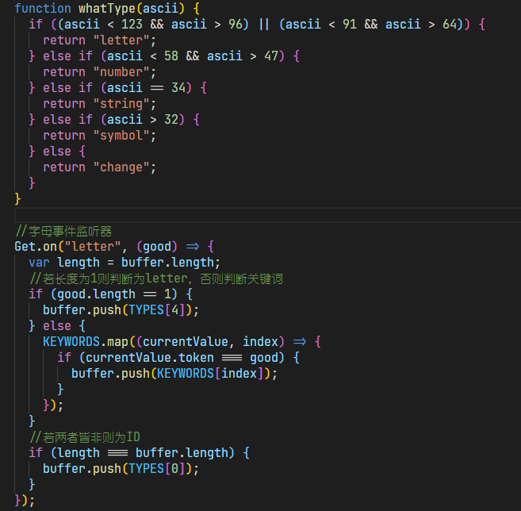

>最近知乎推送了一个介绍 JetBrains Mono 字体的文章，仔细看了看发现这字体已推出一年多了。看来只有火星人才能救得了火星人 (= v =)

[JetBrains Mono 的官网](https://www.jetbrains.com/lp/mono/)

正如文章头图那样，官方称此字体是 for developers 的，看了看也确实戳我 XP。

我认为字体的亮点主要在于它对代码符号连接的优化，如官网所示：

## 在 VSCode 上使用字体

但官网给的安装介绍实在太简短了，自己在这补充下（特别是符号的连字功能，网上几乎没人介绍怎么在 VSCode 上实现）

打开 VSCode 的`首选项`找到`设置`打开，输入`font`找到字体的相关设置

把`Font Family`里的第一项修改为`JetBrains Mono`后，字体就能使用了，但要使用符号的连字功能还需要修改下面那项的`Font Ligatures`，如下高亮处显示，将`null`替换成`JetBrains Mono`即可：

## 使用效果

下面来看看 JetBrains Mono 和 Consolas 字体的区别（以我写的一段 JS 代码为例）

- JetBrains Mono 字体

- Consolas 字体

如上，连字正常～另外汉字部分是我修改为了 “幼圆” 字体，感觉更契合 JetBrains Mono 些。啊，我回不去了 (@ A @)
