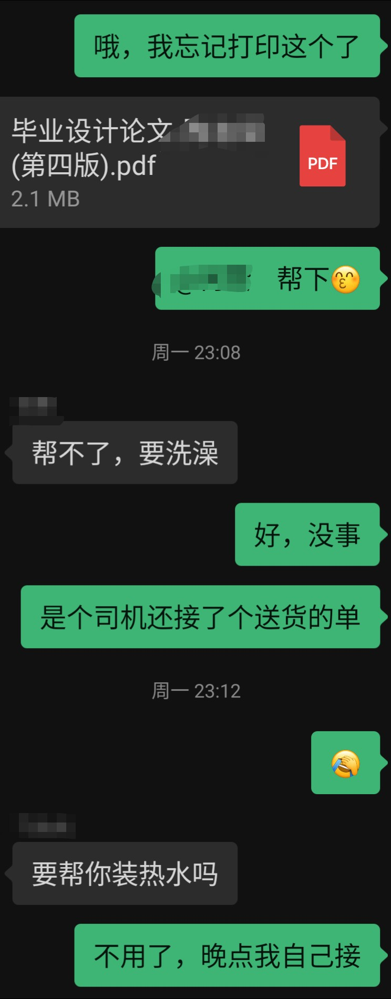
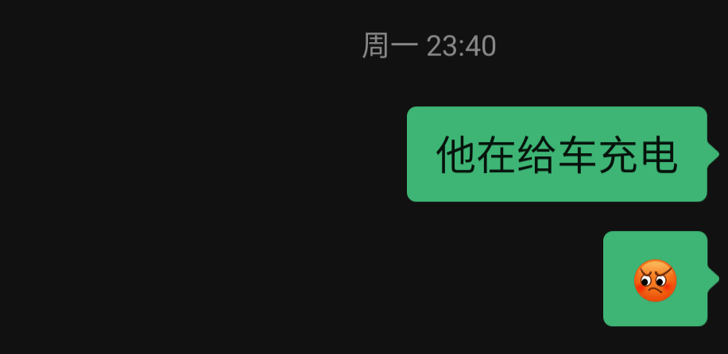
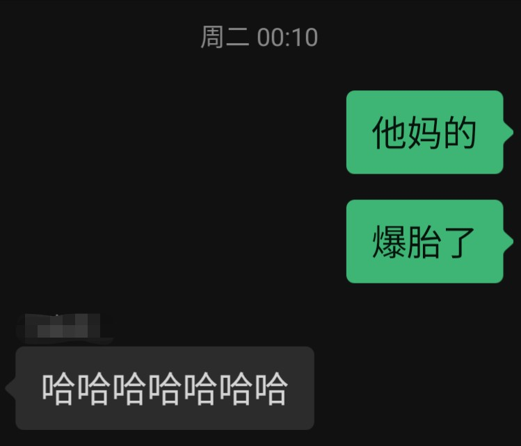
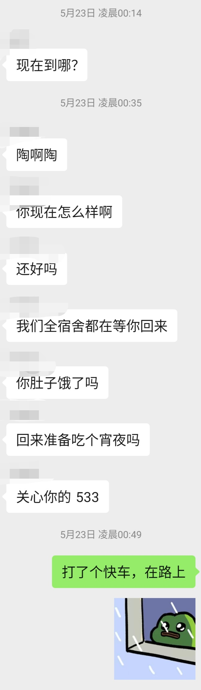
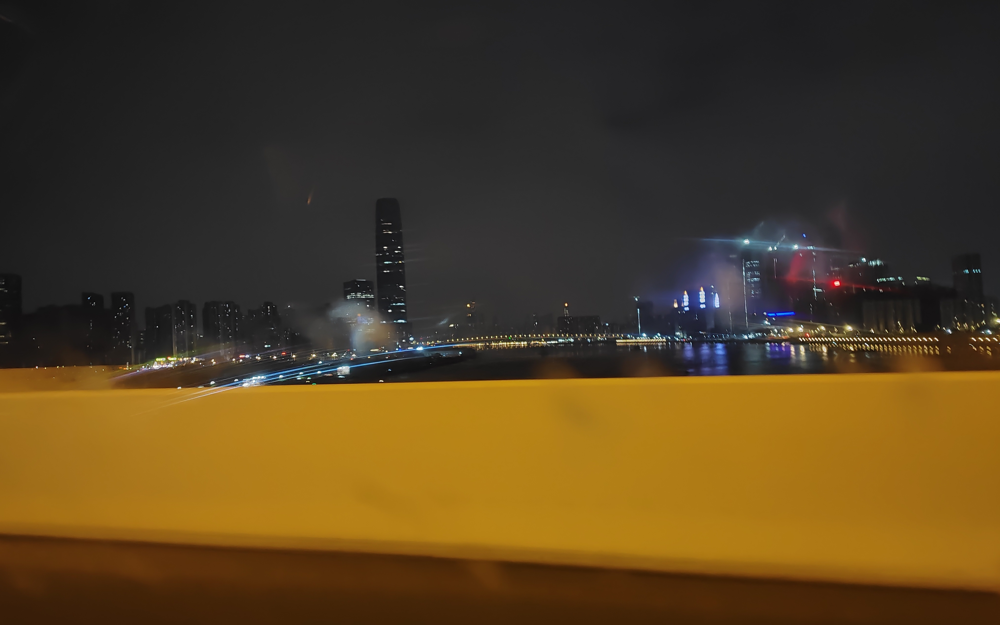

“可以问一下你目前求职的状况吗？”

“今年行情也不是很好，我就直接说了。我目前投了有 50 份简历那样，面试只有 5 家，有一家走完面试流程，但已经泡了一个月池子了，我觉得没有什么希望，而且也在杭州，离家太远了，目前还在面试流程的就我们这家了。”

······

“我们的问题问完了，你还有什么问题想问我们的吗？”

······

“方便透露一下有多少个 HC 吗？”

“目前这个职位计划招两个人。”

“那目前面试了多少呢？”

“今天面试了两个，有一个刚刚就在隔壁房间，这几天都有在一直面，也有很不错的人选了。”

“好的，那我了解了······”

出了公司大厦，望着夕阳染红的天和南山一栋栋挺拔的大楼，三个小时的面试结束了，我的大脑还在不断复盘。于是便想起了刚刚的对话，两间办公室仅仅隔了一面玻璃墙，因此我能听到一些隔壁会议室的对话：“这道题我用了动态规划算法”“嗯，非常好！”······“目前已经有两个 offer 了，其中一个是 13x14 的”。是一个比我优秀的人，这一年的求职过来我已经对落选习以为常了，现在我只想快快回到宿舍洗个澡睡个觉，准备次日继续投简历。

原本约在七点半的顺风车一直没来，于是我便打了个电话给司机，得到了八点钟的答复后我去路边的摊子买了个煎饼，一张饼 4 块，一根肠仔 3 块，晚饭就用 7 块钱解决了，反正也不是很饿。在我干饭时还不时有外卖小哥过来送餐，看来今晚有人要加班了，有一个小哥还用着可莉的语音来导航，太社牛了。不一会儿八点钟到了，司机花了些时间才找到我的位置，上车后还是在不断复盘，思考着自己的回答是否正确，一轮轮的面试下来让我觉得：其实有些问题可能永远没有正确的答案，因为每个提问者都有他们期望的答复，我能做的或许只有说出自己的真实想法。

司机兜兜转转接上了第二个乘客，是个女生，看 APP 上的信息只有一个同行，是和我一起去大学城的，终于可以出发了。奇怪的是，司机一直没上高速，反倒是接了一个电话：“啊，九点啊，嗯，我能到。”难道又有一个乘客？时间来到了九点，第三个乘客也上车了，车上变得有些拥挤。司机终于上了高速，但奇怪的是几十分钟后他把车开到了宝安机场去接下一位乘客，诺大个地方又花了他十多分钟才找到乘客。此时已经十点，车子已经坐满，看来终终终于可以出发了。

司机用了三个打车软件接了我们四人，太狠了！其次一路上还把音响开得超大，音乐不能说不合适，但实在是大声得让人有些烦躁，更不用说的是他的开车习惯实在不好，导致这路上十分“颠簸”，有好几次我看着前方都在想他怎么还不减速？然后就来了个急刹！还记得我曾经开我爸的车在红绿灯也来了个急刹，还被他说我不爱惜他的车，或许这就是为什么有些人的车能开个十几年，有些人的车只能开个几年的原因吧。

离开了虎门，我们终于来到了广州境内，突然下起了暴雨。颠簸的旅途和恶劣的天气让我想起来舍友说的：在广州的线下面试还能勉强去一下，但深圳的实在太远了。我深吸了一口气，想着：自己为什么会在这里？为了一场面试！面试能过吗？不知道······能找到工作吗？不知道······或许最后就是“竹篮打水一场空”吧。司机也来到了他的第一个目的地，某小区，但这不是我们四人任何一人的目的地，他是来送货的，看来车上还有一位我们都不知道的“乘客”呢！此时已是晚上 11 点了，有时候不得不感慨时间过得很快。

再送完机场上车的乘客后，司机说：“接下来去大学城咯？”坐在旁边的小哥忍不住了：“啊？从大学城去大石都要一个小时了，你怎么接单的啊？”司机也没说话，只是导航去了一个 400 米的目的地，难道这就是大石？到了后我们才发现这是个充电站，他是来给车子充电的！

司机下车后，我终于惹不住了，开始和其他两人吐槽这个司机了，听说我是八点钟上车的，小哥也表示很震惊，期间我们还冒着大雨跑出去上了个厕所，算是互相认识了。过了 20 分钟，车子终于上路了，司机说：“去大学城咯？大学城比较近。”经过了之前的通气，小哥也只好默许了，司机又说：“不走高速了吧，这走不走都差不多。”大家也默许了。车子继续在大雨中行驶着、劈开路面的积水，如同一艘快艇，但帅不过三分钟只听一声巨响，车子剧烈晃动了一下，旁边的小哥看了看我，而我系上了安全带。过了一个路口，车底传来异响，司机也停下来看了下，随后在大雨中仰面抱头，不出意外的话是出意外了。

司机拉开了我的车门，我问：“爆胎了吗？”他点了点头说：“下来吧。”我看了看一旁的小哥，他摇了摇头，于是我便一个人下来了，车子右前轮爆胎了，量变终于产生质变了，司机的开车习惯最终还是换来了爆胎的结果，但此时的我只想快点回到宿舍，之前在驾校学车时“有幸”遇到过一次爆胎，看过教练换车胎。我问：“有备胎吗？”司机点了点头立马从后备箱搬出轮胎和工具来，我让司机把车挪到一个安全点的地方，开始了我的操作，但是一上手我就发现无从下手，扳手和螺母完全对不上，轮胎根本卸不下来。我回到了车内，司机还在查看教程翻找工具。正当我盘算着打车回去时，发现前座的同学已经在操作了，于是便和她一拍即合打快车回去。过了十多分钟，快车来了，小哥询问司机能否送完大学城后再送他回大石，快车司机也同意，顺风车司机付完我们一行人的车费后我们便出发了，上车时我发现这辆快车的屁股变形了。

这一趟下来我们终于走在了回家的路上，路上我们和快车司机说了一路的遭遇。快车司机表示自己今天也是白跑了：车屁股今天被一辆摩托车追尾了（怪不得车尾变形了），摩托车司机立马表示愿意协商赔钱，结果等快车司机把车停在路边，摩托车立马就跑了！最后追到巷子里追不上了······只好报警，又是录笔录又是调监控，最后也没查出个结果来，浪费了半天时间，最后还是要自己掏钱修车。听罢，顿时觉得今晚发生的事都太戏剧了，值得好好记录下来，只可惜什么照片都没拍，恰巧此时正行驶在深更半夜的高速路上，便对远处的建筑群来了一张。

一趟下来，旅途的疲惫竟然被兴奋所取代了，不仅想起了《日常》的名言：“我们所度过的每个平凡的日常，也许就是连续发生的奇迹。”现在思考之前的问题：我为什么会在这里？为什么要大老远跑去深圳参加一个不一定能过的面试？将这个问拓展一下实际等价于：我为什么会在这个世上？为什么要渡过一个酸甜苦辣而非永远快乐的人生？没有为什么······如果一切事物都要考虑收益才去进行的话，那人生本就不该开始，因为人生不过就是一趟起点是“生”，终点是“死”，且百分百不会永远快乐的旅途。然而旅途的意义并非付出和收获，还有一路上遇见的人和事，人生或许就是这样：去试错、去体验、去品尝苦与甜，在得意时“一日看尽长安花”，在失意时“沉醉不知归路”······

悟道结束，最后在凌晨一点时回到了宿舍，和舍友开完玩笑洗完澡收拾收拾上床已是两点，睡醒还要答辩，大学生活已所剩无几了。

午饭前，我收到了录用的消息。

## 后记（六月三日）

这两周的事真是太多了：面试、答辩、改论文、三方协议、找房子、入职，最后直到今天才有空写完这篇文章，正如文中所写，在开始时根本想象不到会发生这样一系列的巧合因此也没有记录下来，但好在期间有一直和舍友联系，因此至少留下了微信的聊天记录，还能帮助回忆一下时间点，也让这篇文章不全是文字。这个月拿到毕业证就算正式毕业了，我的大学生活就此结束，而我也要变成一个打工人了，或许以后有机会我会再写一篇文章回忆我的大学生涯吧！
